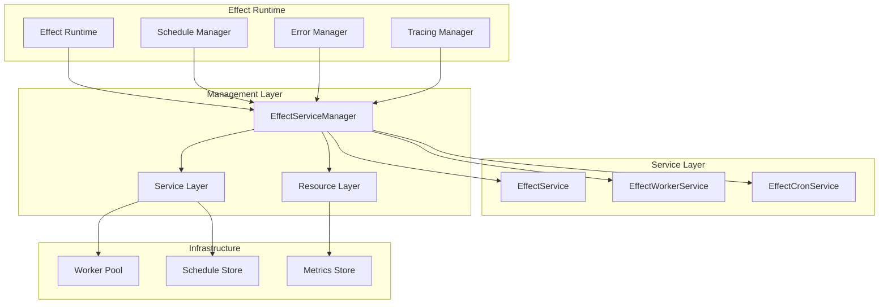
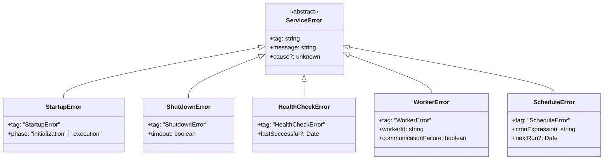
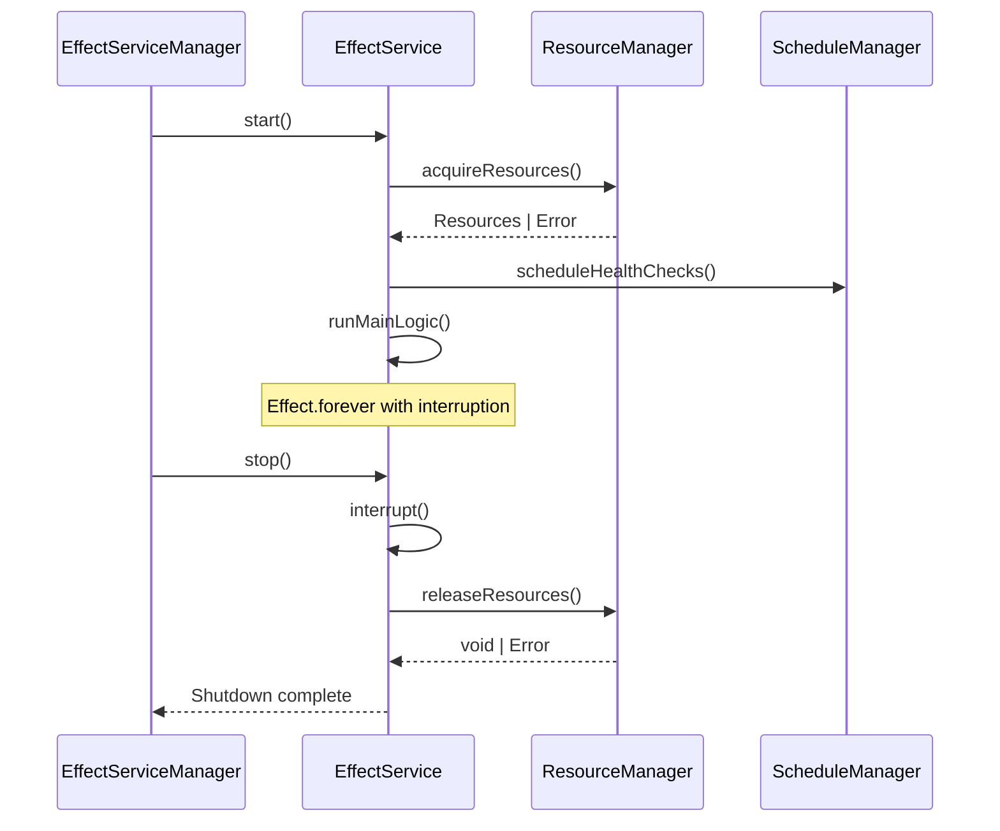
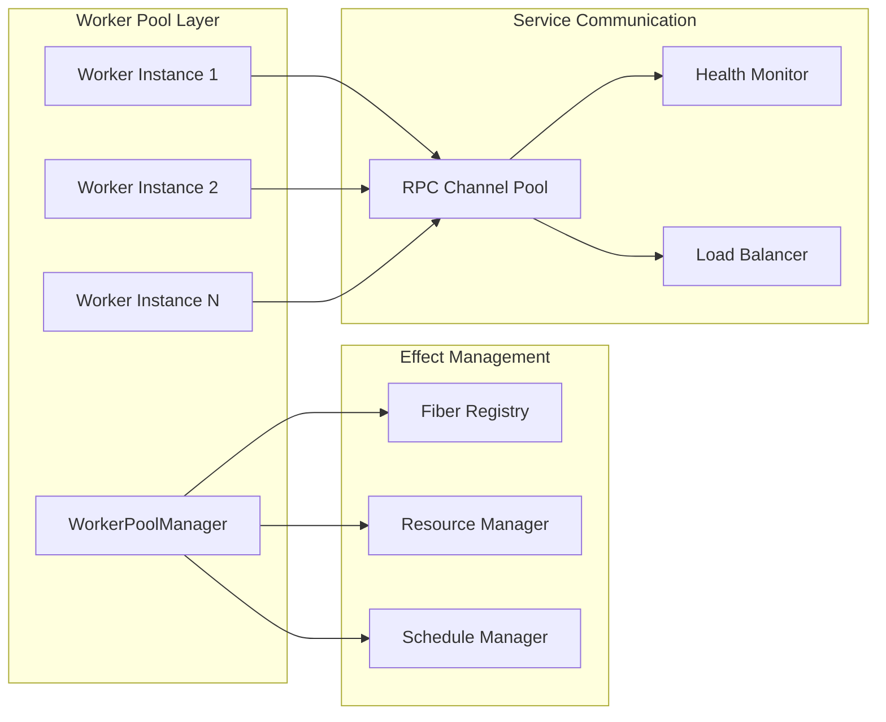
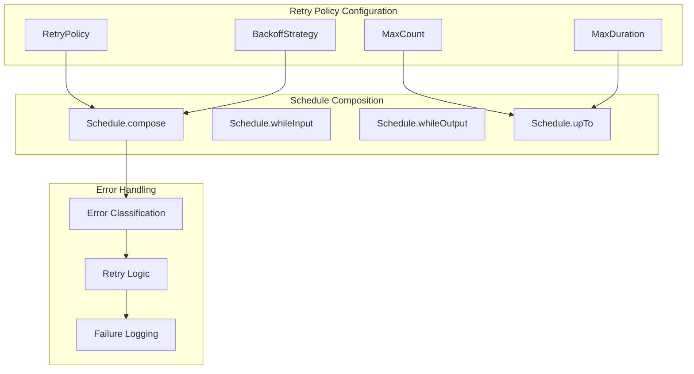
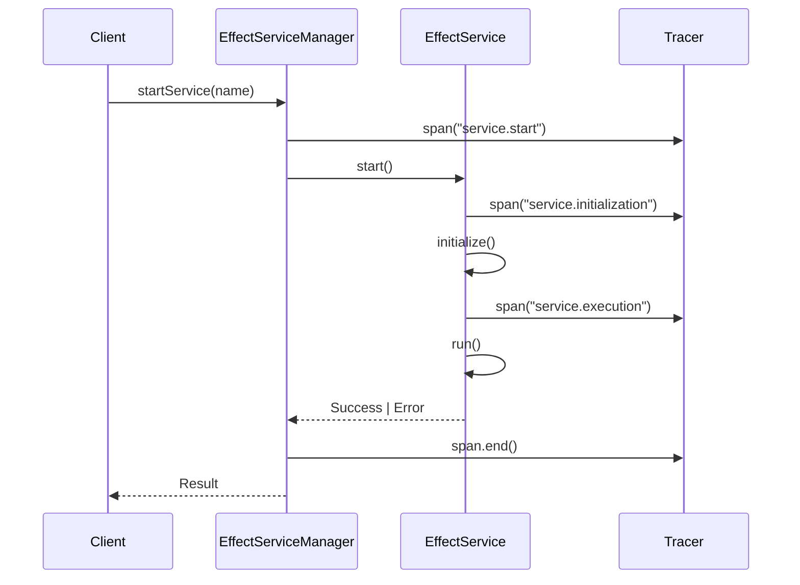
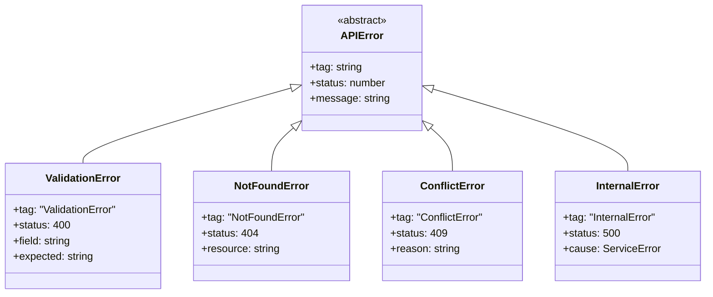
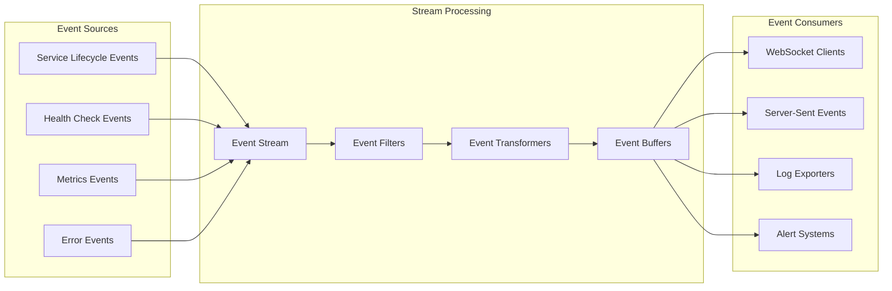
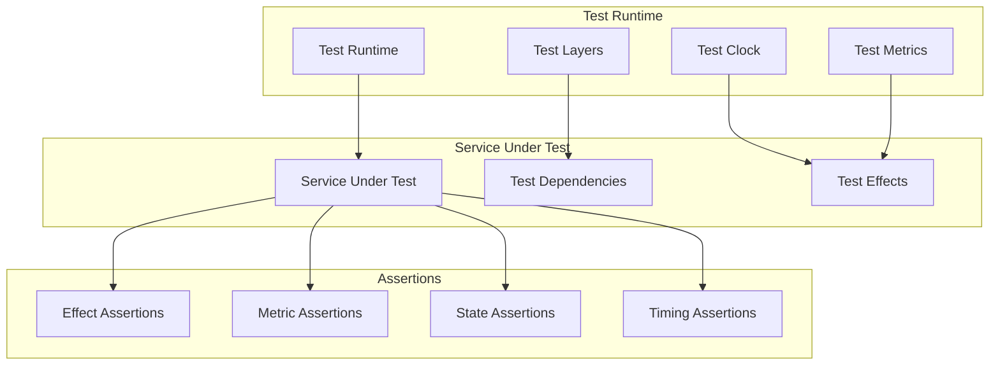
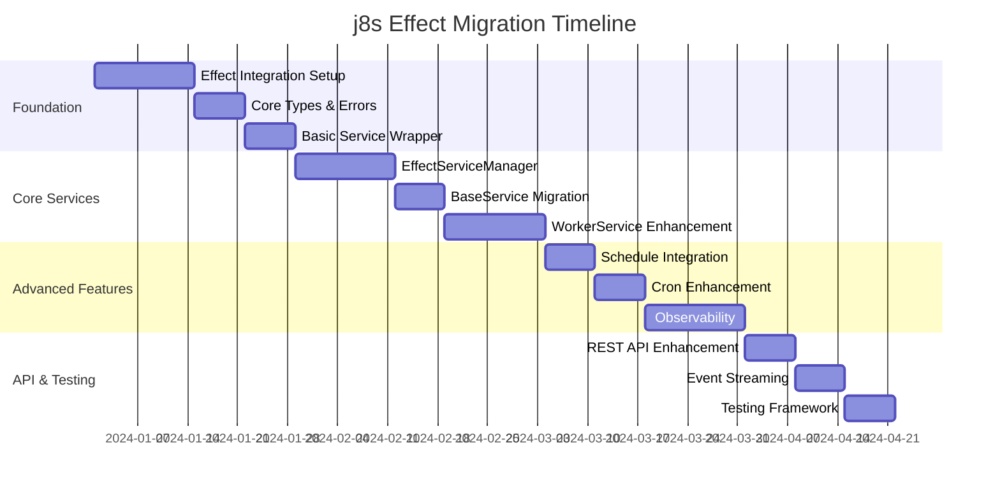

# j8s Effect Integration Design

## Overview

This design outlines the transformation of j8s into a more reliable and feature-rich service orchestration framework using the Effect library. The current j8s implements manual exponential backoff, basic cron scheduling, and custom error handling. By integrating Effect, we will leverage its built-in retry mechanisms, advanced scheduling capabilities, comprehensive error handling, and functional programming primitives to create a more robust and maintainable system.

### Current Architecture Limitations

- Manual exponential backoff implementation prone to errors
- Basic cron scheduling with limited flexibility
- Imperative error handling scattered throughout codebase
- No built-in observability or tracing capabilities
- Limited composability of service operations

### Effect Integration Benefits

- Built-in `Schedule` for sophisticated retry policies
- Comprehensive `Cron` support with time zone handling
- Structured error handling with typed errors
- Built-in observability and metrics collection
- Functional composition enabling complex service orchestration patterns

## Technology Stack & Dependencies

### Core Effect Dependencies

| Package | Purpose | Key Features |
|---------|---------|--------------|
| `effect` | Core functional runtime | Schedule, Effect, Layer, Stream |
| `@effect/platform` | Platform integration | File system, HTTP, process management |
| `@effect/schema` | Data validation | Runtime type checking, serialization |
| `@effect/opentelemetry` | Observability | Tracing, metrics, logging |

### Existing Dependencies (Retained)

| Package | Purpose | Integration Strategy |
|---------|---------|---------------------|
| `@kunkun/kkrpc` | Worker communication | Wrap in Effect for composability |
| `node:worker_threads` | Worker isolation | Integrate with Effect's resource management |

## Architecture

### Service Execution Models

The Effect-based j8s will maintain compatibility with existing execution models while enhancing them with Effect's capabilities.



### Effect Service Interface

The core service interface will be redesigned using Effect's type system and error handling:

| Method | Return Type | Purpose |
|--------|-------------|---------|
| `start` | `Effect<void, ServiceError, ServiceContext>` | Initialize and run service |
| `stop` | `Effect<void, ServiceError, ServiceContext>` | Graceful shutdown |
| `healthCheck` | `Effect<HealthStatus, ServiceError, ServiceContext>` | Service health assessment |
| `restart` | `Effect<void, ServiceError, ServiceContext>` | Composed stop + start operation |

### Error Hierarchy



## Service Implementation

### Base Effect Service

The foundation service class will leverage Effect's composable operations:

**Service Lifecycle Management**

| Phase | Effect Operations | Error Handling |
|-------|-------------------|----------------|
| Initialization | Resource acquisition, dependency injection | Startup errors with cleanup |
| Execution | Long-running effects with interruption | Runtime errors with recovery |
| Shutdown | Resource cleanup, graceful termination | Timeout with forced cleanup |
| Health Monitoring | Periodic checks, metric collection | Health degradation tracking |

**Resource Management Pattern**



### Worker Service Integration

Worker services will benefit from Effect's structured concurrency and resource management:

**Worker Lifecycle with Effect**

| Operation | Effect Pattern | Resource Handling |
|-----------|----------------|-------------------|
| Worker Creation | `Effect.acquireRelease` | Automatic cleanup on failure |
| RPC Communication | `Effect.withSpan` for tracing | Connection pooling and retry |
| Health Monitoring | `Effect.repeat(Schedule.*)` | Degradation detection |
| Termination | `Effect.timeout` + graceful shutdown | Resource finalization |

**Worker Pool Management**



### Cron Service Enhancement

The cron service will be completely redesigned using Effect's `Cron` module:

**Enhanced Cron Capabilities**

| Feature | Current Implementation | Effect Implementation |
|---------|----------------------|----------------------|
| Schedule Parsing | Manual cron library | `Cron.make()` with validation |
| Time Zone Support | System timezone only | Named timezone support |
| Overlap Prevention | Basic timeout mechanism | Effect cancellation with `Schedule.duration` |
| Error Recovery | Manual retry logic | `Schedule.exponential` with jitter |
| Observability | Console logging | Structured tracing and metrics |

**Cron Service Flow**

```mermaid
flowchart TD
    A[Cron Expression] --> B[Cron.make()]
    B --> C{Valid?}
    C -->|No| D[ScheduleError]
    C -->|Yes| E[Schedule.cron()]
    E --> F[Effect.repeat()]
    F --> G[Service.start()]
    G --> H{Success?}
    H -->|Yes| I[Wait for next]
    H -->|No| J[Apply retry policy]
    J --> K{Retry?}
    K -->|Yes| L[Schedule.exponential]
    K -->|No| M[Log failure]
    L --> G
    I --> F
    M --> N[Continue schedule]
    N --> F
```

## Advanced Features

### Retry Policies with Effect Schedule

The manual exponential backoff will be replaced with Effect's sophisticated scheduling system:

**Schedule Configuration**

| Policy Type | Schedule Implementation | Parameters |
|-------------|------------------------|------------|
| Linear | `Schedule.fixed(duration)` | interval duration |
| Exponential | `Schedule.exponential(base, factor?)` | base delay, multiplication factor |
| Fibonacci | `Schedule.fibonacci(base)` | base delay |
| Spaced | `Schedule.spaced(duration)` | fixed intervals |
| Jittered | `Schedule.jittered(schedule)` | base schedule with randomization |

**Custom Retry Policies**



### Health Monitoring and Observability

Effect's built-in observability will provide comprehensive monitoring:

**Metrics Collection**

| Metric Type | Implementation | Purpose |
|-------------|----------------|---------|
| Service Uptime | `Clock.currentTimeMillis` tracking | Availability monitoring |
| Restart Count | `Ref` with atomic updates | Stability assessment |
| Health Check Duration | `Effect.timed` | Performance monitoring |
| Error Rates | `Metrics.counter` | Failure analysis |
| Resource Usage | `Effect.runtime` + platform APIs | Resource optimization |

**Tracing Integration**



### Resource Management

Effect's resource management will ensure proper cleanup and prevent resource leaks:

**Resource Lifecycle**

| Resource Type | Acquisition Pattern | Release Pattern |
|---------------|-------------------|-----------------|
| File Handles | `Effect.acquireRelease` | Automatic closure |
| Network Connections | `Pool.make` | Connection pooling |
| Worker Threads | `Scope.make` | Graceful termination |
| Timers/Intervals | `Effect.async` + cleanup | Cancellation |
| Memory Buffers | `Resource.auto` | Garbage collection hints |

## API Integration

### REST API Enhancement

The existing REST API will be enhanced with Effect's HTTP capabilities:

**API Endpoint Schema**

| Endpoint | Effect Type | Error Handling |
|----------|-------------|----------------|
| `GET /services` | `Effect<ServiceList, APIError, Context>` | Service enumeration errors |
| `POST /services/:name/start` | `Effect<void, ServiceError \| APIError, Context>` | Start failure propagation |
| `POST /services/:name/stop` | `Effect<void, ServiceError \| APIError, Context>` | Stop timeout handling |
| `GET /services/:name/health` | `Effect<HealthStatus, ServiceError \| APIError, Context>` | Health check failures |
| `GET /metrics` | `Effect<MetricsSnapshot, APIError, Context>` | Metrics collection errors |

**API Error Model**



### Event Streaming

Effect's `Stream` will enable real-time service monitoring:

**Event Stream Architecture**



## Testing Strategy

### Effect-Based Testing

The testing approach will leverage Effect's testability features:

**Test Layer Architecture**

| Test Type | Effect Testing Pattern | Mock Strategy |
|-----------|----------------------|---------------|
| Unit Tests | `Effect.runSync` for pure functions | Test services and layers |
| Integration Tests | `Effect.runPromise` with test runtime | Mock external dependencies |
| End-to-End Tests | Full runtime with test configurations | Real services in test mode |
| Property Tests | `Effect.gen` with random inputs | Effect-aware property testing |

**Test Service Implementation**



### Test Scenarios

**Service Lifecycle Testing**

| Scenario | Test Pattern | Expected Behavior |
|----------|--------------|------------------|
| Normal Startup | `startService >> expectSuccess` | Service running state |
| Startup Failure | `startService >> expectFailure<StartupError>` | Error propagation |
| Graceful Shutdown | `stopService >> expectCleanup` | Resource release |
| Forced Termination | `stopService.timeout(1000) >> expectTermination` | Timeout handling |
| Health Degradation | `simulateFailure >> expectUnhealthyState` | State transition |

## Migration Strategy

### Phase 1: Effect Foundation

**Core Infrastructure Migration**

| Component | Migration Approach | Compatibility |
|-----------|-------------------|---------------|
| `BaseService` | Implement `EffectService` interface | Wrapper for existing services |
| `ServiceManager` | Create `EffectServiceManager` | Parallel implementation |
| Error Handling | Introduce typed errors | Gradual error model adoption |
| Retry Logic | Replace with `Schedule` | Configuration migration |

### Phase 2: Service Enhancement

**Service-by-Service Migration**

| Service Type | Migration Strategy | Benefits Realized |
|--------------|-------------------|------------------|
| Main Thread Services | Effect wrapper + lifecycle management | Structured error handling |
| Worker Services | Effect resource management | Better worker lifecycle |
| Cron Services | Effect `Cron` + `Schedule` | Enhanced scheduling capabilities |
| Health Checks | Effect-based monitoring | Comprehensive observability |

### Phase 3: Advanced Features

**Feature Enhancement Implementation**

| Feature | Implementation Timeline | Dependencies |
|---------|------------------------|--------------|
| Advanced Retry Policies | After core migration | Effect `Schedule` |
| Observability Integration | Parallel to service migration | Effect telemetry |
| Stream-based APIs | After service stability | Effect `Stream` |
| Configuration Management | Final phase | Effect `Config` |

**Migration Timeline**



This design provides a comprehensive roadmap for transforming j8s into a more reliable and feature-rich service orchestration framework using the Effect library, while maintaining backward compatibility and providing a clear migration path.