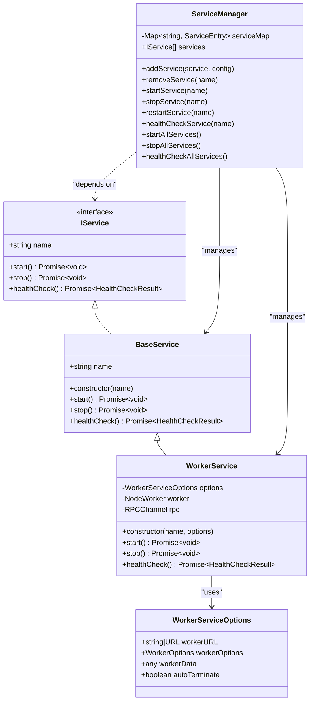

# API Reference

<cite>
**Referenced Files in This Document**   
- [index.ts](file://index.ts)
- [src/interface.ts](file://src/interface.ts)
- [src/ServiceManager.ts](file://src/ServiceManager.ts)
- [src/WorkerService.ts](file://src/WorkerService.ts)
- [src/BaseService.ts](file://src/BaseService.ts)
- [src/api.ts](file://src/api.ts)
- [api.ts](file://api.ts)
- [examples/services/simpleWorker.ts](file://examples/services/simpleWorker.ts)
</cite>

## Table of Contents
1. [Introduction](#introduction)
2. [Core Classes](#core-classes)
   - [BaseService](#baseservice)
   - [ServiceManager](#servicemanager)
   - [WorkerService](#workerservice)
3. [Factory Functions](#factory-functions)
   - [createWorkerService](#createworkerservice)
   - [createServiceManagerAPI](#createservicemanagerapi)
4. [Configuration Interfaces](#configuration-interfaces)
   - [ServiceConfig](#serviceconfig)
   - [RestartPolicyConfig](#restartpolicyconfig)
   - [CronJobConfig](#cronjobconfig)
   - [APIConfig](#apiconfig)
5. [Utility Functions](#utility-functions)
   - [expose](#expose)
6. [Component Relationships](#component-relationships)
7. [Usage Examples](#usage-examples)
8. [Deprecation and Migration](#deprecation-and-migration)

## Introduction
The j8s framework provides a lightweight service orchestration system for JavaScript/TypeScript applications. It enables managing multiple services within a single process using worker threads, with comprehensive lifecycle management, health monitoring, and restart policies. This API reference documents all public interfaces exported from `index.ts`, including core classes, configuration options, factory functions, and utility methods. The framework supports both main-thread services and worker-thread services, with REST API integration for remote management.

## Core Classes

### BaseService
The abstract base class that all services must extend. It implements the `IService` interface and provides a foundation for service lifecycle management.

**Properties**
- `name`: string - The unique identifier for the service instance.

**Constructors**
- `constructor(name: string)` - Initializes a new service with the specified name.

**Methods**
- `start()`: Promise<void> - Abstract method that must be implemented to define service startup logic.
- `stop()`: Promise<void> - Abstract method that must be implemented to define service shutdown logic.
- `healthCheck()`: Promise<HealthCheckResult> - Returns a basic health check result; typically overridden by subclasses.

**Section sources**
- [src/BaseService.ts](file://src/BaseService.ts#L1-L25)

### ServiceManager
The central orchestrator that manages the lifecycle of all registered services. It handles starting, stopping, restarting, and monitoring services according to their configuration.

**Properties**
- `services`: IService[] - Read-only array of all registered services.

**Constructors**
- `constructor()` - Creates a new service manager instance with an empty service registry.

**Methods**
- `addService(service: IService, config?: ServiceConfig)`: void - Registers a service with optional configuration.
- `removeService(serviceName: string)`: void - Unregisters and cleans up a service.
- `startService(serviceName: string)`: Promise<void> - Starts a specific service according to its restart policy.
- `stopService(serviceName: string)`: Promise<void> - Stops a running service gracefully.
- `restartService(serviceName: string)`: Promise<void> - Performs a stop-then-start sequence on a service.
- `healthCheckService(serviceName: string)`: Promise<HealthCheckResult> - Returns the health status of a specific service.
- `startAllServices()`: Promise<void> - Starts all registered services in parallel.
- `stopAllServices()`: Promise<void> - Stops all running services, capturing individual errors.
- `healthCheckAllServices()`: Promise<Record<string, HealthCheckResult>> - Returns health status for all services.

**Section sources**
- [src/ServiceManager.ts](file://src/ServiceManager.ts#L1-L351)

### WorkerService
A specialized service implementation that runs in a separate worker thread. It uses RPC communication to coordinate with the main thread's ServiceManager.

**Properties**
- `name`: string - Inherited from BaseService, identifies the worker service.
- `options`: WorkerServiceOptions - Configuration for the underlying worker thread.

**Constructors**
- `constructor(name: string, options: WorkerServiceOptions)` - Creates a worker service with specified name and worker configuration.

**Methods**
- `start()`: Promise<void> - Initializes the worker thread and invokes the worker's start method.
- `stop()`: Promise<void> - Stops the worker service and terminates the underlying worker.
- `healthCheck()`: Promise<HealthCheckResult> - Proxies the health check request to the worker service.

**Section sources**
- [src/WorkerService.ts](file://src/WorkerService.ts#L1-L193)

## Factory Functions

### createWorkerService
Creates a new WorkerService instance with default options merged with user-provided configuration.

**Parameters**
- `name`: string - The name to assign to the worker service.
- `workerPath`: string | URL - The path or URL to the worker script file.
- `options`: Partial<WorkerServiceOptions> - Optional configuration overrides for the worker.

**Returns**
- `WorkerService` - A configured worker service instance ready to be added to a ServiceManager.

**Usage**
This factory function simplifies worker service creation by providing sensible defaults and handling option merging.

**Section sources**
- [index.ts](file://index.ts#L150-L182)

### createServiceManagerAPI
Creates a REST API interface for managing a ServiceManager instance via HTTP requests.

**Parameters**
- `serviceManager`: IServiceManager - The service manager instance to expose via API.
- `config`: APIConfig - Optional configuration for OpenAPI documentation and UI.

**Returns**
- `Hono` - A Hono application with REST endpoints for service management.

**Section sources**
- [api.ts](file://api.ts#L1-L53)
- [src/api.ts](file://src/api.ts#L1-L498)

## Configuration Interfaces

### ServiceConfig
Defines the configuration options for service management, including restart policies and scheduling.

**Properties**
- `restartPolicy`: RestartPolicy - Determines when a service should be restarted after failure.
- `maxRetries`: number - Maximum number of retry attempts for "on-failure" policy.
- `cronJob`: CronJobConfig - Configuration for running the service as a scheduled cron job.

**Section sources**
- [src/interface.ts](file://src/interface.ts#L28-L34)

### RestartPolicyConfig
Enumeration of available restart policies that control service recovery behavior.

**Values**
- `"always"` - Always restart the service after termination.
- `"unless-stopped"` - Restart unless explicitly stopped by the user.
- `"on-failure"` - Only restart if the service exits with an error.
- `"no"` - Never restart the service automatically.

**Section sources**
- [src/interface.ts](file://src/interface.ts#L2-L3)

### CronJobConfig
Configuration for scheduling services as periodic tasks using cron expressions.

**Properties**
- `schedule`: string - Cron expression defining when the service should run.
- `timeout`: number - Optional timeout in milliseconds after which the service will be stopped.

**Section sources**
- [src/interface.ts](file://src/interface.ts#L22-L26)

### APIConfig
Configuration options for the REST API interface, including documentation and UI settings.

**Properties**
- `openapi`: object - Configuration for OpenAPI documentation generation.
  - `enabled`: boolean - Whether to enable OpenAPI specs endpoint.
  - `info`: object - Metadata for the API documentation.
  - `servers`: Array<object> - List of server URLs for API access.
- `scalar`: object - Configuration for the Scalar API reference UI.
  - `enabled`: boolean - Whether to serve the Scalar UI.
  - `theme`: string - Visual theme for the API documentation.

**Section sources**
- [src/api.ts](file://src/api.ts#L1-L498)

## Utility Functions

### expose
Exposes a service implementation in a worker thread, automatically setting up RPC communication with the main thread.

**Parameters**
- `service`: IService - The service instance to expose to the main thread.

**Returns**
- `void` - This function establishes communication but does not return a value.

**Usage**
This utility eliminates the need for manual RPC setup in worker scripts, allowing services to be easily exposed with a single function call.

**Section sources**
- [index.ts](file://index.ts#L130-L148)
- [examples/services/simpleWorker.ts](file://examples/services/simpleWorker.ts#L1-L60)

## Component Relationships
The j8s framework components work together in a hierarchical relationship. The ServiceManager acts as the central orchestrator, managing instances of BaseService and WorkerService. WorkerService extends BaseService to provide worker-thread execution, while createWorkerService serves as a convenience factory for WorkerService instances. The createServiceManagerAPI function creates a REST interface that wraps a ServiceManager, enabling remote control. The expose function enables worker services to communicate with the main thread's ServiceManager via RPC.

**Diagram sources**
- [src/BaseService.ts](file://src/BaseService.ts#L1-L25)
- [src/WorkerService.ts](file://src/WorkerService.ts#L1-L193)
- [src/ServiceManager.ts](file://src/ServiceManager.ts#L1-L351)
- [src/interface.ts](file://src/interface.ts#L1-L44)

## Usage Examples
The framework provides several usage patterns demonstrated in the examples directory. Worker services can be created using the expose pattern where a service implementation is directly exposed in a worker thread. Main thread services extend BaseService and are managed by ServiceManager. The REST API enables external control of services through standard HTTP endpoints. Cron jobs can be configured to run services on schedules, while restart policies ensure service resilience.

**Section sources**
- [examples/services/simpleWorker.ts](file://examples/services/simpleWorker.ts#L1-L60)
- [index.ts](file://index.ts#L10-L120)

## Deprecation and Migration
The j8s framework does not currently have any deprecated features. All exported APIs are actively supported and maintained. The design emphasizes backward compatibility, with configuration options using optional properties to allow for future extensions without breaking changes. When updates are made to the API, they will follow semantic versioning principles, with major version increments indicating breaking changes.

**Section sources**
- [index.ts](file://index.ts#L1-L182)
- [src/interface.ts](file://src/interface.ts#L1-L44)