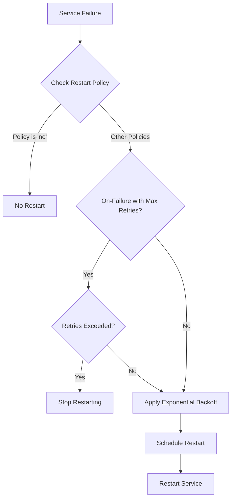

# Advanced Features

<cite>
**Referenced Files in This Document**   
- [ServiceManager.ts](file://src/ServiceManager.ts)
- [WorkerService.ts](file://src/WorkerService.ts)
- [interface.ts](file://src/interface.ts)
- [restart-policy.ts](file://examples/restart-policy.ts)
- [worker-restart-policy.ts](file://examples/worker-restart-policy.ts)
- [demo.ts](file://examples/demo.ts)
</cite>

## Table of Contents
1. [Restart Policies](#restart-policies)
2. [Cron Scheduling](#cron-scheduling)
3. [Auto-Termination Settings](#auto-termination-settings)
4. [Internal Mechanisms in ServiceManager](#internal-mechanisms-in-servicemanager)
5. [Common Issues and Mitigation Strategies](#common-issues-and-mitigation-strategies)
6. [Performance Considerations](#performance-considerations)

## Restart Policies

The j8s framework supports four distinct restart policy strategies: **always**, **unless-stopped**, **on-failure**, and **no**. These policies are configured through the `restartPolicy` field in the `ServiceConfig` interface defined in `interface.ts`. The `ServiceManager` class enforces these policies when handling service lifecycle events.

The **always** policy ensures that a service is restarted regardless of how it exits—whether due to failure or graceful termination. This is ideal for critical background services that must remain operational. The **unless-stopped** policy behaves similarly but respects manual stop commands; once a service is explicitly stopped via `stopService`, it will not be restarted even after process restarts.

The **on-failure** policy triggers restarts only when a service fails during execution, as determined by an unhandled exception in the `start()` method. This policy integrates with the `maxRetries` configuration to prevent infinite restart loops. When the number of consecutive failures exceeds `maxRetries`, restart attempts cease. The default value for `maxRetries` is 3, but this can be customized per service.

The **no** policy disables automatic restarts entirely. Once a service stops or crashes, no further action is taken by the `ServiceManager`.

Exponential backoff is applied during restart attempts to prevent resource exhaustion. The delay starts at 1 second and doubles with each attempt (2^n × 1000ms), capped at 30 seconds. This mechanism is implemented in the `scheduleServiceRestart` method of `ServiceManager`.

**Section sources**
- [ServiceManager.ts](file://src/ServiceManager.ts#L238-L286)
- [interface.ts](file://src/interface.ts#L21-L23)
- [restart-policy.ts](file://examples/restart-policy.ts#L65-L67)

## Cron Scheduling

Cron-based scheduling in j8s allows services to execute at specified intervals using standard cron expressions. This functionality is enabled by configuring the `cronJob` property in the service configuration object. The `setupCronJob` method in `ServiceManager` initializes a `CronJob` instance from the `cron` package based on the provided schedule string.

Cron expressions support full cron syntax, including special characters like `*`, `/`, `-`, and `,`. For example:
- `"0 0 * * * *"` runs every hour at the start of the minute
- `"*/15 * * * * *"` executes every 15 seconds
- `"0 */5 9-17 * * 1-5"` triggers every 5 minutes from 9 AM to 5 PM on weekdays

Each scheduled execution sets the service status to "running" and invokes the `start()` method. A timeout can be specified to prevent long-running tasks from consuming excessive resources. If a service exceeds its configured timeout, the `ServiceManager` automatically calls `stop()` to terminate it gracefully. If graceful shutdown fails, the service is marked as "crashed".

Timeout protection is implemented using `setTimeout` within the cron job callback, ensuring that even if a service becomes unresponsive, it will be forcibly stopped after the specified duration.

**Section sources**
- [ServiceManager.ts](file://src/ServiceManager.ts#L285-L350)
- [demo.ts](file://examples/demo.ts#L104-L147)
- [README.md](file://README.md#L187-L228)

## Auto-Termination Settings

Auto-termination controls the shutdown behavior of worker services after their primary task completes. This feature is configured via the `autoTerminate` option in `WorkerServiceOptions`. When set to `true`, the worker terminates immediately after the `start()` method resolves, making it suitable for short-lived, task-oriented workloads.

In `WorkerService`, auto-termination is handled in the `start()` method. After calling `await this.api.start()`, if `autoTerminate` is enabled and the IO channel is active, the service transitions to "stopping" state, performs cleanup, and sets status to "stopped". This prevents the worker from remaining idle and consuming memory unnecessarily.

When `autoTerminate` is `false` (the default), the worker remains active after task completion, allowing for ongoing communication or periodic work. This mode is appropriate for long-running services that may receive messages or need to perform background operations.

The cleanup process includes destroying the RPC and IO layers before terminating the underlying Node.js worker thread, ensuring all resources are properly released.

**Section sources**
- [WorkerService.ts](file://src/WorkerService.ts#L114-L170)
- [WorkerService.ts](file://src/WorkerService.ts#L67-L117)

## Internal Mechanisms in ServiceManager

The `ServiceManager` class orchestrates both scheduled execution and restart decisions through several key methods. The `setupCronJob` method creates and manages `CronJob` instances, binding them to service entries and handling execution logic. Each cron-triggered run sets the service status, invokes `start()`, and applies timeout protection.

Restart decisions are managed by `scheduleServiceRestart` and `handleServiceFailure`. When a service fails, `handleServiceFailure` updates its status to "crashed" and delegates to `scheduleServiceRestart` if the policy permits. The restart scheduler applies exponential backoff and respects `maxRetries` limits before proceeding.

Service state is tracked in a `Map<string, ServiceEntry>` where each entry maintains status, restart count, timers, and configuration. The `startService` method clears pending restarts, updates status, and handles both immediate and asynchronous failures, ensuring consistent state management across all service types.

**Diagram sources**
- [ServiceManager.ts](file://src/ServiceManager.ts#L238-L286)
- [ServiceManager.ts](file://src/ServiceManager.ts#L104-L152)

**Section sources**
- [ServiceManager.ts](file://src/ServiceManager.ts#L0-L350)

## Common Issues and Mitigation Strategies

A common issue with restart policies is the potential for infinite restart loops, especially when using **always** or **unless-stopped** with services that have persistent startup errors. To mitigate this, use the **on-failure** policy with a reasonable `maxRetries` value (typically 3–5) to allow recovery attempts while preventing endless cycles.

Another issue arises when cron jobs overlap due to long execution times exceeding the interval. This can be prevented by ensuring the cron schedule accounts for maximum runtime or by implementing internal locking within the service logic.

Services with `autoTerminate: true` may exit prematurely if `start()` resolves too quickly. Ensure the method contains proper await statements for asynchronous work. Conversely, services with `autoTerminate: false` may leak resources if not properly stopped; always implement cleanup in the `stop()` method.

Timeout-related issues can occur when the `cronJob.timeout` is too short for the actual workload. Monitor execution times and adjust timeouts accordingly, or implement progress tracking within long-running tasks.

**Section sources**
- [worker-restart-policy.ts](file://examples/worker-restart-policy.ts#L20-L21)
- [ServiceManager.ts](file://src/ServiceManager.ts#L238-L286)

## Performance Considerations

High-frequency cron jobs (e.g., every few seconds) can impact system performance, especially when multiple services are scheduled simultaneously. To optimize performance, avoid overlapping schedules and consider batching operations when possible.

In resource-constrained environments, the exponential backoff strategy helps prevent cascading failures by spacing out restart attempts. However, the default base delay of 1 second may be too aggressive for some systems; consider adjusting the algorithm or using lower `maxRetries` values to reduce load.

Worker services incur overhead from thread creation and IPC communication. For frequently restarted services, evaluate whether a main-thread service would be more efficient. Additionally, minimize worker initialization costs by avoiding heavy imports or computations in the worker script's top level.

Memory usage should be monitored when running many concurrent services, as each worker maintains its own heap. Use `healthCheck` results to track memory consumption and implement graceful degradation when thresholds are exceeded.

**Section sources**
- [ServiceManager.ts](file://src/ServiceManager.ts#L238-L286)
- [demo.ts](file://examples/demo.ts#L104-L147)
- [worker-restart-policy.ts](file://examples/worker-restart-policy.ts#L0-L35)