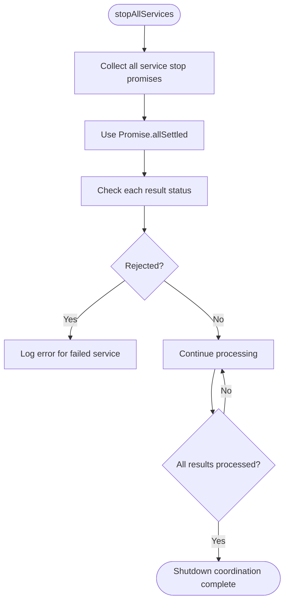
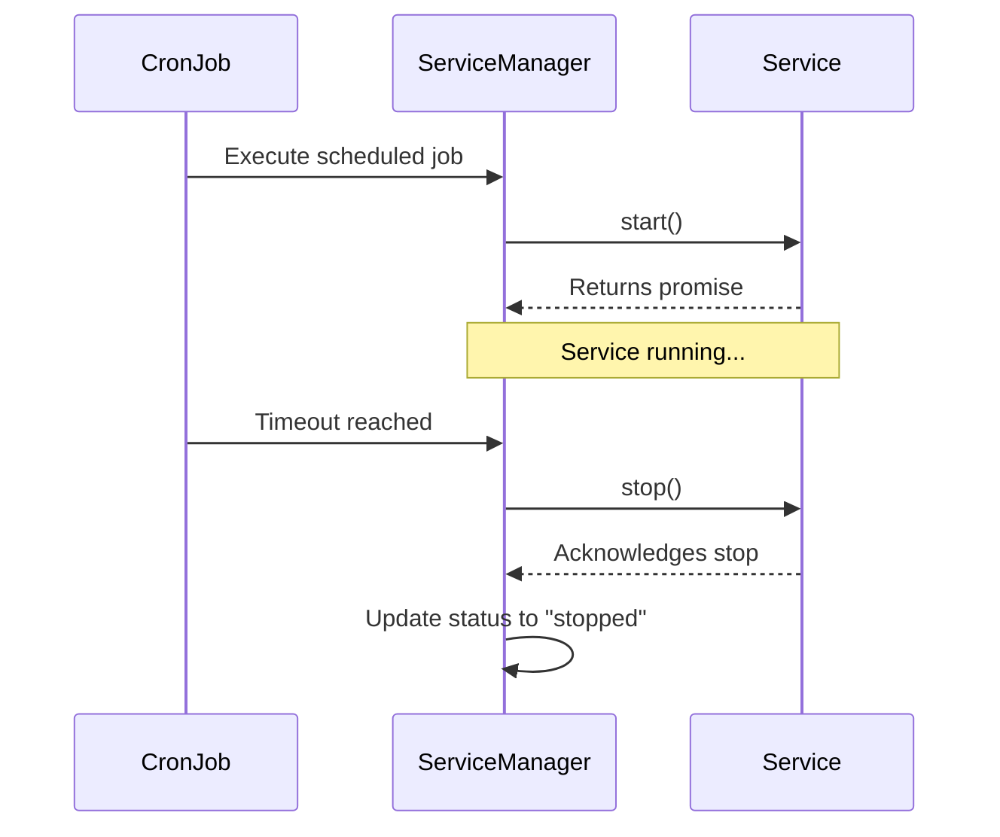
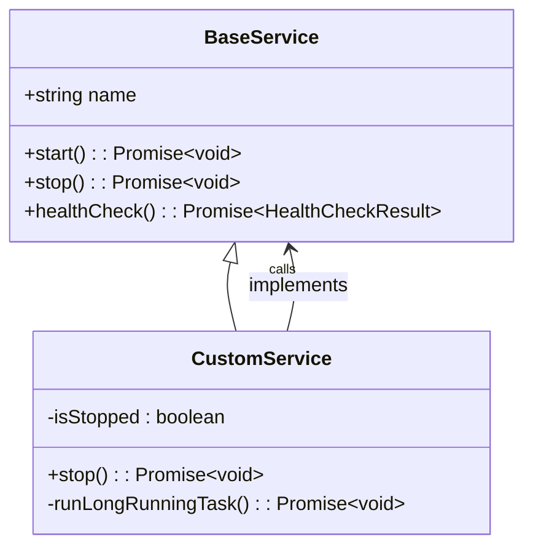

# Auto-Termination Settings

<cite>
**Referenced Files in This Document**   
- [ServiceManager.ts](file://src/ServiceManager.ts)
- [BaseService.ts](file://src/BaseService.ts)
- [interface.ts](file://src/interface.ts)
- [restart-policy.ts](file://examples/restart-policy.ts)
- [worker-failure.ts](file://examples/services/worker-failure.ts)
</cite>

## Table of Contents
1. [Introduction](#introduction)
2. [Service Lifecycle and Status Tracking](#service-lifecycle-and-status-tracking)
3. [Graceful Termination with stopAllServices](#graceful-termination-with-stopallservices)
4. [Handling Pending Promises and Error Resilience](#handling-pending-promises-and-error-resilience)
5. [Cron Job Timeout Configuration](#cron-job-timeout-configuration)
6. [Restart Policies and Termination Interference](#restart-policies-and-termination-interference)
7. [Implementing Clean Shutdown in Custom Services](#implementing-clean-shutdown-in-custom-services)
8. [Troubleshooting Stuck Services](#troubleshooting-stuck-services)
9. [Enforcing Hard Timeouts](#enforcing-hard-timeouts)
10. [Best Practices for Reliable Auto-Termination](#best-practices-for-reliable-auto-termination)

## Introduction
The j8s framework provides a robust service lifecycle management system that ensures reliable and graceful termination of services. This document details the auto-termination behavior, focusing on how the framework coordinates shutdown across multiple services, handles errors during termination, and integrates with configuration options such as cron job timeouts and restart policies. Understanding these mechanisms is essential for building resilient services that can shut down cleanly under various conditions.

## Service Lifecycle and Status Tracking
The j8s framework manages service states through a well-defined status system. Each service transitions through distinct lifecycle phases: `"stopped"`, `"running"`, `"stopping"`, `"crashed"`, or `"unhealthy"`. During shutdown, the `ServiceManager` sets the status to `"stopping"` before invoking the service's `stop()` method, ensuring external observers can detect the shutdown phase. Once termination completes successfully, the status transitions to `"stopped"`.

This state tracking is critical for preventing race conditions and ensuring that restart logic does not interfere with manual termination requests. The managed status overrides any internal status reported by the service itself, providing a consistent view of the system.

**Section sources**
- [interface.ts](file://src/interface.ts#L1-L5)
- [ServiceManager.ts](file://src/ServiceManager.ts#L147-L152)

## Graceful Termination with stopAllServices
The `stopAllServices()` method orchestrates the shutdown of all registered services in a coordinated manner. It iterates over all active services and calls `stopService()` for each one, collecting the resulting promises into an array processed via `Promise.allSettled()`. This approach ensures that even if one service fails to stop, the shutdown process continues for all others.

Using `Promise.allSettled` instead of `Promise.all` prevents a single failing service from halting the entire termination sequence. After all promises settle, the method logs any rejection reasons, allowing operators to identify problematic services without interrupting the overall shutdown flow.

**Diagram sources**
- [ServiceManager.ts](file://src/ServiceManager.ts#L195-L210)

**Section sources**
- [ServiceManager.ts](file://src/ServiceManager.ts#L195-L210)
- [interface.ts](file://src/interface.ts#L41-L41)

## Handling Pending Promises and Error Resilience
During shutdown, the framework ensures that pending operations are properly handled. Each service's `stop()` call is awaited, but failures are caught and logged rather than propagated upward. This error resilience prevents partial shutdowns due to transient issues in individual services.

If a service's `stop()` method throws an error, its status is set to `"crashed"`, but the manager continues terminating other services. This design prioritizes system-wide shutdown over individual service cleanup completeness, aligning with production reliability requirements where timely termination is often more important than perfect cleanup.

**Section sources**
- [ServiceManager.ts](file://src/ServiceManager.ts#L147-L152)

## Cron Job Timeout Configuration
Services configured with cron jobs support a `timeout` option within the `cronJob` configuration. When specified, this timeout enforces a maximum execution duration for each scheduled run. If the service exceeds this limit, the framework automatically invokes `stop()` on the service, transitioning it from `"running"` to `"stopping"` and eventually to `"stopped"`.

This mechanism prevents long-running or stuck cron jobs from consuming resources indefinitely. The timeout is implemented using `setTimeout`, which triggers the service's `stop()` method after the configured delay, ensuring predictable termination behavior.

**Diagram sources**
- [ServiceManager.ts](file://src/ServiceManager.ts#L321-L350)
- [ServiceManager.ts](file://src/ServiceManager.ts#L285-L319)

**Section sources**
- [ServiceManager.ts](file://src/ServiceManager.ts#L321-L350)
- [README.md](file://README.md#L187-L228)

## Restart Policies and Termination Interference
Restart policies such as `"always"`, `"unless-stopped"`, `"on-failure"`, and `"no"` influence post-failure behavior but must not interfere with manual termination. When a user calls `stopService()` or `stopAllServices()`, the framework clears any pending restart timers and stops associated cron jobs, preventing automatic restarts.

However, services with `"always"` or `"unless-stopped"` policies may attempt to restart immediately after a crash unless explicitly stopped. To avoid conflicts, the framework resets the restart count on manual stop and only schedules restarts when failures occur during active operation, not during or after shutdown.

**Section sources**
- [ServiceManager.ts](file://src/ServiceManager.ts#L238-L286)
- [restart-policy.ts](file://examples/restart-policy.ts#L0-L75)

## Implementing Clean Shutdown in Custom Services
Custom services should override the `stop()` method in their implementation to perform cleanup tasks such as closing connections, flushing buffers, or saving state. The base `BaseService` class requires this method to return a `Promise<void>`, enabling asynchronous cleanup.

To ensure responsiveness during shutdown, services should monitor internal flags (e.g., `isStopped`) within long-running loops and exit promptly when signaled. This cooperative cancellation pattern allows services to terminate gracefully without relying solely on timeouts.

**Diagram sources**
- [BaseService.ts](file://src/BaseService.ts#L0-L24)
- [worker-failure.ts](file://examples/services/worker-failure.ts#L0-L69)

**Section sources**
- [BaseService.ts](file://src/BaseService.ts#L0-L24)
- [worker-failure.ts](file://examples/services/worker-failure.ts#L0-L69)

## Troubleshooting Stuck Services
Services may fail to terminate due to unresponsive `stop()` implementations, infinite loops without exit conditions, or unresolved promises. To diagnose such issues:
- Check logs for `"Service X failed to stop"` messages
- Verify that the service's `stop()` method resolves its promise
- Ensure long-running tasks check a termination flag (e.g., `isStopped`)
- Confirm no external dependencies are blocking shutdown

The framework logs rejection reasons from `stop()` calls, aiding in root cause analysis. Services that consistently fail to stop should implement internal timeouts or signal handling.

**Section sources**
- [ServiceManager.ts](file://src/ServiceManager.ts#L147-L152)

## Enforcing Hard Timeouts
While the framework relies on cooperative shutdown via the `stop()` method, hard timeouts can be enforced through configuration. For cron jobs, the `timeout` field ensures automatic termination after a specified duration. For non-cron services, developers can implement similar logic using `setTimeout` within the `start()` method to self-terminate if running too long.

Additionally, external process managers (e.g., Docker, systemd) can apply system-level timeouts to enforce termination if the framework-level mechanisms fail.

**Section sources**
- [ServiceManager.ts](file://src/ServiceManager.ts#L321-L350)

## Best Practices for Reliable Auto-Termination
To ensure reliable auto-termination in production:
- Always implement non-blocking `stop()` methods that resolve promptly
- Use flags to signal termination in long-running loops
- Avoid synchronous operations during shutdown
- Test shutdown behavior under failure conditions
- Configure appropriate cron job timeouts
- Monitor service status during and after shutdown
- Prefer `"on-failure"` or `"no"` restart policies for services requiring manual control

By following these practices, services can achieve predictable and graceful termination, minimizing resource leaks and improving system stability.

**Section sources**
- [ServiceManager.ts](file://src/ServiceManager.ts#L195-L210)
- [BaseService.ts](file://src/BaseService.ts#L0-L24)
- [restart-policy.ts](file://examples/restart-policy.ts#L0-L75)