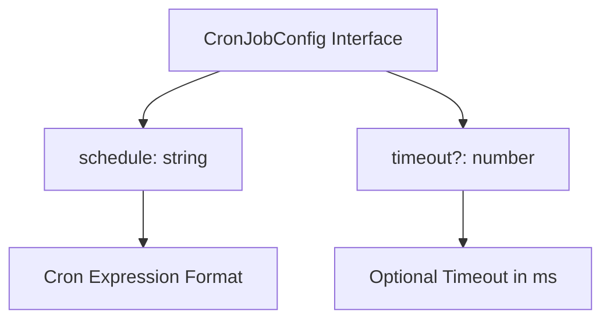
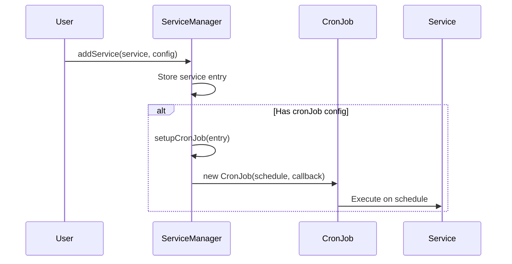
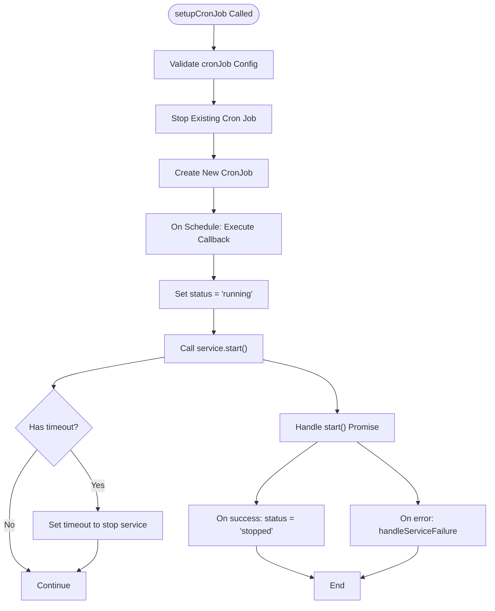

# Cron Scheduling

<cite>
**Referenced Files in This Document**   
- [ServiceManager.ts](file://src/ServiceManager.ts)
- [interface.ts](file://src/interface.ts)
- [demo.ts](file://examples/demo.ts)
- [BaseService.ts](file://src/BaseService.ts)
</cite>

## Table of Contents
1. [Introduction](#introduction)
2. [CronJob Configuration](#cronjob-configuration)
3. [Integration with ServiceManager](#integration-with-servicemanager)
4. [Data Flow in setupCronJob](#data-flow-in-setupcronjob)
5. [Service Execution Patterns](#service-execution-patterns)
6. [Practical Examples from demo.ts](#practical-examples-from-demo.ts)
7. [Common Issues and Solutions](#common-issues-and-solutions)
8. [Performance Tips](#performance-tips)
9. [Conclusion](#conclusion)

## Introduction
The j8s framework provides robust cron-based scheduling capabilities through integration between the `CronJob` class from the `cron` package and the `ServiceManager`. This system enables time-based execution of services using standard cron expressions, with support for optional timeouts and automatic lifecycle management. Services can be configured to run periodically as scheduled tasks while being monitored and managed within the broader service ecosystem.

**Section sources**
- [ServiceManager.ts](file://src/ServiceManager.ts#L0-L61)
- [interface.ts](file://src/interface.ts#L0-L43)

## CronJob Configuration
The `CronJobConfig` interface defines the structure for configuring cron-based service execution. It includes two key properties: `schedule`, which accepts a cron expression string to define the execution pattern, and an optional `timeout` parameter specified in milliseconds that automatically stops the service after the given duration.



**Diagram sources**
- [interface.ts](file://src/interface.ts#L35-L38)

**Section sources**
- [interface.ts](file://src/interface.ts#L35-L38)

## Integration with ServiceManager
The `ServiceManager` class integrates cron functionality by processing the `cronJob` property in the `ServiceConfig` object during service registration via `addService`. When a service is added with a cron configuration, the `setupCronJob` method is invoked to create and manage the corresponding `CronJob` instance. This integration allows services to be automatically triggered at scheduled intervals while maintaining consistent state management and error handling across all services.



**Diagram sources**
- [ServiceManager.ts](file://src/ServiceManager.ts#L0-L61)
- [ServiceManager.ts](file://src/ServiceManager.ts#L285-L350)

**Section sources**
- [ServiceManager.ts](file://src/ServiceManager.ts#L0-L61)
- [ServiceManager.ts](file://src/ServiceManager.ts#L285-L350)

## Data Flow in setupCronJob
The `setupCronJob` method orchestrates the creation and management of cron-triggered services. It first validates the presence of a `cronJob` configuration, then cleans up any existing cron job for the service before creating a new one. The cron job's callback function sets the service status to "running", invokes the service's `start` method, and optionally sets up a timeout to automatically stop the service. Error handling ensures proper status updates in case of failures during execution.



**Diagram sources**
- [ServiceManager.ts](file://src/ServiceManager.ts#L285-L350)

**Section sources**
- [ServiceManager.ts](file://src/ServiceManager.ts#L285-L350)

## Service Execution Patterns
j8s distinguishes between one-off services triggered by cron and long-running services. Cron-triggered services are typically short-lived tasks that execute their logic and complete, while long-running services maintain continuous operation until explicitly stopped. The framework handles both patterns through the same interface, with cron jobs effectively creating periodic one-off executions of services. The timeout mechanism provides a safety net for services that might otherwise run indefinitely.

**Section sources**
- [ServiceManager.ts](file://src/ServiceManager.ts#L285-L350)
- [BaseService.ts](file://src/BaseService.ts#L0-L25)

## Practical Examples from demo.ts
The `demo.ts` file demonstrates several practical cron scheduling scenarios. These include a backup service running hourly (`0 0 * * * *`), a metrics collection service executing every 15 seconds (`*/15 * * * * *`), and a notification service operating every 5 minutes during business hours on weekdays (`0 */5 9-17 * * 1-5`). Each example includes appropriate timeout values to prevent runaway executions, showcasing real-world configuration patterns for different service types and frequencies.

```mermaid
erDiagram
SERVICE ||--o{ CRON_CONFIG : has
CRON_CONFIG {
string schedule
number timeout
}
SERVICE {
string name
string description
}
SERVICE }|--|{ BACKUP : example
SERVICE }|--|{ METRICS : example
SERVICE }|--|{ NOTIFICATION : example
BACKUP {
string "backup-service"
string "Daily backup"
}
METRICS {
string "metrics-service"
string "Collect metrics"
}
NOTIFICATION {
string "notification-service"
string "Send notifications"
}
```

**Diagram sources**
- [demo.ts](file://examples/demo.ts#L104-L147)

**Section sources**
- [demo.ts](file://examples/demo.ts#L104-L147)

## Common Issues and Solutions
Common challenges in cron-based scheduling include overlapping executions, timezone handling, and missed jobs. The j8s implementation uses the system timezone by default (timezone parameter set to undefined), which ensures consistency with the host environment. Overlapping executions are prevented by the framework's state management - subsequent triggers will still fire but execute against the same service instance. Missed jobs due to system downtime are not recovered upon restart, following standard cron behavior. For critical tasks, consider implementing idempotent operations and external monitoring.

**Section sources**
- [ServiceManager.ts](file://src/ServiceManager.ts#L345-L350)
- [demo.ts](file://examples/demo.ts#L104-L147)

## Performance Tips
For high-frequency cron jobs, consider the following performance optimizations: use minimal timeout values appropriate to the task duration, ensure service startup is lightweight, and avoid blocking operations in the main thread. Monitor resource usage through the health check system and consider distributing high-frequency tasks across multiple service instances when necessary. The exponential backoff restart mechanism helps prevent resource exhaustion during failure conditions, but setting appropriate `maxRetries` limits is crucial for production stability.

**Section sources**
- [ServiceManager.ts](file://src/ServiceManager.ts#L238-L286)
- [interface.ts](file://src/interface.ts#L28-L32)

## Conclusion
The j8s cron scheduling system provides a flexible and reliable mechanism for time-based service execution. By integrating the established `cron` package with the `ServiceManager`, it offers a robust solution for periodic task automation with proper lifecycle management, error handling, and monitoring capabilities. The configuration interface is simple yet powerful, allowing precise control over execution patterns while maintaining consistency with the overall service architecture.