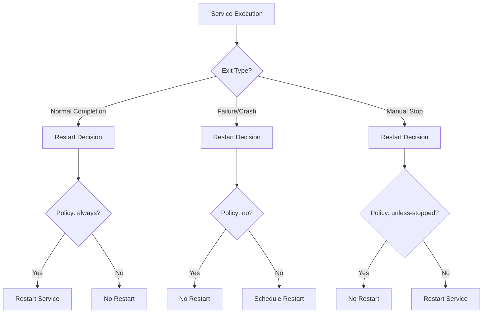
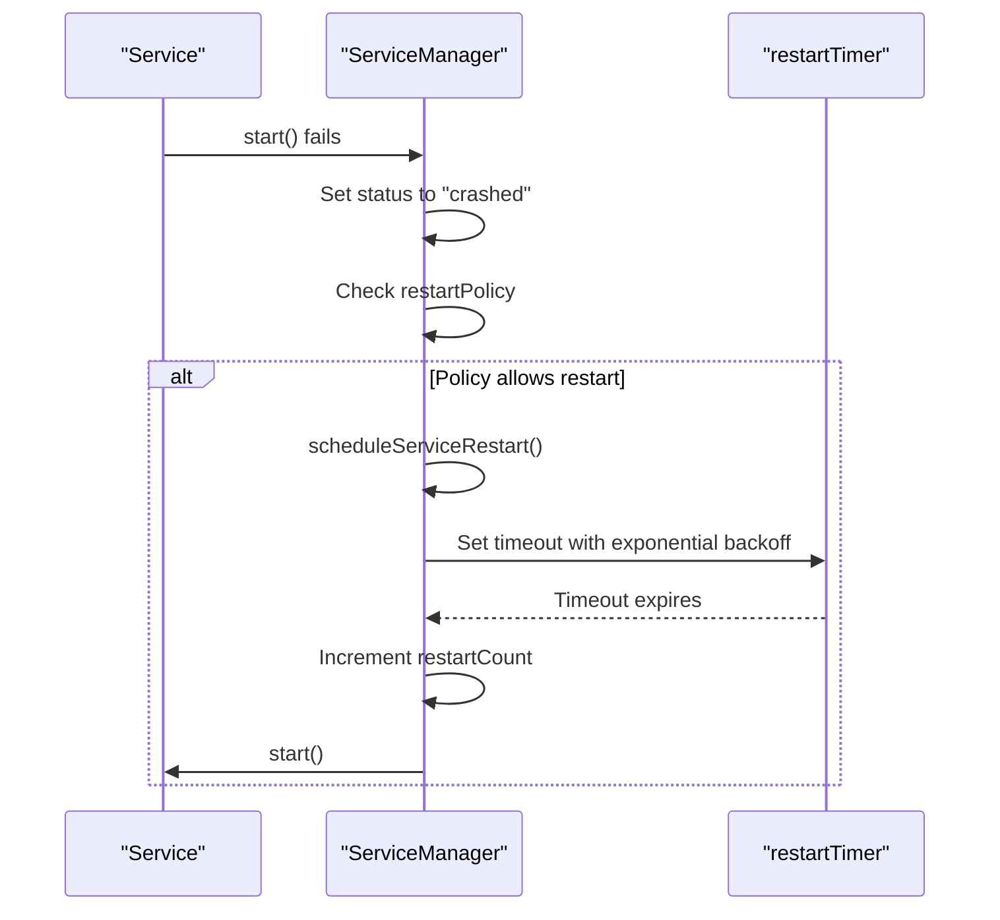
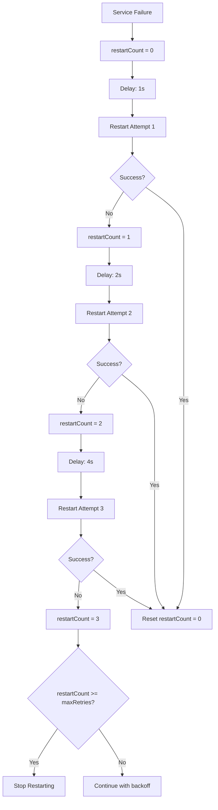
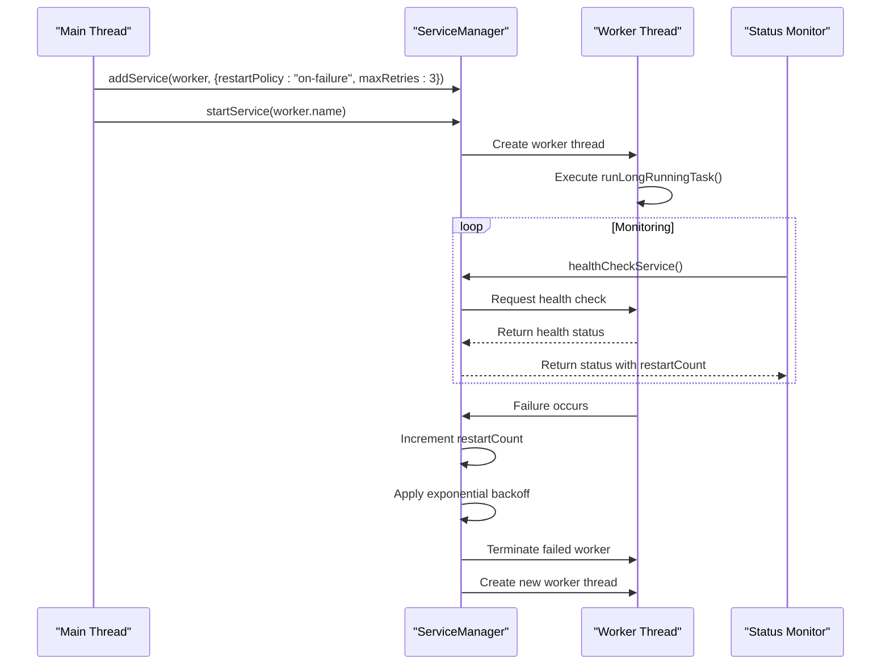

# Restart Policies

<cite>
**Referenced Files in This Document**  
- [ServiceManager.ts](file://src/ServiceManager.ts)
- [interface.ts](file://src/interface.ts)
- [worker-restart-policy.ts](file://examples/worker-restart-policy.ts)
- [restart-policy.ts](file://examples/restart-policy.ts)
- [worker-failure.ts](file://examples/services/worker-failure.ts)
</cite>

## Table of Contents
1. [Introduction](#introduction)
2. [Restart Policy Types](#restart-policy-types)
3. [ServiceManager Restart Mechanism](#servicemanager-restart-mechanism)
4. [On-Failure Policy Implementation](#on-failure-policy-implementation)
5. [Worker-Specific Restart Behavior](#worker-specific-restart-behavior)
6. [Status Transitions and Internal State](#status-transitions-and-internal-state)
7. [Common Issues and Mitigation Strategies](#common-issues-and-mitigation-strategies)
8. [Performance Considerations](#performance-considerations)

## Introduction

The j8s framework provides a robust service management system with configurable restart policies that determine how services behave when they fail or terminate. These policies are implemented in the ServiceManager class and allow fine-grained control over service lifecycle management. The restart mechanism is designed to handle both transient failures and persistent issues while preventing system instability from excessive restart attempts.

**Section sources**
- [ServiceManager.ts](file://src/ServiceManager.ts#L0-L50)
- [interface.ts](file://src/interface.ts#L0-L10)

## Restart Policy Types

The j8s framework supports four distinct restart policies that can be configured for each service:

### Always
The "always" policy ensures that a service is restarted regardless of how it exits. This policy is ideal for critical services that must remain available at all times. When a service configured with this policy terminates for any reason—whether through normal completion, error, or manual stop—it will be automatically restarted by the ServiceManager.

### Unless-Stopped
The "unless-stopped" policy restarts a service after any failure or unexpected termination, but respects explicit stop commands. If a service is manually stopped via the stopService method, it will not be restarted even if the process continues running. However, if the service crashes or fails during execution, it will be restarted according to the standard restart procedure.

### On-Failure
The "on-failure" policy only triggers restarts when a service fails during execution. This policy includes built-in safeguards such as maximum retry limits and exponential backoff to prevent infinite restart loops. It is particularly suitable for services that perform discrete tasks where repeated failures may indicate a systemic issue that requires intervention.

### No
The "no" policy disables automatic restarts entirely. When a service fails or terminates, it remains in its final state without intervention from the ServiceManager. This policy is appropriate for one-time tasks or services where failure should be investigated before attempting restart.

**Diagram sources**
- [interface.ts](file://src/interface.ts#L5-L8)
- [ServiceManager.ts](file://src/ServiceManager.ts#L104-L152)

**Section sources**
- [interface.ts](file://src/interface.ts#L5-L8)
- [ServiceManager.ts](file://src/ServiceManager.ts#L104-L152)

## ServiceManager Restart Mechanism

The ServiceManager class implements the core restart functionality through a combination of state tracking, timer-based scheduling, and policy enforcement. Each service managed by ServiceManager maintains internal state including status, restart count, and optional restart timers.

When a service fails during execution, the ServiceManager catches the error and updates the service status to "crashed". It then evaluates the configured restart policy to determine whether a restart should be attempted. The restart decision is made in the startService method, which handles both initial startup and subsequent restart attempts.

The restart process involves clearing any existing restart timers, updating the service status to "running", and invoking the service's start method asynchronously. If the service fails immediately upon startup, this is detected by a short delay check that verifies the service remains in the "running" state.

**Diagram sources**
- [ServiceManager.ts](file://src/ServiceManager.ts#L104-L152)
- [ServiceManager.ts](file://src/ServiceManager.ts#L238-L286)

**Section sources**
- [ServiceManager.ts](file://src/ServiceManager.ts#L104-L152)
- [ServiceManager.ts](file://src/ServiceManager.ts#L238-L286)

## On-Failure Policy Implementation

The "on-failure" restart policy implements sophisticated failure handling with exponential backoff and maximum retry limits to prevent system overload from repeated restart attempts.

### Exponential Backoff Algorithm

The exponential backoff mechanism calculates delay intervals using the formula: `baseDelay * 2^restartCount`, with a maximum cap to prevent excessively long waits. The implementation uses a base delay of 1,000 milliseconds (1 second) and a maximum delay of 30,000 milliseconds (30 seconds). This creates a progressive delay pattern: 1s, 2s, 4s, 8s, 16s, 30s, 30s, etc.

The backoff algorithm is implemented in the scheduleServiceRestart method, which calculates the appropriate delay based on the current restart count before setting a timeout for the next restart attempt.

### Maximum Retry Limits

The on-failure policy respects the maxRetries configuration parameter, which defaults to 3 if not specified. Before scheduling a restart, the ServiceManager checks whether the current restartCount has reached or exceeded the maxRetries limit. If the limit has been reached, the restart is canceled, and the service remains in the "crashed" state.

This safeguard prevents infinite restart loops when a service has a fundamental issue that cannot be resolved through repeated attempts. Once the maximum retry count is reached, manual intervention is required to address the underlying problem.

### Restart Count Tracking and Reset

The restartCount is maintained as part of the ServiceEntry object in the serviceMap. It is incremented each time a restart timer expires and a new restart attempt begins. The counter is reset to zero under three conditions:
1. When a service starts successfully and runs past the initial startup verification period
2. When a service is manually stopped through the stopService method
3. When a service completes its task naturally without failure

This tracking mechanism ensures that transient issues are handled appropriately while preventing the counter from accumulating across unrelated failure events.

**Diagram sources**
- [ServiceManager.ts](file://src/ServiceManager.ts#L192-L236)
- [ServiceManager.ts](file://src/ServiceManager.ts#L238-L286)

**Section sources**
- [ServiceManager.ts](file://src/ServiceManager.ts#L192-L236)
- [ServiceManager.ts](file://src/ServiceManager.ts#L238-L286)

## Worker-Specific Restart Behavior

Worker services in j8s exhibit specialized restart behavior that is demonstrated in the worker-restart-policy.ts example. Worker services are created using the createWorkerService function and run in separate worker threads, which introduces additional considerations for failure detection and restart management.

The worker-restart-policy.ts example configures a worker service with the "on-failure" policy and a maximum of 3 retries. The example includes monitoring code that periodically checks the service health and logs the current status along with the restart count obtained from the ServiceManager's internal serviceMap.

When the worker service fails, the ServiceManager detects the failure through the worker's health check mechanism and initiates the restart process according to the configured policy. The restart involves terminating the existing worker thread and creating a new one with the same configuration.

The example demonstrates how to monitor the restart process by accessing the restartCount directly from the ServiceManager's internal state. This allows applications to implement custom logic based on the restart history, such as alerting when a service approaches its maximum retry limit or automatically scaling resources in response to persistent failures.

**Diagram sources**
- [worker-restart-policy.ts](file://examples/worker-restart-policy.ts#L0-L56)
- [worker-failure.ts](file://examples/services/worker-failure.ts#L0-L68)

**Section sources**
- [worker-restart-policy.ts](file://examples/worker-restart-policy.ts#L0-L56)
- [worker-failure.ts](file://examples/services/worker-failure.ts#L0-L68)

## Status Transitions and Internal State

The ServiceManager maintains comprehensive internal state for each managed service, tracking both operational status and restart-related metrics. Understanding these state transitions is crucial for diagnosing service behavior and troubleshooting issues.

### Status Lifecycle

Services transition through several states during their lifecycle:
- **stopped**: Initial state when a service is added or after successful completion
- **running**: Active state when a service is executing
- **stopping**: Transitional state during graceful shutdown
- **crashed**: State indicating a failure during execution
- **unhealthy**: State for services that fail health checks but haven't crashed

The ServiceManager overrides the status reported by individual services with its own managed status, ensuring consistency in how service health is reported across the system.

### Internal State Management

Each service entry in the ServiceManager maintains the following state properties:
- **restartCount**: Number of restart attempts for the current failure sequence
- **restartTimer**: Reference to the Node.js Timeout object for scheduled restarts
- **status**: Current operational status of the service
- **runningPromise**: Promise representing the current execution of the service's start method

The restartTimer is particularly important as it prevents multiple concurrent restart attempts and enables the exponential backoff mechanism. When a new restart is scheduled, any existing timer is cleared to prevent race conditions.

State transitions occur in response to specific events:
- Service start → status changes from "stopped" to "running"
- Service completion → status changes from "running" to "stopped"
- Service failure → status changes from "running" to "crashed"
- Manual stop → status changes from "running" to "stopping", then to "stopped"
- Restart scheduling → restartTimer is set with calculated delay
- Restart execution → restartCount is incremented, status changes to "running"

**Section sources**
- [ServiceManager.ts](file://src/ServiceManager.ts#L0-L61)
- [interface.ts](file://src/interface.ts#L1-L4)

## Common Issues and Mitigation Strategies

### Infinite Restart Loops

The "always" restart policy can lead to infinite restart loops when a service has a fundamental issue that prevents successful execution. This can consume system resources and make the service unavailable for extended periods.

**Mitigation Strategies:**
- Implement circuit breaker patterns that temporarily disable restarts after repeated failures
- Use the "on-failure" policy with appropriate maxRetries limits instead of "always"
- Implement health checks that prevent restarts when underlying dependencies are unavailable
- Add startup probes that verify prerequisites before allowing restart attempts

### Resource Exhaustion

High-frequency restarts, especially with short intervals, can lead to resource exhaustion including memory leaks, file descriptor limits, and CPU saturation.

**Mitigation Strategies:**
- Configure appropriate exponential backoff parameters to space out restart attempts
- Implement resource cleanup in the stop method to release allocated resources
- Monitor system resource usage and adjust restart policies accordingly
- Use process supervisors to limit the total number of restarts over time

### State Corruption

Frequent restarts can lead to state corruption, particularly when services manage persistent data or maintain connections to external systems.

**Mitigation Strategies:**
- Implement idempotent operations that can be safely retried
- Use transactional patterns to ensure data consistency
- Implement proper shutdown procedures that save state before termination
- Use external state management rather than in-memory state when possible

## Performance Considerations

### High-Frequency Restart Impact

Services configured with aggressive restart policies can significantly impact system performance, particularly in resource-constrained environments. Each restart involves:
- Process or thread creation overhead
- Initialization costs for the service and its dependencies
- Potential network connection establishment
- Memory allocation and garbage collection pressure

The exponential backoff mechanism helps mitigate these impacts by progressively increasing the interval between restart attempts, allowing the system time to stabilize and resources to be reclaimed.

### Resource-Constrained Environments

In environments with limited CPU, memory, or I/O capacity, restart policies should be configured conservatively:
- Increase baseDelay values to reduce restart frequency
- Lower maxRetries limits to prevent prolonged recovery attempts
- Implement health checks that consider system resource availability
- Use conditional restarts based on system load metrics

### Monitoring and Alerting

Effective monitoring is essential for maintaining system stability with restart policies:
- Track restartCount metrics to identify services with persistent issues
- Monitor the frequency and timing of restart attempts
- Implement alerts when services approach their maximum retry limits
- Log restart events with sufficient context for troubleshooting

The combination of appropriate restart policies, exponential backoff, and maximum retry limits provides a balanced approach to service recovery that maximizes availability while protecting system stability.