# Architecture

<cite>
**Referenced Files in This Document**   
- [BaseService.ts](file://src/BaseService.ts)
- [ServiceManager.ts](file://src/ServiceManager.ts)
- [WorkerService.ts](file://src/WorkerService.ts)
- [api.ts](file://src/api.ts)
- [interface.ts](file://src/interface.ts)
- [expose.ts](file://src/expose.ts)
- [index.ts](file://index.ts)
- [README.md](file://README.md)
</cite>

## Table of Contents
1. [Introduction](#introduction)
2. [Core Architectural Patterns](#core-architectural-patterns)
3. [Component Interactions and Data Flows](#component-interactions-and-data-flows)
4. [System Context and Process Model](#system-context-and-process-model)
5. [External Integration and API Layer](#external-integration-and-api-layer)
6. [Technical Decision Analysis](#technical-decision-analysis)
7. [Scalability and Deployment Considerations](#scalability-and-deployment-considerations)
8. [Cross-Cutting Concerns](#cross-cutting-concerns)
9. [Conclusion](#conclusion)

## Introduction

The j8s framework is a lightweight service orchestration layer designed for JavaScript/TypeScript applications. It enables the management of multiple services within a single process using worker threads, providing a unified interface for service lifecycle management, health monitoring, and remote control. The architecture is built around pluggable execution models that support both main-thread and worker-thread service execution, with configurable restart policies and cron-based scheduling. This document details the high-level design, key architectural patterns, component interactions, and technical decisions that define the framework's capabilities and constraints.

## Core Architectural Patterns

The j8s framework implements several well-known design patterns to achieve its service orchestration goals, creating a flexible and maintainable architecture.

### Abstract Factory Pattern (BaseService)

The BaseService class serves as an abstract factory for service implementations, providing a common interface and lifecycle management foundation. All services, whether running in the main thread or worker threads, extend this base class to ensure consistent behavior and interface compliance.

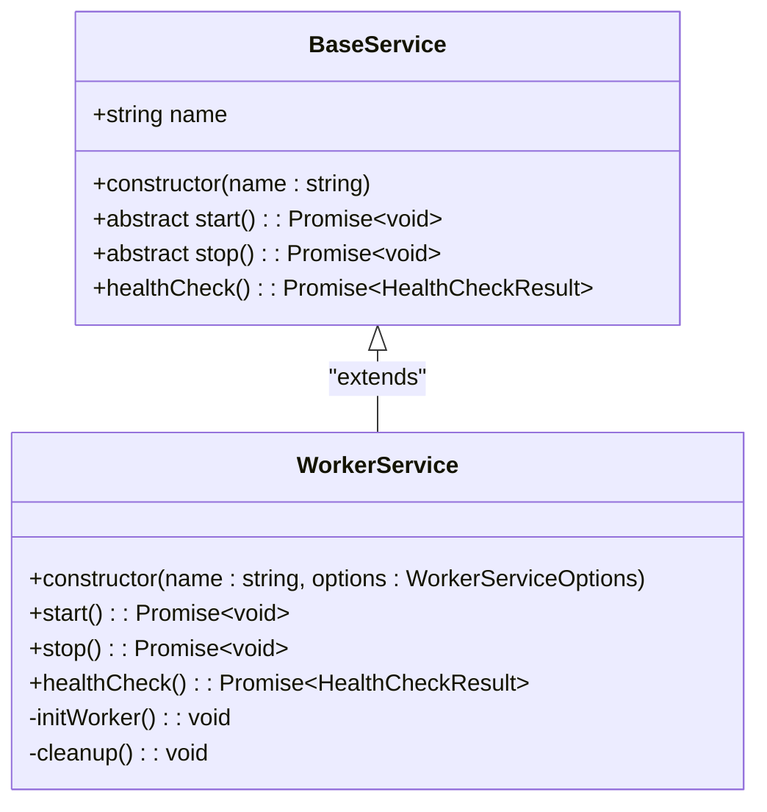

**Diagram sources**
- [BaseService.ts](file://src/BaseService.ts#L1-L25)
- [WorkerService.ts](file://src/WorkerService.ts#L36-L193)

**Section sources**
- [BaseService.ts](file://src/BaseService.ts#L1-L25)
- [WorkerService.ts](file://src/WorkerService.ts#L36-L193)

### Command Pattern (Lifecycle Methods)

The framework implements the Command Pattern through standardized lifecycle methods (start, stop, healthCheck) that encapsulate service operations as executable commands. This pattern enables consistent service control regardless of the underlying implementation, allowing the ServiceManager to invoke these commands uniformly across all registered services.

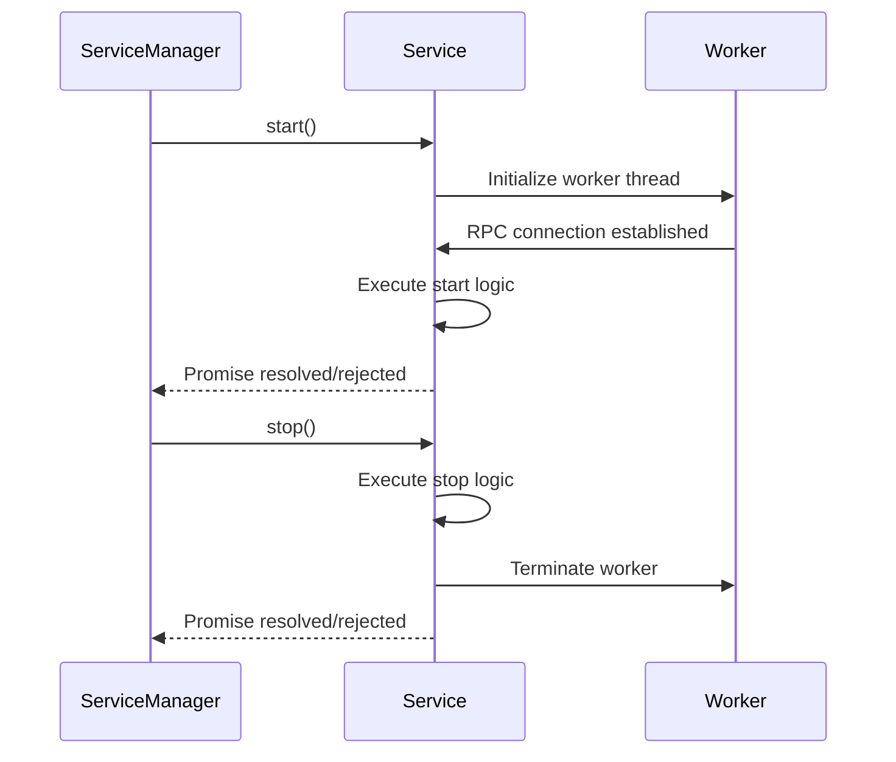

**Diagram sources**
- [ServiceManager.ts](file://src/ServiceManager.ts#L70-L200)
- [WorkerService.ts](file://src/WorkerService.ts#L114-L170)

**Section sources**
- [ServiceManager.ts](file://src/ServiceManager.ts#L70-L200)
- [WorkerService.ts](file://src/WorkerService.ts#L114-L170)

### Observer Pattern (Health Monitoring)

The framework employs the Observer Pattern for health monitoring, where the ServiceManager acts as the subject that maintains a collection of services (observers) and periodically checks their health status. Services expose their health information through the healthCheck method, which the ServiceManager aggregates and manages.

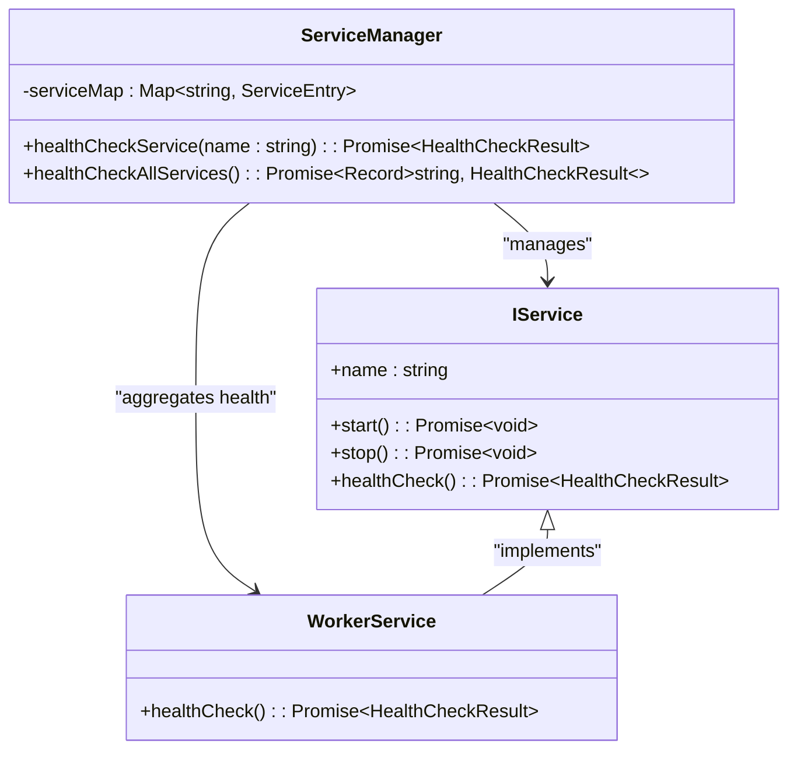

**Diagram sources**
- [ServiceManager.ts](file://src/ServiceManager.ts#L240-L270)
- [interface.ts](file://src/interface.ts#L20-L25)
- [WorkerService.ts](file://src/WorkerService.ts#L172-L193)

**Section sources**
- [ServiceManager.ts](file://src/ServiceManager.ts#L240-L270)
- [interface.ts](file://src/interface.ts#L20-L25)

### Strategy Pattern (Restart Policies)

The framework implements the Strategy Pattern for restart policies, allowing different restart behaviors to be injected as configuration rather than hard-coded logic. The ServiceManager applies the appropriate restart strategy based on the service configuration, supporting policies such as 'always', 'unless-stopped', 'on-failure', and 'no'.

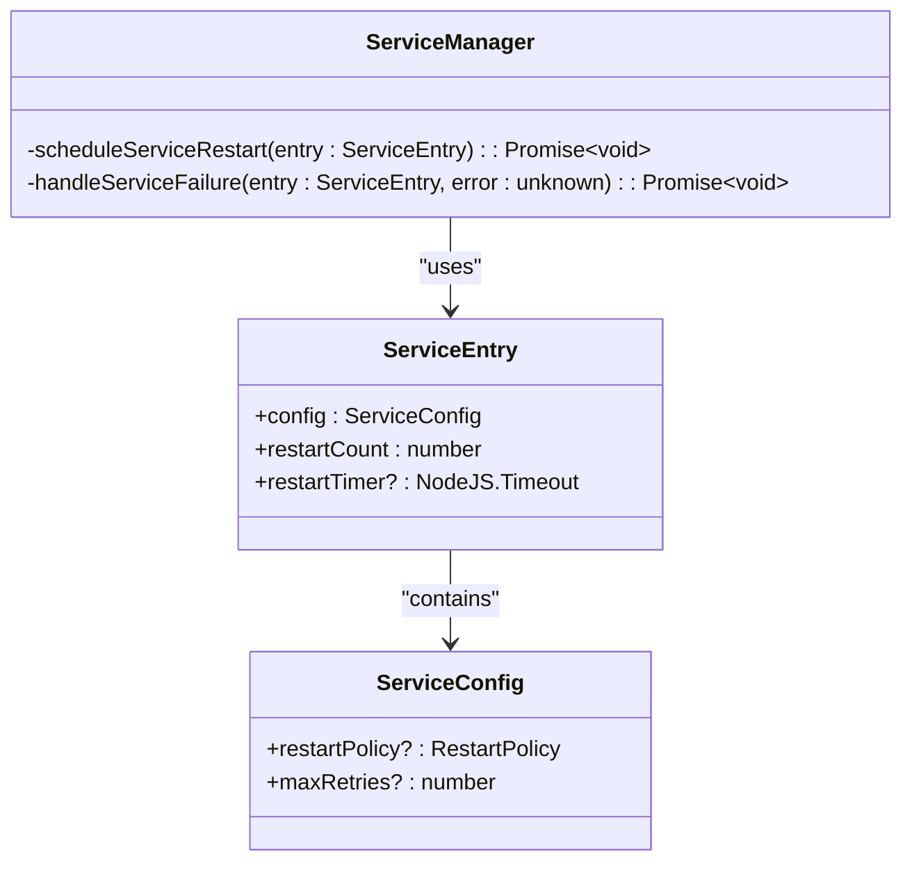

**Diagram sources**
- [ServiceManager.ts](file://src/ServiceManager.ts#L272-L351)
- [interface.ts](file://src/interface.ts#L35-L40)

**Section sources**
- [ServiceManager.ts](file://src/ServiceManager.ts#L272-L351)
- [interface.ts](file://src/interface.ts#L35-L40)

### Singleton-like ServiceManager

The ServiceManager class functions as a singleton-like container that manages all services within the application. It maintains a central registry of services and coordinates their lifecycle, health checks, and restart policies. While not enforcing strict singleton semantics, it is designed to be instantiated once per application context.

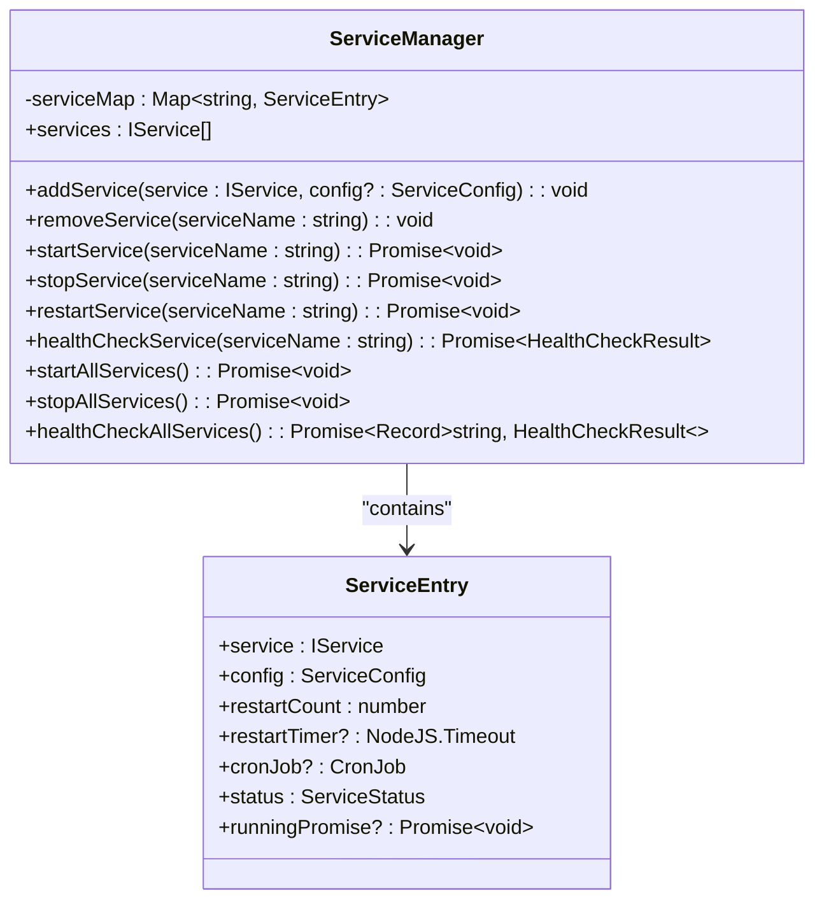

**Diagram sources**
- [ServiceManager.ts](file://src/ServiceManager.ts#L1-L351)
- [interface.ts](file://src/interface.ts#L42-L58)

**Section sources**
- [ServiceManager.ts](file://src/ServiceManager.ts#L1-L351)
- [interface.ts](file://src/interface.ts#L42-L58)

## Component Interactions and Data Flows

The j8s framework orchestrates complex interactions between components to manage service lifecycles, health monitoring, and communication across thread boundaries.

### Service Lifecycle Management

The ServiceManager coordinates the complete lifecycle of services, from registration to termination. When a service is added, it is registered with its configuration, and the ServiceManager sets up appropriate monitoring and restart policies.

```mermaid
flowchart TD
A["addService(service, config)"] --> B{Validate service name}
B --> |Exists| C[Throw Error]
B --> |New| D[Create ServiceEntry]
D --> E{Has cronJob?}
E --> |Yes| F[Setup CronJob]
E --> |No| G[Store in serviceMap]
F --> G
G --> H[Service registered]
I["startService(name)"] --> J{Service exists?}
J --> |No| K[Throw Error]
J --> |Yes| L[Clear restart timer]
L --> M[Set status to running]
M --> N[Call service.start()]
N --> O[Handle promise asynchronously]
O --> P{Success?}
P --> |Yes| Q[Update status to stopped]
P --> |No| R[Handle failure based on policy]
R --> S[scheduleServiceRestart()]
```

**Diagram sources**
- [ServiceManager.ts](file://src/ServiceManager.ts#L30-L200)

**Section sources**
- [ServiceManager.ts](file://src/ServiceManager.ts#L30-L200)

### Worker Thread Communication

The framework uses the @kunkun/kkrpc library to establish bidirectional communication between the main thread and worker threads. This RPC mechanism enables method calls and data exchange across thread boundaries while maintaining isolation.

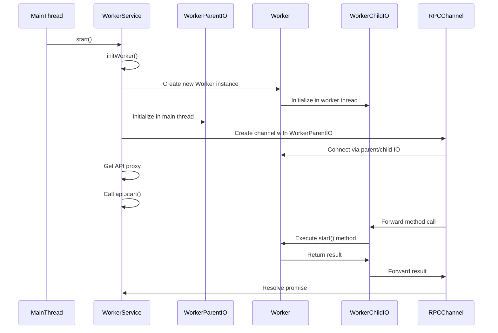

**Diagram sources**
- [WorkerService.ts](file://src/WorkerService.ts#L34-L117)
- [expose.ts](file://src/expose.ts#L1-L54)

**Section sources**
- [WorkerService.ts](file://src/WorkerService.ts#L34-L117)
- [expose.ts](file://src/expose.ts#L1-L54)

### Health Check Propagation

Health checks flow from individual services to the ServiceManager, which aggregates and manages the overall health status. For worker services, health checks are proxied through the RPC channel to the actual worker implementation.

```mermaid
flowchart TD
A["healthCheckService(name)"] --> B{Service exists?}
B --> |No| C[Throw Error]
B --> |Yes| D{Is WorkerService?}
D --> |Yes| E[Call api.healthCheck()]
D --> |No| F[Call service.healthCheck()]
E --> G[RPC forwards to worker]
G --> H[Worker executes healthCheck()]
H --> I[Return health result]
I --> J[RPC forwards result to main thread]
J --> K[Override status with managed status]
K --> L[Return final health result]
F --> K
```

**Diagram sources**
- [ServiceManager.ts](file://src/ServiceManager.ts#L240-L270)
- [WorkerService.ts](file://src/WorkerService.ts#L172-L193)

**Section sources**
- [ServiceManager.ts](file://src/ServiceManager.ts#L240-L270)
- [WorkerService.ts](file://src/WorkerService.ts#L172-L193)

## System Context and Process Model

The j8s framework operates within a Node.js process, managing multiple services that can run in either the main thread or dedicated worker threads.

```mermaid
graph TB
subgraph "Main Process"
SM[ServiceManager]
MT[Main Thread Services]
WT[Worker Threads]
API[REST API Server]
end
subgraph "Worker Thread 1"
W1[Worker Service 1]
W1IO[WorkerChildIO]
W1RPC[RPCChannel]
end
subgraph "Worker Thread 2"
W2[Worker Service 2]
W2IO[WorkerChildIO]
W2RPC[RPCChannel]
end
SM --> MT : "manages"
SM --> WT : "creates/manages"
SM --> API : "provides data"
WT --> W1 : "hosts"
WT --> W2 : "hosts"
W1 --> W1IO : "uses"
W1IO --> W1RPC : "uses"
W1RPC --> SM : "communicates via"
W2 --> W2IO : "uses"
W2IO --> W2RPC : "uses"
W2RPC --> SM : "communicates via"
API --> SM : "queries"
```

**Diagram sources**
- [ServiceManager.ts](file://src/ServiceManager.ts#L1-L351)
- [WorkerService.ts](file://src/WorkerService.ts#L1-L193)
- [api.ts](file://src/api.ts#L1-L498)

**Section sources**
- [ServiceManager.ts](file://src/ServiceManager.ts#L1-L351)
- [WorkerService.ts](file://src/WorkerService.ts#L1-L193)

## External Integration and API Layer

The framework provides a REST API interface using Hono, enabling external systems to manage services programmatically.

### API Endpoint Structure

The REST API exposes a comprehensive set of endpoints for service management, following RESTful conventions with proper HTTP methods and status codes.

```mermaid
flowchart TD
A[Client] --> B[API Gateway]
B --> C["GET /api/services"]
B --> D["GET /api/services/:name"]
B --> E["GET /api/services/:name/health"]
B --> F["POST /api/services/:name/start"]
B --> G["POST /api/services/:name/stop"]
B --> H["POST /api/services/:name/restart"]
B --> I["DELETE /api/services/:name"]
B --> J["GET /api/health"]
B --> K["POST /api/services/start-all"]
B --> L["POST /api/services/stop-all"]
C --> M[ServiceManager.services]
D --> N[ServiceManager.getService()]
E --> O[ServiceManager.healthCheckService()]
F --> P[ServiceManager.startService()]
G --> Q[ServiceManager.stopService()]
H --> R[ServiceManager.restartService()]
I --> S[ServiceManager.removeService()]
J --> T[ServiceManager.healthCheckAllServices()]
K --> U[ServiceManager.startAllServices()]
L --> V[ServiceManager.stopAllServices()]
M --> B
N --> B
O --> B
P --> B
Q --> B
R --> B
S --> B
T --> B
U --> B
V --> B
```

**Diagram sources**
- [api.ts](file://src/api.ts#L1-L498)
- [ServiceManager.ts](file://src/ServiceManager.ts#L1-L351)

**Section sources**
- [api.ts](file://src/api.ts#L1-L498)

### API Request Validation and Documentation

The API includes comprehensive request validation using valibot and automatic OpenAPI/Swagger documentation generation, ensuring type safety and discoverability.

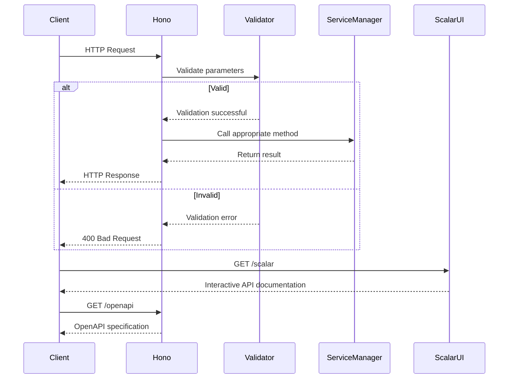

**Diagram sources**
- [api.ts](file://src/api.ts#L1-L498)

**Section sources**
- [api.ts](file://src/api.ts#L1-L498)

## Technical Decision Analysis

The j8s framework makes several key technical decisions that balance complexity, performance, and developer experience.

### RPC Communication with @kunkun/kkrpc

The choice of @kunkun/kkrpc for worker communication provides a robust RPC layer that abstracts the complexities of Node.js worker threads. This library handles serialization, error propagation, and connection management, allowing the framework to focus on service orchestration rather than communication infrastructure.

**Advantages:**
- Simplified bidirectional communication between main and worker threads
- Automatic serialization of complex data types
- Built-in error handling and propagation
- Type safety through TypeScript generics

**Trade-offs:**
- Additional dependency increases bundle size
- Abstraction may hide low-level performance characteristics
- Limited control over underlying message passing mechanisms

### REST API with Hono

The selection of Hono as the REST framework provides a lightweight, fast, and standards-compliant API layer with excellent TypeScript support.

**Advantages:**
- Minimal overhead and high performance
- Built-in support for OpenAPI/Swagger documentation
- Comprehensive middleware ecosystem
- Strong TypeScript integration with valibot validation

**Trade-offs:**
- Smaller community compared to Express.js
- Fewer third-party integrations
- Rapid development may introduce breaking changes

### Pluggable Execution Models

The framework supports multiple execution models (main thread, worker thread, cron jobs) through a pluggable architecture that allows services to be configured with different execution characteristics.

**Advantages:**
- Flexibility to choose appropriate execution model for each service
- Isolation of resource-intensive tasks in worker threads
- Support for scheduled tasks through cron integration
- Consistent interface across different execution models

**Trade-offs:**
- Increased complexity in service management logic
- Higher memory overhead for worker threads
- Potential debugging challenges across thread boundaries

## Scalability and Deployment Considerations

The j8s framework is designed to manage hundreds of services within a single process, with considerations for performance, resource usage, and deployment flexibility.

### Scalability Characteristics

The framework's architecture supports horizontal scaling of services within a single process, with performance characteristics that depend on the service types and execution models.

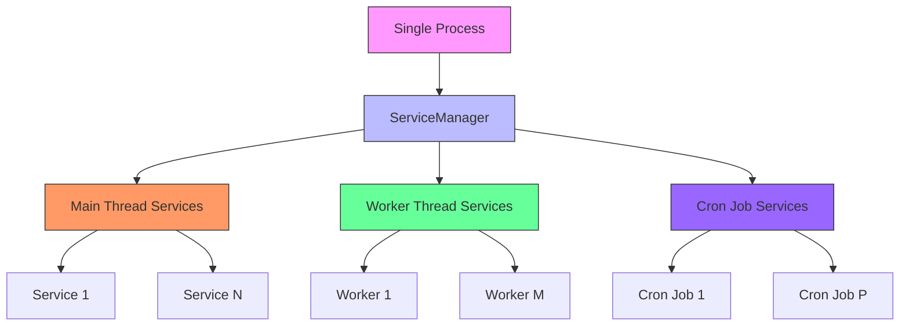

**Scalability Factors:**
- **Main Thread Services**: Limited by event loop performance; suitable for lightweight, I/O-bound tasks
- **Worker Thread Services**: Limited by system resources (CPU, memory); suitable for CPU-intensive tasks
- **Cron Job Services**: Limited by scheduling precision and overlap; suitable for periodic maintenance tasks

### Deployment Topology Options

The framework supports multiple deployment topologies to accommodate different operational requirements.

**Single Process Deployment:**
- All services run in a single Node.js process
- Simple deployment and monitoring
- Shared memory space and resources
- Risk of cascading failures

**Multi-Process Deployment:**
- Multiple j8s instances running on the same or different machines
- Services distributed across processes for isolation
- Higher resource overhead but improved fault tolerance
- Requires external coordination for service discovery

**Containerized Deployment:**
- j8s instances packaged in containers (Docker, etc.)
- Orchestrated with Kubernetes or similar platforms
- Horizontal scaling through container replication
- Integrated with cloud-native monitoring and logging

## Cross-Cutting Concerns

The framework addresses several cross-cutting concerns that affect multiple components and aspects of the system.

### Error Propagation and Handling

The framework implements comprehensive error handling strategies to ensure robust operation and graceful degradation.

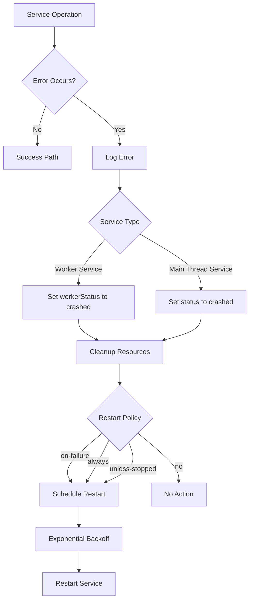

**Section sources**
- [ServiceManager.ts](file://src/ServiceManager.ts#L140-L200)
- [WorkerService.ts](file://src/WorkerService.ts#L114-L170)

### Resource Cleanup and Garbage Collection

The framework ensures proper resource cleanup to prevent memory leaks and resource exhaustion, particularly important for long-running processes managing many services.

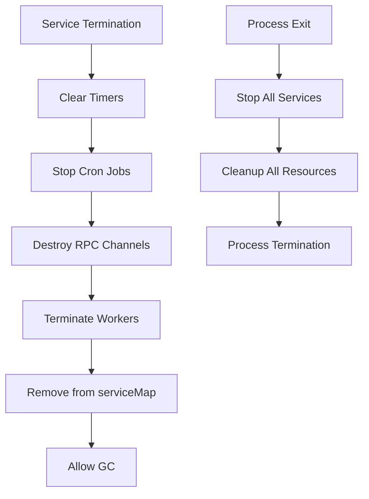

**Section sources**
- [ServiceManager.ts](file://src/ServiceManager.ts#L50-L70)
- [WorkerService.ts](file://src/WorkerService.ts#L67-L117)

### Process Lifetime Management

The framework manages the complete lifecycle of services and their associated resources, ensuring clean startup and shutdown sequences.

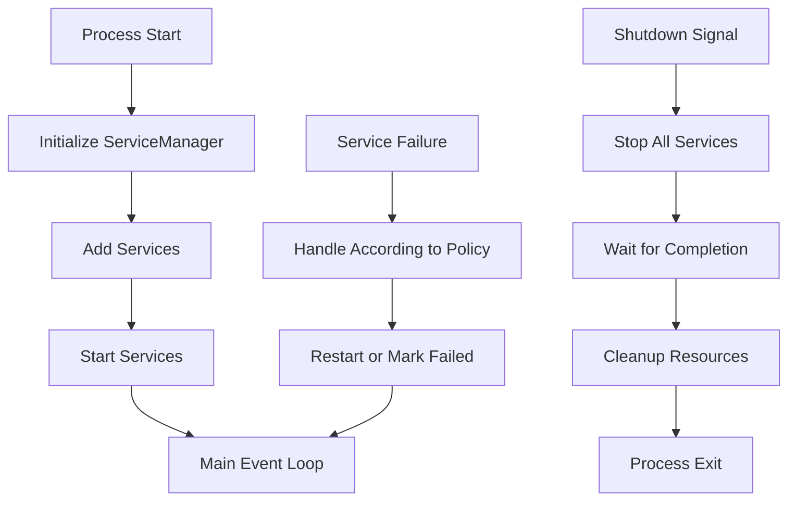

**Section sources**
- [ServiceManager.ts](file://src/ServiceManager.ts#L200-L240)
- [WorkerService.ts](file://src/WorkerService.ts#L114-L170)

## Conclusion

The j8s framework presents a sophisticated service orchestration architecture that balances flexibility, performance, and developer experience. By implementing established design patterns like Abstract Factory, Command, Observer, Strategy, and Singleton-like patterns, the framework achieves a clean separation of concerns and extensible design. The use of worker threads for service isolation, combined with a robust RPC layer and REST API interface, enables the management of complex service topologies within a single process. While the framework introduces some complexity through its pluggable execution models and cross-thread communication, this is offset by the benefits of process isolation, resource management, and remote control capabilities. The architecture is well-suited for applications requiring the coordination of multiple services with varying execution characteristics, providing a solid foundation for building scalable and maintainable JavaScript/TypeScript applications.