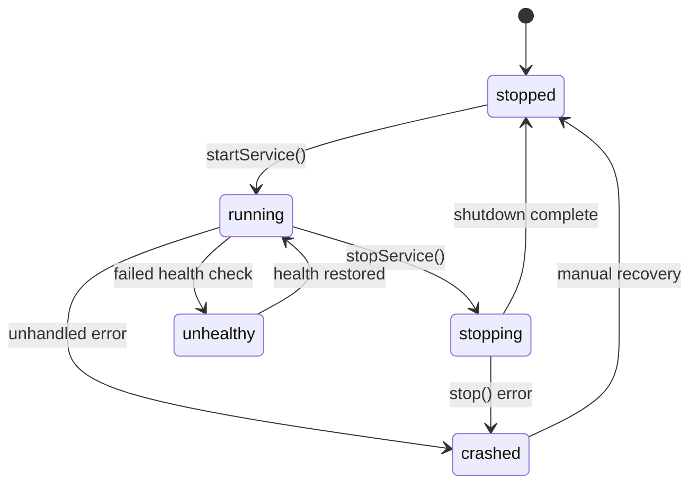
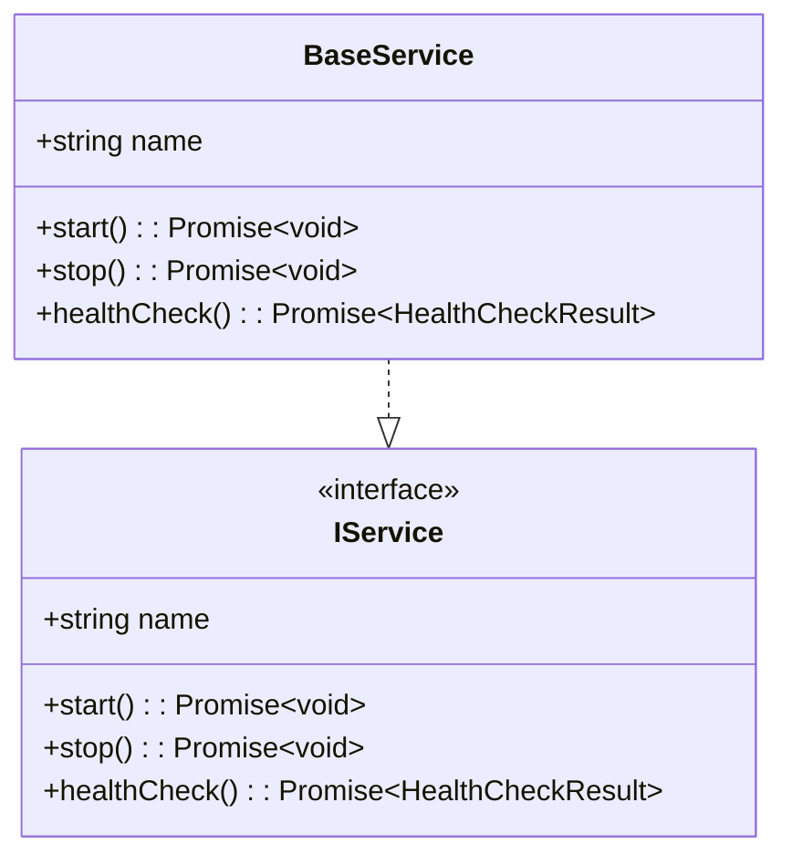
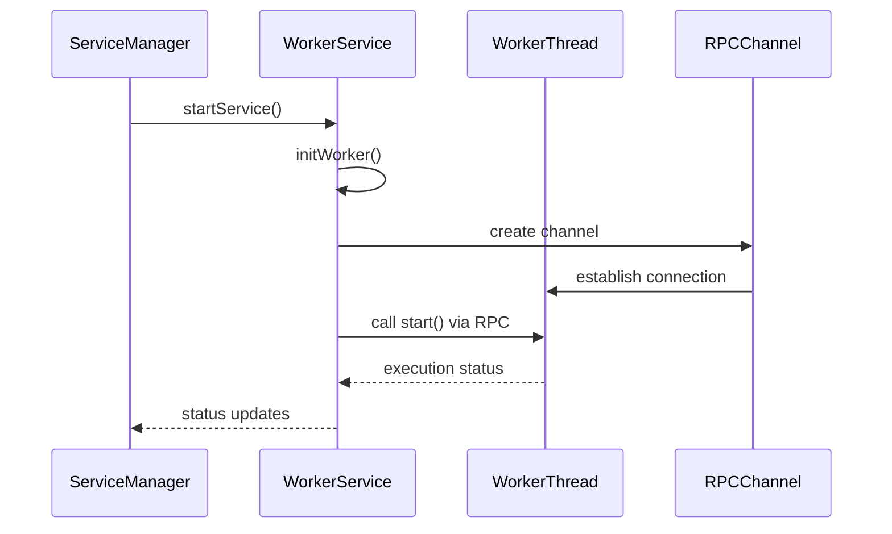
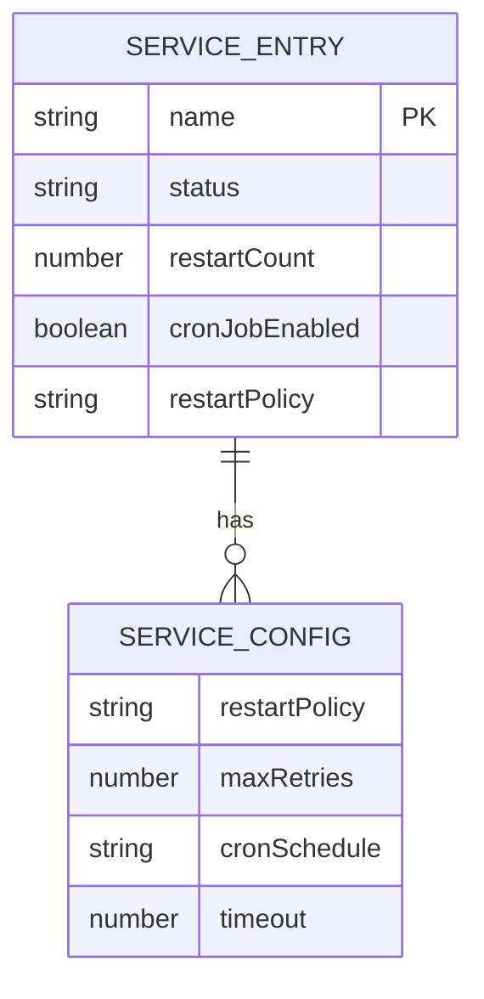
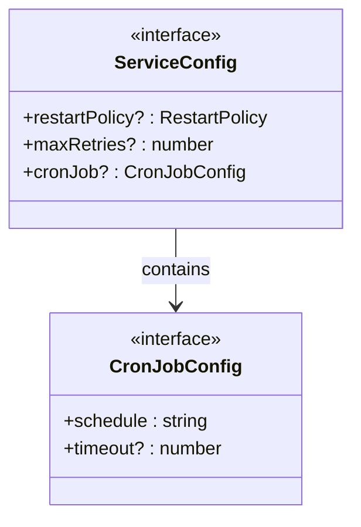
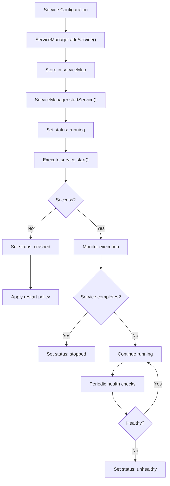
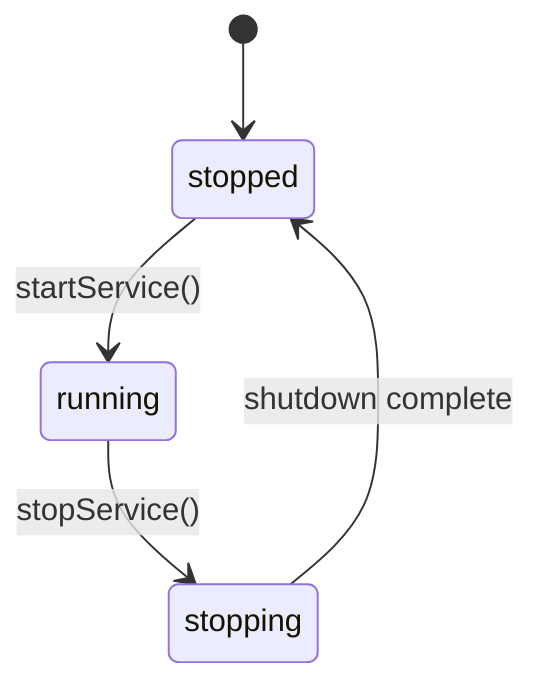
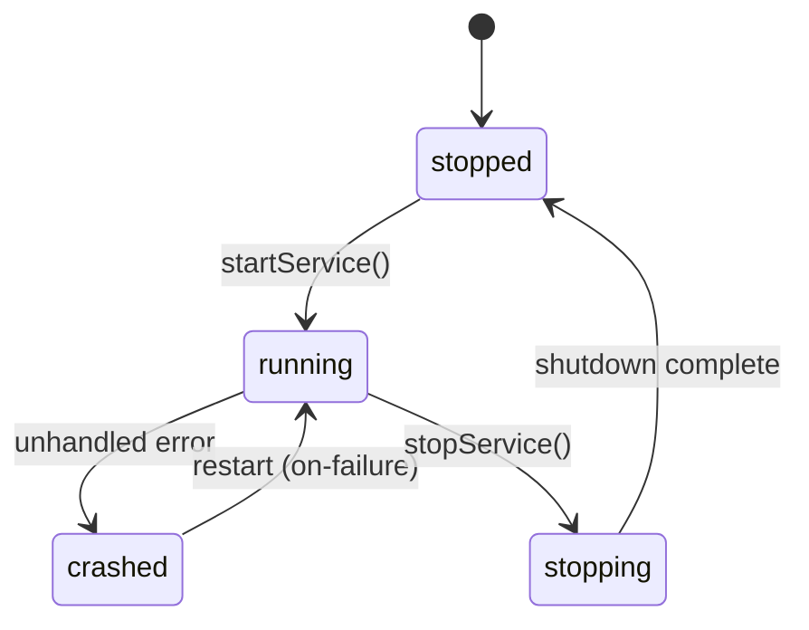
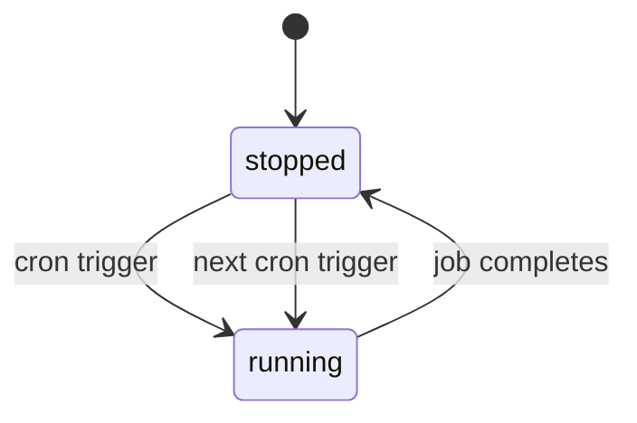

# Core Concepts

<cite>
**Referenced Files in This Document**   
- [interface.ts](file://src/interface.ts)
- [BaseService.ts](file://src/BaseService.ts)
- [WorkerService.ts](file://src/WorkerService.ts)
- [ServiceManager.ts](file://src/ServiceManager.ts)
- [examples/services/logService.ts](file://examples/services/logService.ts)
- [examples/services/simpleWorker.ts](file://examples/services/simpleWorker.ts)
</cite>

## Table of Contents
1. [Service Lifecycle States](#service-lifecycle-states)
2. [Service Execution Models](#service-execution-models)
3. [Status Tracking and Health Checking](#status-tracking-and-health-checking)
4. [Interface Contracts](#interface-contracts)
5. [Data Flow from Configuration to Execution](#data-flow-from-configuration-to-execution)
6. [State Transition Examples](#state-transition-examples)
7. [Common Misconceptions and Best Practices](#common-misconceptions-and-best-practices)

## Service Lifecycle States

The j8s framework defines five distinct service lifecycle states: **stopped**, **running**, **stopping**, **crashed**, and **unhealthy**. These states are managed centrally by the ServiceManager, which ensures consistent state tracking across all services regardless of execution context.

- **stopped**: The service is not currently executing and has been cleanly shut down.
- **running**: The service is actively executing its start() method.
- **stopping**: The service has received a stop signal and is in the process of shutting down.
- **crashed**: The service encountered an unhandled error during execution.
- **unhealthy**: The service is running but failing health checks or experiencing communication issues.

The ServiceManager maintains the authoritative status of each service in its internal serviceMap, ensuring that external queries always reflect the true operational state.



**Diagram sources**
- [interface.ts](file://src/interface.ts#L1-L5)
- [ServiceManager.ts](file://src/ServiceManager.ts#L15-L20)

**Section sources**
- [interface.ts](file://src/interface.ts#L1-L5)
- [ServiceManager.ts](file://src/ServiceManager.ts#L15-L20)

## Service Execution Models

j8s supports two primary execution models: main-thread execution via BaseService and worker-thread execution via WorkerService. This dual-model architecture allows developers to choose the appropriate execution context based on performance, isolation, and resource requirements.

### Main-Thread Services (BaseService)

Services extending BaseService run in the main thread and are suitable for lightweight operations that don't block the event loop. The BaseService provides the foundational IService interface implementation while delegating status management to the ServiceManager.



**Diagram sources**
- [BaseService.ts](file://src/BaseService.ts#L1-L25)
- [interface.ts](file://src/interface.ts#L20-L25)

### Worker-Thread Services (WorkerService)

WorkerService enables execution in isolated worker threads, providing better fault isolation and preventing long-running tasks from blocking the main thread. Each WorkerService instance manages a Node.js worker thread and communicates with it via RPCChannel.



**Diagram sources**
- [WorkerService.ts](file://src/WorkerService.ts#L1-L193)
- [ServiceManager.ts](file://src/ServiceManager.ts#L100-L150)

**Section sources**
- [BaseService.ts](file://src/BaseService.ts#L1-L25)
- [WorkerService.ts](file://src/WorkerService.ts#L1-L193)

## Status Tracking and Health Checking

The ServiceManager serves as the central authority for service status tracking and health monitoring. It maintains the definitive state of each service and coordinates health check operations across all registered services.

### Status Management

Each service entry in the ServiceManager contains a complete status tracking record:



The ServiceManager overrides the status field in health check responses with its internally tracked status, ensuring consistency between reported health and actual operational state.

### Health Check Mechanism

Health checking operates through a hierarchical delegation model:

1. External request triggers healthCheckService()
2. ServiceManager delegates to the service's healthCheck() method
3. Service returns its self-assessment
4. ServiceManager overrides status with its authoritative state
5. Final result includes both service details and managed status

This approach ensures that health reports reflect both the service's self-perception and the orchestrator's authoritative assessment.

**Section sources**
- [ServiceManager.ts](file://src/ServiceManager.ts#L200-L250)
- [interface.ts](file://src/interface.ts#L10-L15)

## Interface Contracts

The interface.ts file defines the core contracts that govern service behavior and configuration in the j8s framework. These TypeScript interfaces establish clear boundaries and expectations for service implementation.

### ServiceStatus Type

The ServiceStatus union type enforces type safety across the entire framework:

```typescript
type ServiceStatus = "stopped" | "running" | "stopping" | "crashed" | "unhealthy"
```

This enumerated string type prevents invalid state assignments and enables exhaustive checking in switch statements.

### Service Configuration

The ServiceConfig interface defines optional configuration parameters that control service behavior:



The restartPolicy field supports four strategies: "always", "unless-stopped", "on-failure", and "no", enabling flexible recovery behavior.

### Service Interface

The IService interface establishes the contract that all services must implement:

```typescript
interface IService {
  name: string;
  start(): Promise<void>;
  stop(): Promise<void>;
  healthCheck(): Promise<HealthCheckResult>;
}
```

This contract ensures consistent lifecycle management across all services, regardless of their execution context.

**Section sources**
- [interface.ts](file://src/interface.ts#L1-L44)

## Data Flow from Configuration to Execution

The j8s framework follows a clear data flow from service configuration to execution and status reporting. This flow ensures predictable behavior and enables comprehensive monitoring.



When a service is added via addService(), the ServiceManager stores it with its configuration in the serviceMap. Starting a service updates its status to "running" before invoking the start() method. The framework then monitors the returned promise for completion or rejection, updating the status accordingly.

For services with cronJob configuration, the ServiceManager creates a CronJob instance that periodically triggers the start() method according to the specified schedule.

**Diagram sources**
- [ServiceManager.ts](file://src/ServiceManager.ts#L50-L150)
- [interface.ts](file://src/interface.ts#L25-L35)

**Section sources**
- [ServiceManager.ts](file://src/ServiceManager.ts#L50-L150)

## State Transition Examples

### Normal Service Lifecycle

A typical service follows this state progression:



Example: A logging service that starts when the application boots and stops during graceful shutdown.

### Failed Service with Restart Policy

Services with restart capabilities follow more complex state transitions:



Example: A worker service processing queue messages that encounters a transient database connection issue, crashes, and automatically restarts after exponential backoff.

### Cron Job Service

Scheduled services exhibit periodic state transitions:



Example: A daily backup service configured with a cron schedule of "0 0 * * *" that runs at midnight and completes within the timeout period.

**Section sources**
- [examples/services/logService.ts](file://examples/services/logService.ts)
- [examples/services/simpleWorker.ts](file://examples/services/simpleWorker.ts)
- [ServiceManager.ts](file://src/ServiceManager.ts#L250-L300)

## Common Misconceptions and Best Practices

### Misconceptions

**Misconception**: The service's own healthCheck() method determines its final status.
**Reality**: The ServiceManager overrides the status field with its authoritative state, using only the details from the service's health check.

**Misconception**: WorkerService status is determined by the worker thread's state.
**Reality**: WorkerService maintains its own workerStatus field that is synchronized with the ServiceManager's status tracking.

**Misconception**: Setting restartPolicy to "always" will restart services even after manual stop.
**Reality**: The "unless-stopped" policy continues restarting after crashes but respects manual stop commands.

### Best Practices

**Implement Idempotent Operations**: Ensure start() and stop() methods can be called multiple times without side effects.

**Use Appropriate Execution Context**: Run CPU-intensive or potentially unstable code in WorkerService instances to prevent main thread blocking.

**Provide Meaningful Health Details**: Include diagnostic information in health check details to aid troubleshooting.

**Configure Appropriate Timeouts**: Set cronJob timeouts to prevent long-running tasks from accumulating.

**Monitor Restart Counts**: Pay attention to restartCount metrics to identify recurring failures that may indicate deeper issues.

**Handle Cleanup in stop()**: Always release resources and close connections in the stop() method to prevent leaks.

**Section sources**
- [README.md](file://README.md#L100-L200)
- [ServiceManager.ts](file://src/ServiceManager.ts#L300-L350)