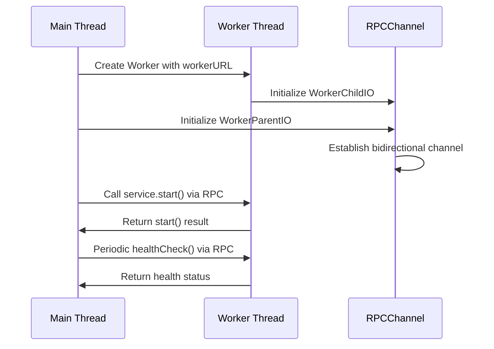

# Execution Models

<cite>
**Referenced Files in This Document**   
- [BaseService.ts](file://src/BaseService.ts)
- [WorkerService.ts](file://src/WorkerService.ts)
- [expose.ts](file://src/expose.ts)
- [worker-with-data.ts](file://examples/worker-with-data.ts)
- [interface.ts](file://src/interface.ts)
</cite>

## Table of Contents
1. [Main-Thread Execution via BaseService](#main-thread-execution-via-baseservice)
2. [Worker-Thread Execution via WorkerService](#worker-thread-execution-via-workerservice)
3. [RPC Communication and Method Exposure](#rpc-communication-and-method-exposure)
4. [Data Passing and Worker Configuration](#data-passing-and-worker-configuration)
5. [Error Handling and Debugging Challenges](#error-handling-and-debugging-challenges)
6. [Model Selection Guidance](#model-selection-guidance)

## Main-Thread Execution via BaseService

The BaseService class serves as the foundational implementation for services that execute within the main event loop of the Node.js process. As defined in `BaseService.ts`, it implements the `IService` interface, requiring concrete implementations of `start()`, `stop()`, and `healthCheck()` methods. Services extending BaseService run synchronously with other main-thread operations, sharing the same memory space and event queue.

This execution model is optimal for lightweight operations, tightly coupled components, or services requiring direct access to main-thread resources. Since these services operate in the same context as the ServiceManager, they benefit from low-latency communication and direct object references. However, CPU-intensive tasks can block the event loop, degrading overall application responsiveness.

The BaseService provides a default healthCheck implementation that returns a "stopped" status, which is later overridden by the ServiceManager with the actual operational status. This design pattern allows status management to be centralized while maintaining service-specific health details.

**Section sources**
- [BaseService.ts](file://src/BaseService.ts#L1-L25)
- [interface.ts](file://src/interface.ts#L14-L19)

## Worker-Thread Execution via WorkerService

The WorkerService class enables service execution in isolated Node.js worker threads, providing thread-level parallelism for CPU-intensive operations. Defined in `WorkerService.ts`, this model leverages the `node:worker_threads` module to create separate V8 instances, preventing long-running computations from blocking the main event loop.

WorkerService extends BaseService but implements a fundamentally different execution paradigm. Each worker runs in its own memory space with dedicated execution context, initialized through the `initWorker()` method. The service lifecycle is managed through RPC communication, where `start()` and `stop()` calls are proxied to the worker thread. This isolation ensures that failures in worker threads do not directly crash the main process, enhancing application resilience.

Key configuration options include `workerURL` (specifying the worker script location), `workerData` (for passing initialization data), and `autoTerminate` (controlling worker lifecycle). The `autoTerminate` flag is particularly useful for batch processing jobs that should exit after completing their work.

**Section sources**
- [WorkerService.ts](file://src/WorkerService.ts#L1-L193)
- [interface.ts](file://src/interface.ts#L1-L44)

## RPC Communication and Method Exposure

Inter-thread communication between the main thread and worker threads is facilitated by the `@kunkun/kkrpc` library, which provides a robust RPC (Remote Procedure Call) mechanism. The WorkerService establishes a communication channel using `RPCChannel` and `WorkerParentIO` on the main thread side, while worker threads use `WorkerChildIO` to connect back.

The `expose()` utility function in `expose.ts` simplifies RPC setup by encapsulating the boilerplate code required to expose service implementations in worker threads. When a service instance is passed to `expose()`, it automatically creates the necessary IO interface and RPC channel, making the service's methods available to the main thread. This abstraction allows developers to focus on business logic rather than communication infrastructure.

The RPC mechanism serializes method calls and responses, enabling seamless interaction across thread boundaries. Health checks, for example, are performed by calling the worker's `healthCheck()` method remotely and returning the result to the ServiceManager. Error events from workers are captured and logged, with appropriate status updates to reflect worker health.



**Diagram sources**
- [WorkerService.ts](file://src/WorkerService.ts#L34-L65)
- [expose.ts](file://src/expose.ts#L1-L55)

## Data Passing and Worker Configuration

The framework supports passing initialization data to worker threads through the `workerData` property in `WorkerServiceOptions`. As demonstrated in `examples/worker-with-data.ts`, custom configuration objects can be transmitted to workers, enabling dynamic behavior based on main-thread parameters. This data is accessible within the worker through Node.js's `worker_threads.workerData` global.

The example shows a worker service receiving configuration for maximum iterations, delay intervals, and message content, which it uses to customize its execution behavior. The worker's constructor processes this data to initialize internal state, allowing the same worker implementation to exhibit different behaviors based on configuration.

This data passing mechanism uses structured cloning, supporting JSON-serializable objects, arrays, and certain built-in types. However, functions, Error objects, RegExp, Set, Map, ArrayBuffer, and TypedArray instances require special handling or cannot be cloned. Developers must ensure that only serializable data is passed to maintain compatibility.

```mermaid
flowchart TD
A["Main Thread"] --> |workerData: {config: {...}, mode: 'verbose'}| B["Worker Thread"]
B --> C["Deserialize workerData"]
C --> D["Initialize service with configuration"]
D --> E["Execute task with custom parameters"]
E --> F["Return results via RPC"]
```

**Diagram sources**
- [WorkerService.ts](file://src/WorkerService.ts#L34-L65)
- [worker-with-data.ts](file://examples/worker-with-data.ts#L0-L44)

## Error Handling and Debugging Challenges

Worker-based services introduce additional complexity in error handling and debugging. The WorkerService implements comprehensive error monitoring by listening to worker "error" and "messageerror" events, logging exceptions and updating worker status accordingly. Unhandled exceptions in workers trigger cleanup procedures to prevent resource leaks.

However, debugging worker threads presents challenges due to their isolated nature. Stack traces from worker errors may lack context, and traditional debugging tools require additional configuration to attach to worker processes. The framework mitigates some of these issues by propagating error information through the RPC channel and maintaining consistent logging patterns.

Serialization limitations represent another challenge, as only certain data types can be safely transferred between threads. Complex objects with methods or non-serializable properties must be reconstructed or proxied, potentially leading to unexpected behavior. Additionally, memory leaks in worker threads can be harder to detect and diagnose due to the separation of memory spaces.

**Section sources**
- [WorkerService.ts](file://src/WorkerService.ts#L114-L170)
- [expose.ts](file://src/expose.ts#L1-L55)

## Model Selection Guidance

Choosing between BaseService and WorkerService depends on workload characteristics and performance requirements. Use BaseService for:

- Lightweight operations with minimal CPU usage
- Services requiring frequent, low-latency communication with main-thread components
- Applications where memory sharing simplifies data access patterns
- Simple background tasks or event-driven operations

Choose WorkerService when:

- Performing CPU-intensive computations (data processing, encryption, etc.)
- Running long-running tasks that could block the event loop
- Isolating potentially unstable code to prevent main process crashes
- Processing large datasets that benefit from parallel execution
- Implementing batch jobs or computational workloads

The decision should also consider operational factors such as debugging complexity, monitoring requirements, and resource utilization. While worker threads provide isolation and parallelism, they introduce overhead from serialization, inter-process communication, and additional memory usage. For I/O-bound operations, the built-in Node.js async capabilities may be more efficient than worker threads.

**Section sources**
- [BaseService.ts](file://src/BaseService.ts#L1-L25)
- [WorkerService.ts](file://src/WorkerService.ts#L1-L193)
- [worker-with-data.ts](file://examples/worker-with-data.ts#L0-L44)