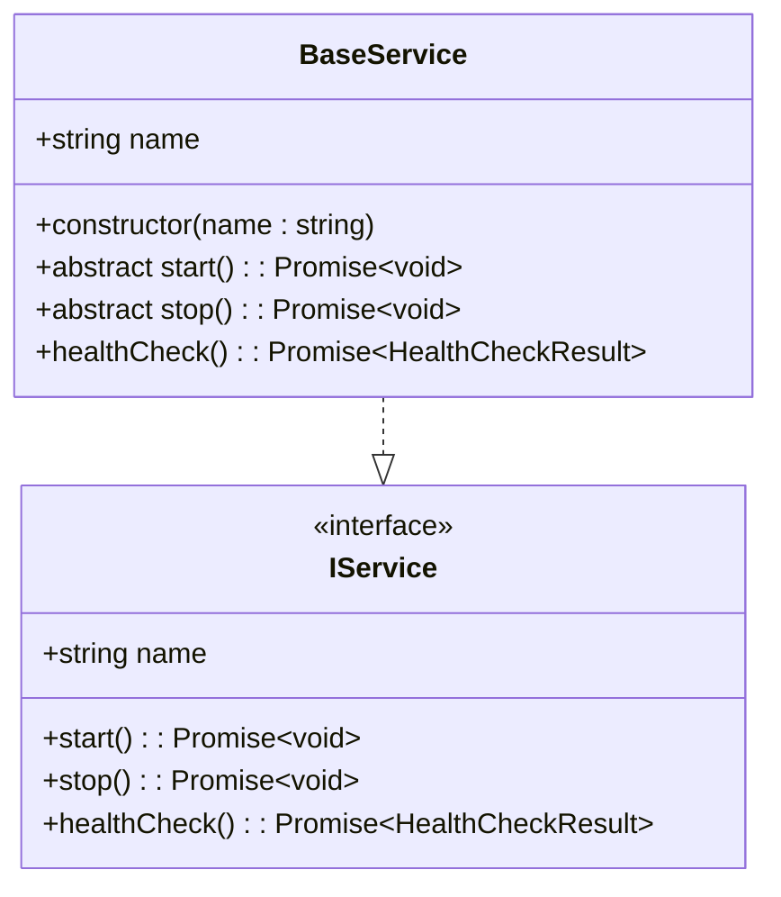
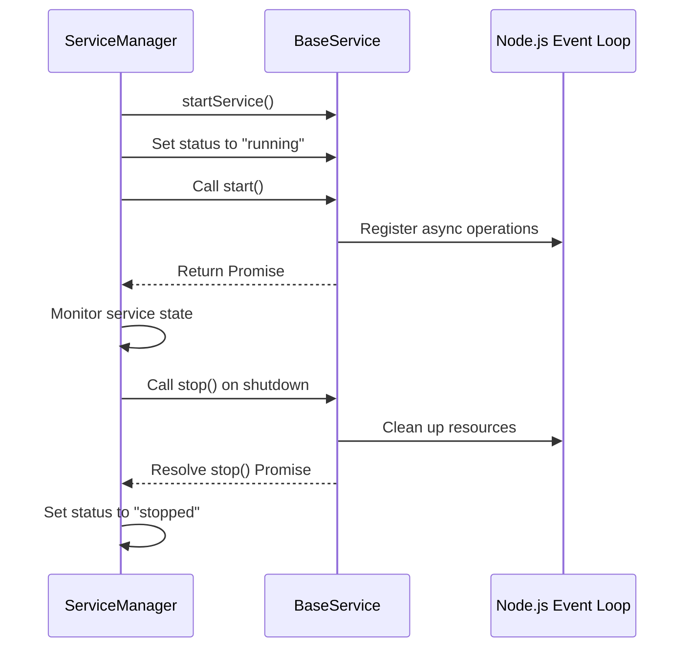
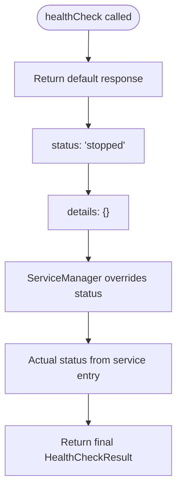
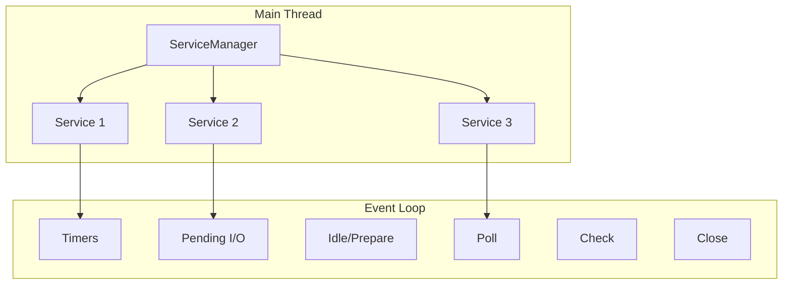
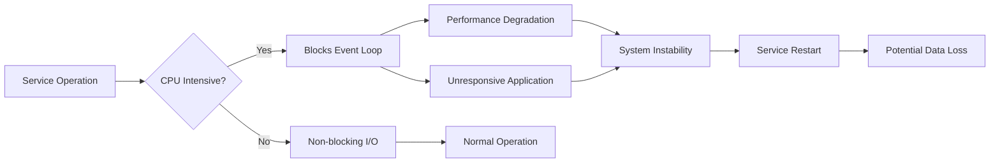
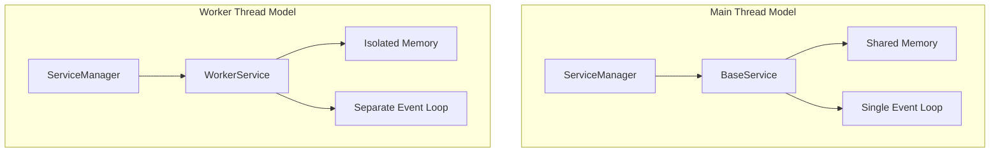
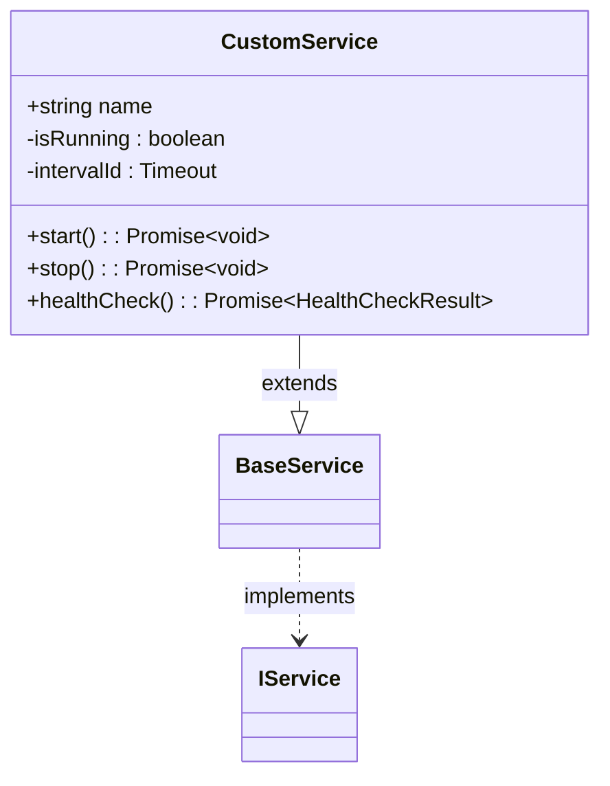
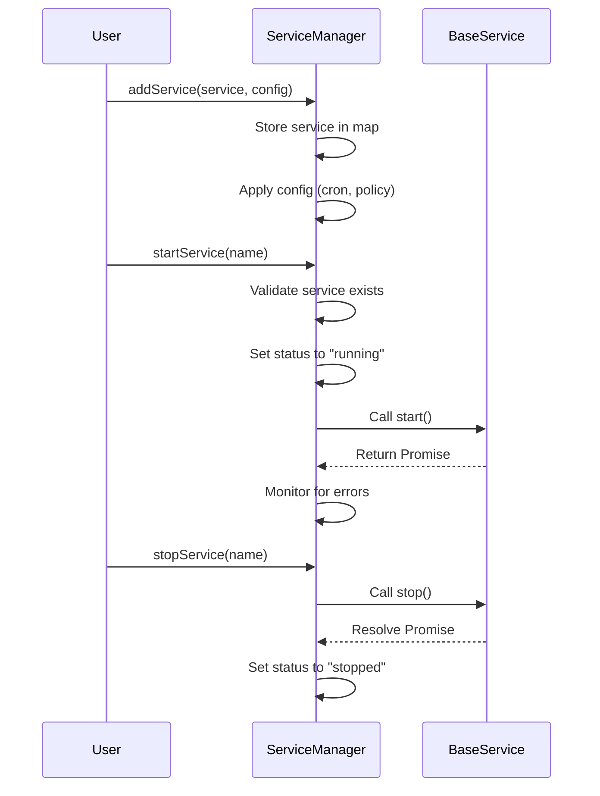

# Main Thread Execution with BaseService

<cite>
**Referenced Files in This Document**   
- [BaseService.ts](file://src/BaseService.ts)
- [ServiceManager.ts](file://src/ServiceManager.ts)
- [interface.ts](file://src/interface.ts)
- [examples/services/logService.ts](file://examples/services/logService.ts)
- [examples/rest-api.ts](file://examples/rest-api.ts)
</cite>

## Table of Contents
1. [Introduction](#introduction)
2. [BaseService Implementation](#baseservice-implementation)
3. [Lifecycle Management](#lifecycle-management)
4. [Health Check Mechanism](#health-check-mechanism)
5. [Main Thread Execution Model](#main-thread-execution-model)
6. [Use Cases and Best Practices](#use-cases-and-best-practices)
7. [Limitations and Risks](#limitations-and-risks)
8. [Contrast with Worker-Thread Execution](#contrast-with-worker-thread-execution)
9. [Custom Service Implementation Guide](#custom-service-implementation-guide)
10. [Integration with ServiceManager](#integration-with-servicemanager)

## Introduction
The BaseService class provides a foundational abstraction for services that execute within the main Node.js event loop. This model enables lightweight, tightly integrated services that share memory and execution context with the primary application process. By extending BaseService, developers can create services that benefit from direct access to main-thread resources while adhering to a standardized lifecycle management pattern enforced by the ServiceManager.

## BaseService Implementation

The BaseService class serves as an abstract foundation for all main-thread services, implementing the IService interface and providing a consistent structure for service definition.



**Diagram sources**
- [BaseService.ts](file://src/BaseService.ts#L6-L25)
- [interface.ts](file://src/interface.ts#L13-L18)

**Section sources**
- [BaseService.ts](file://src/BaseService.ts#L6-L25)

## Lifecycle Management

BaseService defines two abstract lifecycle methods that must be implemented by all extending classes: `start()` and `stop()`. These methods represent the core execution points for service initialization and cleanup.

The ServiceManager orchestrates the execution of these methods, managing service state transitions between "stopped", "running", and "stopping" statuses. When a service is started, the ServiceManager sets its status to "running" and invokes the `start()` method asynchronously, allowing long-running services to maintain their execution context without blocking the event loop.



**Diagram sources**
- [ServiceManager.ts](file://src/ServiceManager.ts#L79-L114)
- [BaseService.ts](file://src/BaseService.ts#L15-L17)

**Section sources**
- [ServiceManager.ts](file://src/ServiceManager.ts#L79-L114)
- [BaseService.ts](file://src/BaseService.ts#L15-L17)

## Health Check Mechanism

BaseService provides a default implementation of the `healthCheck()` method that returns a minimal health status. This implementation returns a "stopped" status with empty details, as the ServiceManager will override the status field with the actual managed state of the service.

Services can override this method to provide additional health details while relying on the ServiceManager to supply the authoritative status. This separation of concerns ensures consistent status reporting across all services while allowing individual services to expose custom health metrics.



**Diagram sources**
- [BaseService.ts](file://src/BaseService.ts#L19-L25)
- [ServiceManager.ts](file://src/ServiceManager.ts#L225-L235)

**Section sources**
- [BaseService.ts](file://src/BaseService.ts#L19-L25)

## Main Thread Execution Model

Services extending BaseService execute within the main Node.js event loop, sharing memory space and execution context with other services and the primary application. This model is ideal for lightweight operations that perform I/O-bound tasks or require direct access to shared resources.

The execution model relies on asynchronous programming patterns to prevent blocking the event loop. Services typically use timers, event emitters, or promise-based APIs to perform non-blocking operations. Long-running services maintain their execution by returning promises that resolve only when the `stop()` method is called.



**Diagram sources**
- [ServiceManager.ts](file://src/ServiceManager.ts#L79-L114)
- [examples/rest-api.ts](file://examples/rest-api.ts#L20-L53)

**Section sources**
- [ServiceManager.ts](file://src/ServiceManager.ts#L79-L114)

## Use Cases and Best Practices

Main-thread execution is preferred for services with low computational overhead or those requiring direct access to main-thread resources. Typical use cases include:

- Logging services that write to shared output streams
- Monitoring services that track application metrics
- Event-driven processors that respond to internal events
- API clients that maintain persistent connections
- Caching services that store data in memory

When implementing services for main-thread execution, follow these best practices:
- Use asynchronous operations to avoid blocking the event loop
- Implement proper cleanup in the `stop()` method
- Limit CPU-intensive operations to prevent performance degradation
- Use the healthCheck method to expose service-specific metrics
- Leverage ServiceManager configuration options like restart policies

```mermaid
erDiagram
SERVICE : "BaseService" {
string name PK
status status
config config
}
CONFIG : "ServiceConfig" {
string restartPolicy
number maxRetries
cronJob cronJob
}
STATUS : "ServiceStatus" {
enum status
}
SERVICE ||--o{ CONFIG : "has"
SERVICE }|--|| STATUS : "current"
```

**Diagram sources**
- [interface.ts](file://src/interface.ts#L1-L28)
- [BaseService.ts](file://src/BaseService.ts#L6-L25)

**Section sources**
- [examples/services/logService.ts](file://examples/services/logService.ts#L6-L42)

## Limitations and Risks

While the main-thread execution model offers simplicity and direct resource access, it carries inherent risks. The primary limitation is the potential to block the Node.js event loop with CPU-intensive tasks, which can degrade application performance and responsiveness.

Services that perform heavy computation, large data processing, or synchronous operations can monopolize the event loop, preventing other services and application code from executing. Additionally, unhandled exceptions in main-thread services can potentially crash the entire process.

The ServiceManager mitigates some risks by isolating service failures and implementing restart policies, but fundamentally blocking operations cannot be recovered through orchestration alone. Developers must carefully evaluate the computational requirements of their services before choosing main-thread execution.



**Diagram sources**
- [ServiceManager.ts](file://src/ServiceManager.ts#L93-L102)
- [BaseService.ts](file://src/BaseService.ts#L15-L17)

**Section sources**
- [ServiceManager.ts](file://src/ServiceManager.ts#L93-L102)

## Contrast with Worker-Thread Execution

The BaseService model contrasts with worker-thread execution, where services run in separate Node.js worker threads. While BaseService services share memory and the event loop, worker-thread services operate in isolated contexts with their own memory space and event loops.

Worker-thread services are better suited for CPU-intensive tasks that would otherwise block the main thread. However, they require message passing for inter-process communication and cannot directly access main-thread resources. The choice between models depends on the service's computational profile and resource requirements.

BaseService provides a simpler programming model with lower overhead for lightweight, I/O-bound operations, while worker threads offer superior isolation and performance for computationally intensive workloads.



**Diagram sources**
- [BaseService.ts](file://src/BaseService.ts#L6-L25)
- [ServiceManager.ts](file://src/ServiceManager.ts#L79-L114)

**Section sources**
- [BaseService.ts](file://src/BaseService.ts#L6-L25)

## Custom Service Implementation Guide

To implement a custom service using BaseService, extend the class and provide implementations for the `start()` and `stop()` methods. The constructor should accept a name parameter and pass it to the superclass constructor.

In the `start()` method, initialize service resources and begin any ongoing operations. For long-running services, return a promise that resolves only when the service is stopped. The `stop()` method should clean up resources and resolve any pending operations.

Services can override the `healthCheck()` method to provide additional diagnostic information while relying on the ServiceManager to supply the authoritative status.



**Diagram sources**
- [examples/rest-api.ts](file://examples/rest-api.ts#L18-L53)
- [examples/services/logService.ts](file://examples/services/logService.ts#L6-L42)

**Section sources**
- [examples/rest-api.ts](file://examples/rest-api.ts#L18-L53)

## Integration with ServiceManager

Services extending BaseService integrate with the ServiceManager through the `addService()` method. The ServiceManager maintains a registry of services and their configurations, including restart policies and cron job schedules.

When a service is added, the ServiceManager tracks its state and provides lifecycle management. The `startService()` and `stopService()` methods coordinate the execution of service lifecycle methods while maintaining consistent state tracking across all managed services.

The ServiceManager also provides health check aggregation through the `healthCheckAllServices()` method, which collects health information from all registered services while ensuring consistent status reporting.



**Diagram sources**
- [ServiceManager.ts](file://src/ServiceManager.ts#L30-L76)
- [BaseService.ts](file://src/BaseService.ts#L6-L25)

**Section sources**
- [ServiceManager.ts](file://src/ServiceManager.ts#L30-L76)