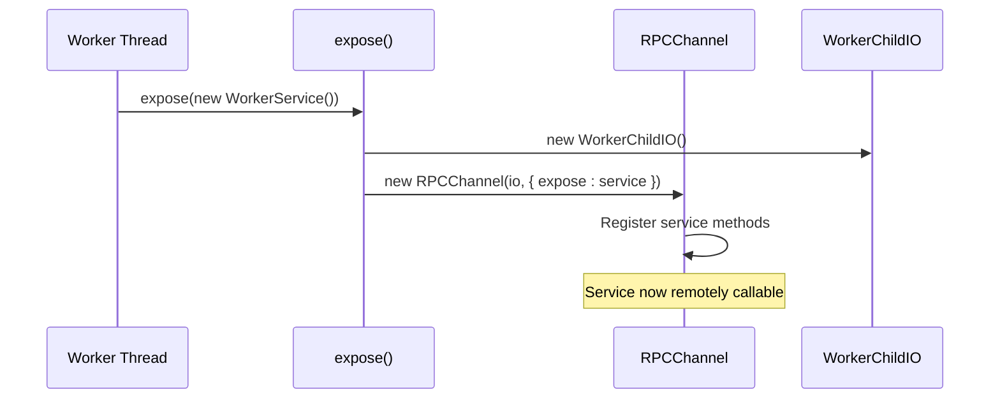
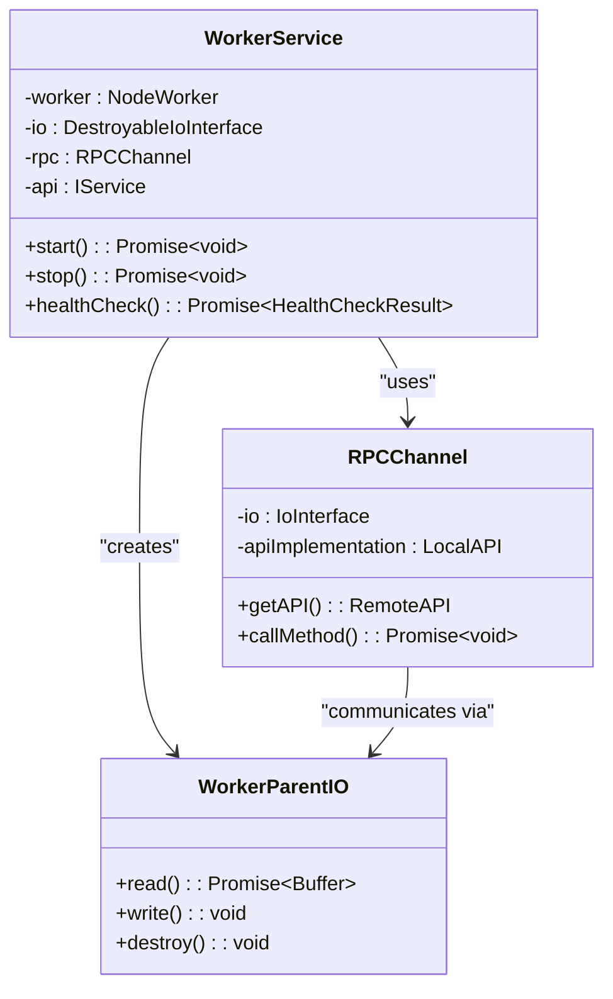

# RPC Communication and Service Exposure

<cite>
**Referenced Files in This Document**  
- [src/expose.ts](file://src/expose.ts)
- [src/WorkerService.ts](file://src/WorkerService.ts)
- [src/BaseService.ts](file://src/BaseService.ts)
- [src/interface.ts](file://src/interface.ts)
- [node_modules/@kunkun/kkrpc/src/channel.ts](file://node_modules/@kunkun/kkrpc/src/channel.ts)
</cite>

## Table of Contents
1. [Introduction](#introduction)
2. [RPC Communication Architecture](#rpc-communication-architecture)
3. [Core Components and Roles](#core-components-and-roles)
4. [Service Exposure via expose()](#service-exposure-via-expose)
5. [Bidirectional Communication with RPCChannel](#bidirectional-communication-with-rpccannel)
6. [WorkerService and RPC Integration](#workerservice-and-rpc-integration)
7. [Method Invocation Across Threads](#method-invocation-across-threads)
8. [Data Serialization Requirements and Pitfalls](#data-serialization-requirements-and-pitfalls)
9. [Debugging RPC Communication Issues](#debugging-rpc-communication-issues)
10. [Conclusion](#conclusion)

## Introduction
This document provides a comprehensive overview of how Remote Procedure Call (RPC) communication is established between the main thread and worker threads in the `j8s` framework. It focuses on the integration of `@kunkun/kkrpc` for enabling bidirectional communication, the role of `RPCChannel`, and the utility of the `expose()` function in simplifying service exposure within worker threads. The analysis includes the interaction between `WorkerParentIO` and `WorkerChildIO`, method invocation across thread boundaries, serialization constraints, and debugging strategies.

**Section sources**
- [src/expose.ts](file://src/expose.ts#L1-L54)
- [src/WorkerService.ts](file://src/WorkerService.ts#L1-L193)

## RPC Communication Architecture
The RPC communication model in `j8s` leverages the `@kunkun/kkrpc` library to enable seamless method calls between the main thread and worker threads. This is achieved through a message-passing mechanism over a structured IO interface, where method invocations and responses are serialized and transmitted via standard input/output or worker message channels.

At the core of this architecture is the `RPCChannel`, which abstracts the complexity of message serialization, request tracking, and response handling. The channel operates bidirectionally, allowing both the main thread and worker thread to expose APIs and invoke methods on each other.

```mermaid
graph TB
MainThread[Main Thread] < --> RPCChannelMain[RPCChannel]
WorkerThread[Worker Thread] < --> RPCChannelWorker[RPCChannel]
RPCChannelMain < --> RPCChannelWorker
subgraph "Main Thread"
MainThread --> WorkerParentIO[WorkerParentIO]
WorkerParentIO --> RPCChannelMain
end
subgraph "Worker Thread"
WorkerThread --> WorkerChildIO[WorkerChildIO]
WorkerChildIO --> RPCChannelWorker
end
```

**Diagram sources**
- [src/WorkerService.ts](file://src/WorkerService.ts#L34-L65)
- [src/expose.ts](file://src/expose.ts#L25-L35)

## Core Components and Roles
The RPC communication system relies on several key components:

- **RPCChannel**: Manages the bidirectional communication channel, handles message serialization/deserialization, tracks pending requests, and routes method calls.
- **WorkerParentIO**: IO adapter used by the main thread to communicate with the worker thread.
- **WorkerChildIO**: IO adapter used by the worker thread to communicate with the main thread.
- **expose()**: Utility function that simplifies service exposure in the worker thread by setting up the RPC channel and registering the service instance.
- **WorkerService**: Class in the main thread that manages the lifecycle of a worker and provides access to its exposed API.

These components work together to abstract the complexity of inter-thread communication, allowing developers to focus on business logic rather than low-level messaging details.

**Section sources**
- [src/expose.ts](file://src/expose.ts#L1-L54)
- [src/WorkerService.ts](file://src/WorkerService.ts#L1-L193)
- [node_modules/@kunkun/kkrpc/src/channel.ts](file://node_modules/@kunkun/kkrpc/src/channel.ts#L1-L340)

## Service Exposure via expose()
The `expose()` function in `src/expose.ts` simplifies the process of exposing a service instance within a worker thread. Instead of manually setting up the RPC channel and IO interface, developers can simply call `expose(service)` with an instance that implements the `IService` interface.

Internally, `expose()` creates a `WorkerChildIO` instance to handle communication with the main thread and initializes an `RPCChannel` with the provided service instance passed to the `expose` option. This automatically registers the service methods (`start`, `stop`, `healthCheck`) so they can be invoked remotely.



**Diagram sources**
- [src/expose.ts](file://src/expose.ts#L25-L35)

**Section sources**
- [src/expose.ts](file://src/expose.ts#L25-L35)

## Bidirectional Communication with RPCChannel
The `RPCChannel` class from `@kunkun/kkrpc` serves as the backbone of inter-thread communication. It supports bidirectional method invocation by allowing each end of the channel to both expose local methods and call remote ones.

In the main thread, `WorkerService` creates a `WorkerParentIO` instance connected to the worker and initializes an `RPCChannel` without exposing any local API (empty options). It then retrieves a proxy to the remote API via `getAPI()`, which allows calling methods like `start()` and `stop()` on the worker's service instance.

In the worker thread, `expose()` sets up the reverse: a `WorkerChildIO` and `RPCChannel` that exposes the local service instance, making its methods available to the main thread.

The channel handles message framing, request/response correlation via UUIDs, and error propagation, ensuring reliable communication across thread boundaries.

**Section sources**
- [node_modules/@kunkun/kkrpc/src/channel.ts](file://node_modules/@kunkun/kkrpc/src/channel.ts#L1-L340)
- [src/WorkerService.ts](file://src/WorkerService.ts#L34-L65)

## WorkerService and RPC Integration
The `WorkerService` class extends `BaseService` and manages the lifecycle of a worker thread while integrating with the RPC system. During initialization in `initWorker()`, it:

1. Cleans up any existing worker state
2. Creates a `NodeWorker` with the specified URL and options
3. Wraps the worker in a `WorkerParentIO` adapter
4. Initializes an `RPCChannel` using this IO
5. Obtains a proxy to the remote service API via `getAPI()`

This integration allows the main thread to treat the worker's service as if it were a local object, even though method calls are transparently forwarded over the RPC channel.



**Diagram sources**
- [src/WorkerService.ts](file://src/WorkerService.ts#L1-L193)

**Section sources**
- [src/WorkerService.ts](file://src/WorkerService.ts#L1-L193)

## Method Invocation Across Threads
Methods such as `start()`, `stop()`, and `healthCheck()` are invoked across thread boundaries through the RPC proxy. When `WorkerService.start()` is called, it:

1. Initializes the worker and RPC channel
2. Calls `await this.api.start()` — this triggers a remote method call
3. The `RPCChannel` serializes the request and sends it via `WorkerParentIO`
4. In the worker, `WorkerChildIO` receives the message and `RPCChannel` dispatches it to the exposed service
5. The result is serialized and sent back, resolving the promise in the main thread

This mechanism enables seamless integration while maintaining thread isolation.

**Section sources**
- [src/WorkerService.ts](file://src/WorkerService.ts#L114-L170)
- [src/expose.ts](file://src/expose.ts#L25-L35)

## Data Serialization Requirements and Pitfalls
All data passed through the RPC channel must be serializable via `JSON.stringify()`, as the underlying transport relies on text-based message framing. This imposes several constraints:

- Functions and non-enumerable properties are not preserved
- Circular references will cause serialization errors
- Built-in objects like `Map`, `Set`, `Date`, and `RegExp` may not serialize as expected
- `undefined` values are omitted
- Symbols cannot be serialized

Pitfalls include:
- Attempting to pass closures or class instances with methods
- Storing state in non-serializable forms
- Expecting prototype chains to be preserved

To avoid issues, ensure all method arguments and return values are plain objects, arrays, strings, numbers, or booleans.

**Section sources**
- [node_modules/@kunkun/kkrpc/src/channel.ts](file://node_modules/@kunkun/kkrpc/src/channel.ts#L1-L340)
- [src/interface.ts](file://src/interface.ts#L1-L44)

## Debugging RPC Communication Issues
Common RPC issues and debugging strategies include:

- **Method not found**: Verify the service is properly exposed and method names match exactly
- **Serialization errors**: Check for circular references or non-serializable types in arguments
- **Timeouts**: Ensure both ends of the channel are active and not blocked
- **Worker crashes**: Monitor error events via `worker.addListener("error")`
- **Message corruption**: Validate message framing and newline delimiters

Enable logging in `RPCChannel` to trace message flow. Use structured logging in service methods to confirm execution. Test with simple methods first before adding complexity.

**Section sources**
- [src/WorkerService.ts](file://src/WorkerService.ts#L67-L117)
- [node_modules/@kunkun/kkrpc/src/channel.ts](file://node_modules/@kunkun/kkrpc/src/channel.ts#L1-L340)

## Conclusion
The `j8s` framework provides a robust and developer-friendly RPC system for inter-thread communication using `@kunkun/kkrpc`. The `expose()` utility and `WorkerService` class abstract the complexity of setting up bidirectional communication, allowing services to be seamlessly exposed and invoked across thread boundaries. By understanding the roles of `RPCChannel`, `WorkerParentIO`, and `WorkerChildIO`, and adhering to serialization constraints, developers can build reliable and maintainable multi-threaded applications.