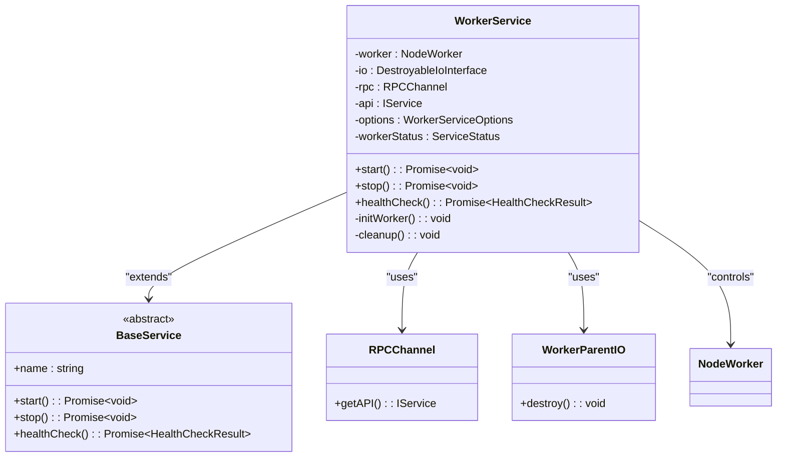
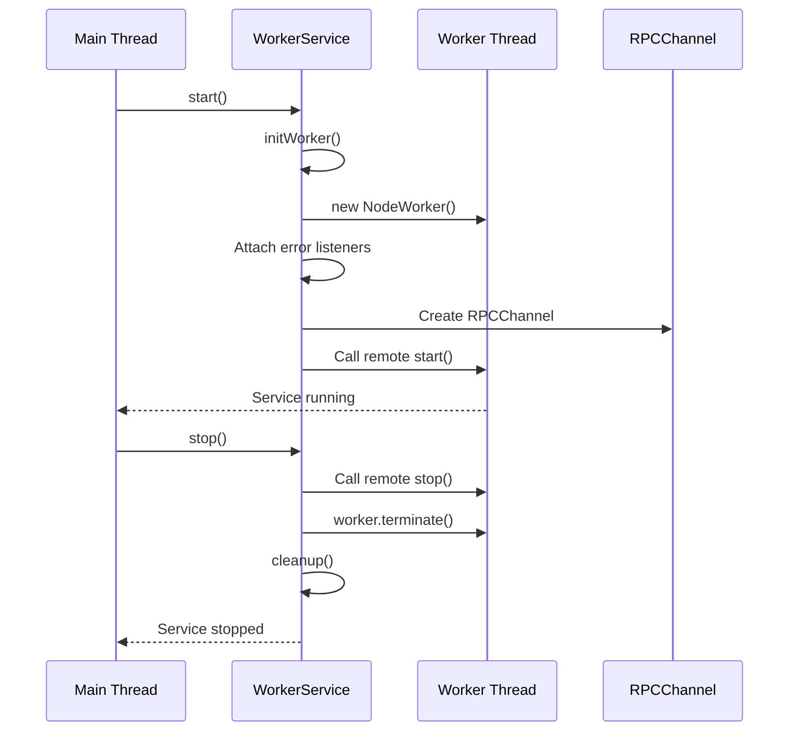
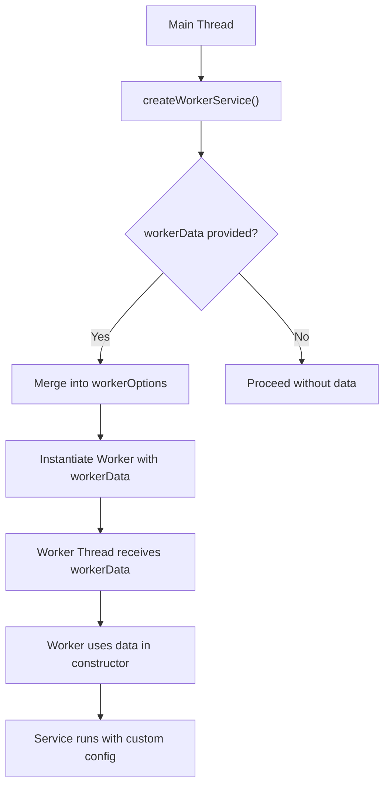
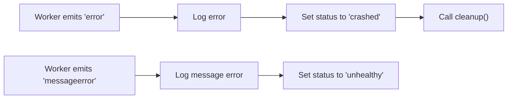

# Worker Thread Execution with WorkerService

<cite>
**Referenced Files in This Document**   
- [WorkerService.ts](file://src/WorkerService.ts)
- [worker-with-data.ts](file://examples/worker-with-data.ts)
- [expose.ts](file://src/expose.ts)
- [interface.ts](file://src/interface.ts)
- [index.ts](file://index.ts)
</cite>

## Table of Contents
1. [Introduction](#introduction)
2. [WorkerService Architecture](#workerservice-architecture)
3. [Worker Initialization and Lifecycle Management](#worker-initialization-and-lifecycle-management)
4. [Passing Data to Workers via workerData](#passing-data-to-workers-via-workerdata)
5. [Auto-Terminate Feature and Service Lifecycle](#auto-terminate-feature-and-service-lifecycle)
6. [Error Handling in Worker Threads](#error-handling-in-worker-threads)
7. [Performance Implications of Worker Threads](#performance-implications-of-worker-threads)
8. [Configuration and Customization of WorkerService](#configuration-and-customization-of-workerservice)
9. [Common Issues and Debugging Challenges](#common-issues-and-debugging-challenges)
10. [Conclusion](#conclusion)

## Introduction
The WorkerService class provides a robust mechanism for executing services in isolated Node.js worker threads, enabling parallel execution without blocking the main thread. This document details how WorkerService leverages the `node:worker_threads` module to encapsulate service logic within dedicated worker contexts, ensuring thread safety and efficient resource utilization. The implementation supports advanced features such as data injection via `workerData`, automatic termination, and comprehensive error monitoring through event listeners for 'error' and 'messageerror' events.

**Section sources**
- [WorkerService.ts](file://src/WorkerService.ts#L1-L20)

## WorkerService Architecture
WorkerService extends BaseService and integrates with the RPCChannel and WorkerParentIO classes to establish bidirectional communication between the main thread and worker threads. It uses the Node.js `Worker` API under the alias `NodeWorker` to instantiate isolated execution environments. Each worker runs independently, communicating with the main thread via message passing, which prevents shared memory issues and ensures thread safety.

The architecture includes lifecycle tracking via a `workerStatus` field that reflects states such as "running", "stopped", "crashed", or "unhealthy". The service maintains references to the worker instance, IO interface, and RPC channel, all of which are properly cleaned up during shutdown to prevent resource leaks.



**Diagram sources**
- [WorkerService.ts](file://src/WorkerService.ts#L1-L193)
- [BaseService.ts](file://src/BaseService.ts#L1-L25)

**Section sources**
- [WorkerService.ts](file://src/WorkerService.ts#L1-L193)

## Worker Initialization and Lifecycle Management
Worker initialization occurs within the `initWorker()` method, which first calls `cleanup()` to terminate any existing worker instance, ensuring a clean state before creating a new one. The worker is instantiated using the `NodeWorker` constructor with a URL pointing to the worker script and optional configuration parameters.

During initialization, the worker is configured with an IO layer (`WorkerParentIO`) and an RPC channel that enables method invocation across threads. Event listeners are attached to monitor critical lifecycle events:
- `'error'`: Triggered when an uncaught exception occurs in the worker.
- `'messageerror'`: Emitted when deserialization of a message fails.

The lifecycle is managed through `start()` and `stop()` methods. On start, the worker is initialized, and the remote `start()` method on the worker’s service API is invoked. On stop, the service attempts a graceful shutdown by calling the worker’s `stop()` method before terminating the thread.



**Diagram sources**
- [WorkerService.ts](file://src/WorkerService.ts#L34-L117)
- [WorkerService.ts](file://src/WorkerService.ts#L114-L170)

**Section sources**
- [WorkerService.ts](file://src/WorkerService.ts#L34-L170)

## Passing Data to Workers via workerData
WorkerService allows custom data to be passed from the main thread to the worker context during instantiation using the `workerData` option. This data is made available in the worker thread via the global `workerData` object from `node:worker_threads`.

In the constructor of `WorkerService`, the `workerOptions` are merged with `{ workerData: this.options.workerData }` if provided. This ensures that any serializable data (strings, numbers, plain objects, arrays) can be injected into the worker environment.

For example, in `examples/worker-with-data.ts`, a configuration object containing `maxIterations`, `delay`, `message`, and `mode` is passed to the worker. Inside the worker (`services/worker-with-data.ts`), these values are extracted from `workerData` during construction and used to configure task behavior.



**Diagram sources**
- [WorkerService.ts](file://src/WorkerService.ts#L45-L55)
- [worker-with-data.ts](file://examples/worker-with-data.ts#L5-L20)
- [worker-with-data.ts](file://examples/services/worker-with-data.ts#L0-L41)

**Section sources**
- [WorkerService.ts](file://src/WorkerService.ts#L45-L55)
- [worker-with-data.ts](file://examples/worker-with-data.ts#L5-L20)
- [worker-with-data.ts](file://examples/services/worker-with-data.ts#L0-L41)

## Auto-Terminate Feature and Service Lifecycle
The `autoTerminate` option, when set to `true`, causes the worker to automatically terminate after the `start()` method completes its execution. This is particularly useful for short-lived tasks or batch jobs that do not require persistent execution.

When `autoTerminate` is enabled, after the worker's `start()` method resolves, WorkerService immediately transitions to the "stopping" state, invokes `cleanup()`, and sets the status to "stopped". This eliminates the need for manual intervention and ensures efficient resource management by preventing idle workers from consuming memory.

This behavior is implemented in the `start()` method where, after successfully invoking `this.api.start()`, a conditional check triggers cleanup if `autoTerminate` is true and the IO interface exists.

**Section sources**
- [WorkerService.ts](file://src/WorkerService.ts#L145-L150)

## Error Handling in Worker Threads
WorkerService implements robust error handling by registering listeners for `'error'` and `'messageerror'` events on the worker instance.

- The `'error'` event listener logs the error, updates the `workerStatus` to "crashed", and triggers `cleanup()` to release resources.
- The `'messageerror'` event is fired when there is a problem deserializing a message sent from the worker (e.g., due to non-serializable objects). In this case, the status is set to "unhealthy" to indicate partial failure without immediate termination.

These mechanisms ensure that unexpected failures do not leave orphaned workers or dangling connections, maintaining system stability even under error conditions.



**Diagram sources**
- [WorkerService.ts](file://src/WorkerService.ts#L60-L67)
- [WorkerService.ts](file://src/WorkerService.ts#L69-L75)

**Section sources**
- [WorkerService.ts](file://src/WorkerService.ts#L60-L75)

## Performance Implications of Worker Threads
Using WorkerService offers significant performance benefits by offloading CPU-intensive tasks from the main thread, thus avoiding event loop blocking and ensuring responsiveness in I/O-bound applications.

However, there are trade-offs:
- **Thread Creation Overhead**: Spawning a new worker involves initialization cost, including VM startup and module loading.
- **Inter-Thread Communication Cost**: Message passing between threads requires serialization (structured cloning), which can be expensive for large or complex data structures.
- **Memory Usage**: Each worker runs in a separate V8 instance, increasing overall memory consumption.

Despite these costs, the isolation and parallelism provided by workers make them ideal for computationally heavy operations such as data processing, encryption, or image manipulation.

**Section sources**
- [WorkerService.ts](file://src/WorkerService.ts#L34-L193)

## Configuration and Customization of WorkerService
WorkerService can be customized through the `WorkerServiceOptions` interface, which includes:
- `workerURL`: Specifies the script to run in the worker.
- `workerOptions`: Additional options passed to the `Worker` constructor (e.g., environment variables, resource limits).
- `workerData`: Arbitrary data passed to the worker context.
- `autoTerminate`: Controls whether the worker exits after startup.

The helper function `createWorkerService()` in `index.ts` simplifies instantiation by providing defaults and merging user options. For example:

```ts
const workerService = createWorkerService(
  "worker-with-data-service",
  new URL("./services/worker-with-data.ts", import.meta.url),
  {
    autoTerminate: false,
    workerData: {
      config: { maxIterations: 5, delay: 1000, message: "Hello!" },
      mode: "verbose"
    }
  }
);
```

This creates a named service with custom configuration and disables auto-termination for long-running execution.

**Section sources**
- [index.ts](file://index.ts#L155-L181)
- [WorkerService.ts](file://src/WorkerService.ts#L10-L18)
- [worker-with-data.ts](file://examples/worker-with-data.ts#L5-L20)

## Common Issues and Debugging Challenges
Common issues when using WorkerService include:
- **Serialization Constraints**: Only structured-cloneable data can be passed via `workerData`. Functions, Error objects, or circular references will cause `messageerror`.
- **Debugging Complexity**: Workers run in isolated contexts, making traditional debugging tools less effective. Console logs must be explicitly routed, and breakpoints may not work as expected.
- **Resource Leaks**: Failure to properly clean up workers (via `cleanup()`) can lead to memory leaks or zombie processes.

To mitigate these, always ensure data passed to workers is plain JSON-serializable, use structured logging, and rely on the built-in cleanup mechanism provided by WorkerService.

**Section sources**
- [WorkerService.ts](file://src/WorkerService.ts#L69-L75)
- [WorkerService.ts](file://src/WorkerService.ts#L90-L117)

## Conclusion
WorkerService provides a powerful abstraction for running services in isolated Node.js worker threads, combining ease of use with robust lifecycle and error management. By leveraging `workerData`, event-driven error handling, and optional auto-termination, it enables efficient execution of CPU-intensive tasks without compromising main thread performance. While considerations around serialization and debugging exist, the framework's design minimizes common pitfalls and promotes reliable, scalable service execution.