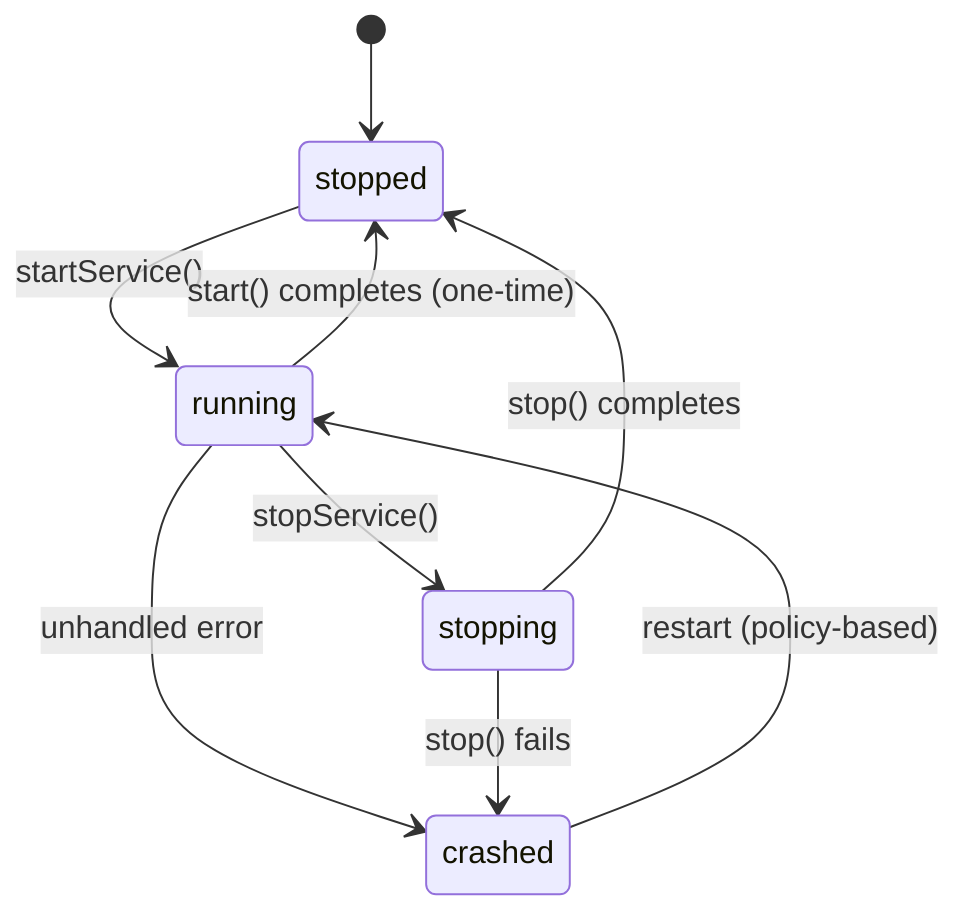
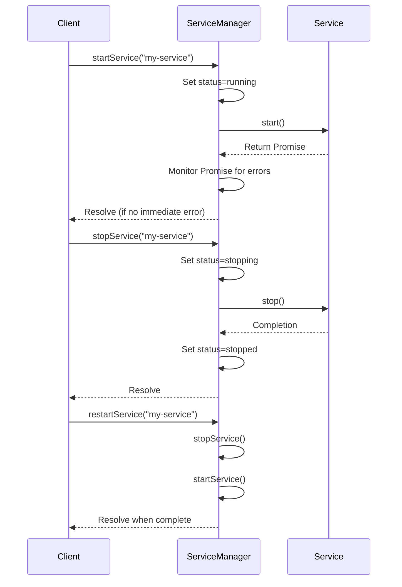

# Lifecycle Management

<cite>
**Referenced Files in This Document**  
- [ServiceManager.ts](file://src/ServiceManager.ts)
- [BaseService.ts](file://src/BaseService.ts)
- [interface.ts](file://src/interface.ts)
- [restart.ts](file://examples/restart.ts)
- [restart-policy.ts](file://examples/restart-policy.ts)
</cite>

## Table of Contents
1. [Lifecycle States](#lifecycle-states)
2. [State Transitions and Management](#state-transitions-and-management)
3. [Start, Stop, and Restart Operations](#start-stop-and-restart-operations)
4. [Failure Handling and Crash Recovery](#failure-handling-and-crash-recovery)
5. [Automatic Restart Policies](#automatic-restart-policies)
6. [Asynchronous Operation and Promise Tracking](#asynchronous-operation-and-promise-tracking)
7. [Common Lifecycle Issues](#common-lifecycle-issues)
8. [Best Practices for Service Implementation](#best-practices-for-service-implementation)

## Lifecycle States

The j8s framework defines five distinct lifecycle states for services, each representing a specific phase in a service's execution lifecycle:

- **stopped**: The service is not running and has not been started or has completed execution.
- **running**: The service is actively executing its `start()` method.
- **stopping**: The service has received a stop signal and is in the process of shutting down via its `stop()` method.
- **crashed**: The service encountered an unhandled error during startup or execution.
- **unhealthy**: The service is running but failing health checks (not directly managed by ServiceManager but reported by service).

These states are formally defined in the `ServiceStatus` type in the framework's interface layer.

**Section sources**
- [interface.ts](file://src/interface.ts#L1-L5)

## State Transitions and Management

The `ServiceManager` class is responsible for orchestrating state transitions across all registered services. It maintains a `serviceMap` that tracks each service's current state and associated metadata. Valid state transitions follow a strict flow to ensure predictable behavior:



The diagram illustrates that services begin in the `stopped` state and can only transition to `running` via `startService()`. Once running, they may move to `stopping` through explicit shutdown or to `crashed` due to errors. The `ServiceManager` enforces these transitions and prevents invalid state changes.

**Diagram sources**
- [ServiceManager.ts](file://src/ServiceManager.ts#L66-L133)
- [ServiceManager.ts](file://src/ServiceManager.ts#L135-L163)

**Section sources**
- [ServiceManager.ts](file://src/ServiceManager.ts#L5-L10)

## Start, Stop, and Restart Operations

### Start Operation
The `startService()` method initiates a service by calling its `start()` method. It sets the status to `running` and asynchronously handles the returned promise. A short delay (100ms) allows immediate startup errors to be caught before confirming successful initiation.

### Stop Operation
The `stopService()` method transitions a service to the `stopping` state, calls its `stop()` method, and updates status to `stopped` upon completion. If `stop()` fails, the status becomes `crashed`.

### Restart Operation
The `restartService()` method performs a sequential stop-then-start operation, ensuring proper cleanup before reinitialization.



**Diagram sources**
- [ServiceManager.ts](file://src/ServiceManager.ts#L66-L133)
- [ServiceManager.ts](file://src/ServiceManager.ts#L135-L168)

**Section sources**
- [ServiceManager.ts](file://src/ServiceManager.ts#L66-L168)

## Failure Handling and Crash Recovery

When a service's `start()` or execution promise rejects, the `ServiceManager` catches the error, logs it, and sets the status to `crashed`. This prevents unhandled rejections from terminating the entire process.

For services with restart policies other than `"no"`, the manager schedules a restart using exponential backoff via `scheduleServiceRestart()`. The restart delay starts at 1 second and doubles with each attempt, capped at 30 seconds.

Immediate startup failures (within the first 100ms) are treated as critical and trigger the same crash handling logic. This ensures consistent error management regardless of when the failure occurs.

**Section sources**
- [ServiceManager.ts](file://src/ServiceManager.ts#L95-L102)
- [ServiceManager.ts](file://src/ServiceManager.ts#L110-L115)
- [ServiceManager.ts](file://src/ServiceManager.ts#L140-L144)

## Automatic Restart Policies

The framework supports four restart policies defined in `RestartPolicy`:

- **always**: Restart on any failure
- **unless-stopped**: Restart unless manually stopped
- **on-failure**: Restart only after crash (default)
- **no**: Never restart automatically

The `maxRetries` configuration limits retry attempts under `on-failure` policy. After exceeding the limit, restarts cease and the service remains in `crashed` state.

Example configuration:
```typescript
manager.addService(myService, {
  restartPolicy: "on-failure",
  maxRetries: 3
});
```

**Section sources**
- [interface.ts](file://src/interface.ts#L7-L10)
- [ServiceManager.ts](file://src/ServiceManager.ts#L220-L240)

## Asynchronous Operation and Promise Tracking

To manage long-running services, the `ServiceManager` stores the `start()` promise in `runningPromise` within each `ServiceEntry`. This enables:

- Error monitoring via `.catch()`
- Potential future cancellation or cleanup
- Status synchronization (e.g., preventing premature `stopped` status)

The promise is handled asynchronously to avoid blocking the `startService()` call, while still allowing error detection through immediate rejection checks.

**Section sources**
- [ServiceManager.ts](file://src/ServiceManager.ts#L78-L86)
- [ServiceManager.ts](file://src/ServiceManager.ts#L90-L94)

## Common Lifecycle Issues

### Service Fails to Start
Caused by immediate rejection in `start()`. The manager detects this within 100ms and transitions to `crashed`, potentially triggering restarts.

### Improper Shutdown Handling
If `stop()` throws an error, the service enters `crashed` state instead of `stopped`. Services should ensure `stop()` handles all cleanup gracefully.

### Race Conditions During Restart
The `restartService()` method uses sequential `stop()` then `start()`, preventing overlap. However, improper state management within services (e.g., not checking `isStopped`) can cause race conditions.

Example from `restart-policy.ts` demonstrates proper loop termination:
```typescript
while (!this.isStopped) {
  // perform work
}
```

**Section sources**
- [restart-policy.ts](file://examples/restart-policy.ts#L30-L32)
- [ServiceManager.ts](file://src/ServiceManager.ts#L165-L168)

## Best Practices for Service Implementation

1. **Graceful Startup**: Perform minimal work in `start()`; defer heavy initialization to background tasks.
2. **Idempotent Stop**: Ensure `stop()` can be called multiple times safely.
3. **State Checks**: Use internal flags (like `isStopped`) to control execution loops.
4. **Error Handling**: Catch and handle expected errors within `start()` to avoid unintended crashes.
5. **Cleanup Timers**: Always clear intervals and timeouts in `stop()`.
6. **Health Checks**: Provide meaningful details in `healthCheck()` even though status is overridden.

Example implementation pattern:
```typescript
class MyService extends BaseService {
  private isStopped = false;
  private intervalId: NodeJS.Timeout | null = null;

  async start() {
    this.isStopped = false;
    // Setup async work
  }

  async stop() {
    this.isStopped = true;
    if (this.intervalId) clearInterval(this.intervalId);
  }
}
```

**Section sources**
- [BaseService.ts](file://src/BaseService.ts#L15-L25)
- [restart.ts](file://examples/restart.ts#L10-L35)
- [restart-policy.ts](file://examples/restart-policy.ts#L10-L25)