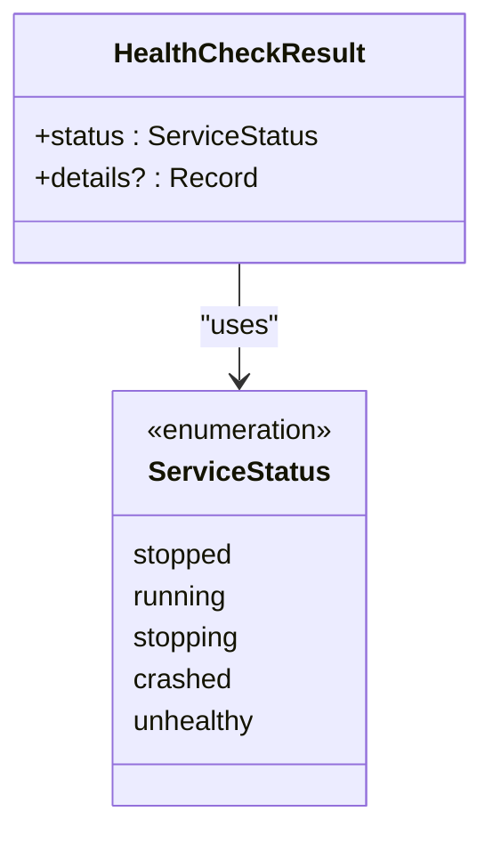
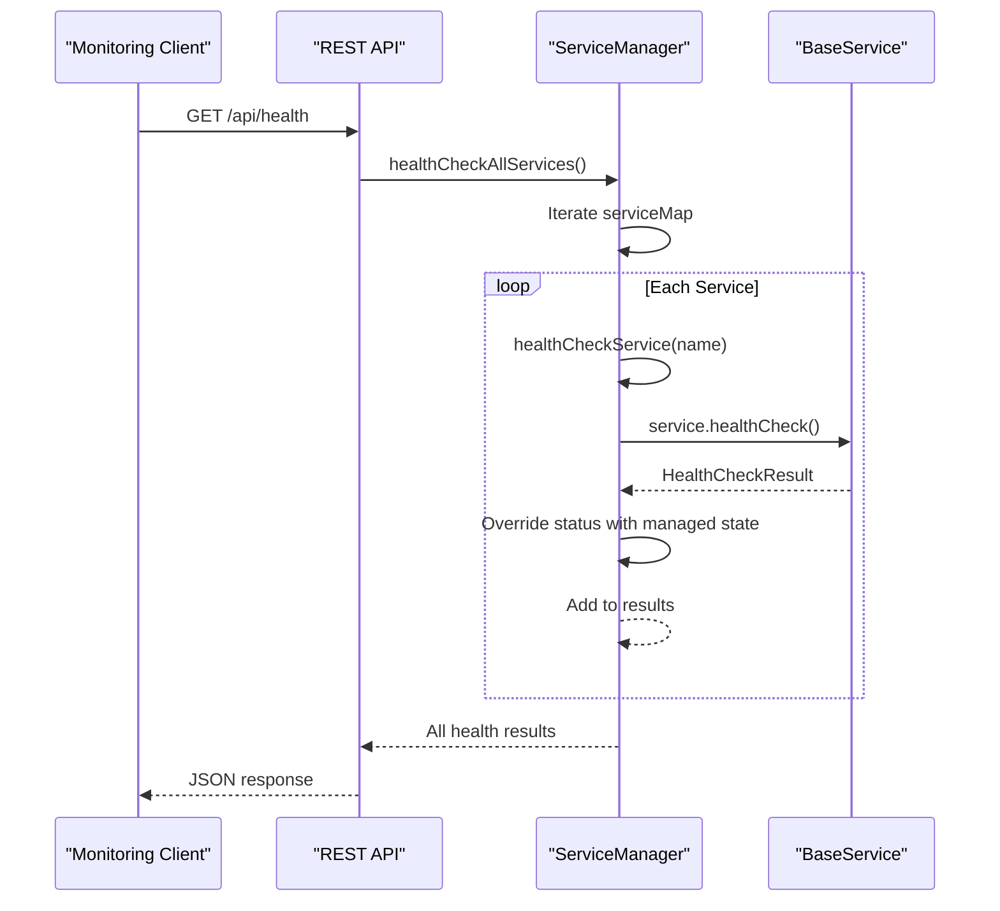

# Status & Health

<cite>
**Referenced Files in This Document**   
- [src/ServiceManager.ts](file://src/ServiceManager.ts)
- [src/BaseService.ts](file://src/BaseService.ts)
- [src/interface.ts](file://src/interface.ts)
- [src/api.ts](file://src/api.ts)
</cite>

## Table of Contents
1. [Status & Health](#status--health)
2. [Authoritative Status Management](#authoritative-status-management)
3. [HealthCheckResult Interface](#healthcheckresult-interface)
4. [Individual and Bulk Health Monitoring](#individual-and-bulk-health-monitoring)
5. [Integration with Service Lifecycle](#integration-with-service-lifecycle)
6. [Common Issues and Mitigations](#common-issues-and-mitigations)
7. [Best Practices for Health Check Implementation](#best-practices-for-health-check-implementation)

## Authoritative Status Management

The `ServiceManager` class serves as the central authority for service status in the j8s system, ensuring a single source of truth for operational state. Unlike traditional health check systems where services self-report their status, j8s implements a managed approach where the `ServiceManager` maintains authoritative state that supersedes individual service health reports.

This design pattern prevents status inconsistencies that could arise from services reporting inaccurate or stale information. When a service is started, stopped, or crashes, the `ServiceManager` immediately updates its internal state in the `serviceMap`, which contains `ServiceEntry` objects tracking each service's current status. The status field in `ServiceEntry` can be one of several values: "stopped", "running", "stopping", "crashed", or "unhealthy".

During health checks, the `ServiceManager` invokes each service's `healthCheck()` method to gather diagnostic details but replaces the status field in the returned `HealthCheckResult` with its own managed status. This ensures that even if a service incorrectly reports itself as "running" after a crash, the system will still reflect the correct "crashed" status as determined by the `ServiceManager`. This authoritative model is particularly important for automated systems that make decisions based on service health, as it prevents cascading failures due to incorrect status information.

**Section sources**
- [src/ServiceManager.ts](file://src/ServiceManager.ts#L200-L210)
- [src/interface.ts](file://src/interface.ts#L1-L12)

## HealthCheckResult Interface

The `HealthCheckResult` interface defines the standardized structure for health check responses across all services in the j8s ecosystem. This interface consists of two primary components: a required `status` field and an optional `details` object. The `status` field uses the `ServiceStatus` type, which is a union type containing predefined status values: "stopped", "running", "stopping", "crashed", and "unhealthy".

The `details` property is a flexible `Record<string, any>` that allows services to include additional diagnostic information specific to their functionality. This extensibility enables services to expose meaningful metrics and contextual data that can aid in troubleshooting and monitoring. For example, a logging service might include uptime and log volume statistics, while a worker service could report processing progress and iteration counts.

The interface is designed to support both minimal and comprehensive health reporting. Services can return just the essential status information, or they can enrich the response with detailed operational metrics. This flexibility allows developers to implement health checks that are appropriate for their service's complexity while maintaining a consistent interface across the system. The `details` field is particularly valuable for debugging, as it provides insight into the internal state of services without requiring direct access to their implementation.

**Diagram sources**
- [src/interface.ts](file://src/interface.ts#L9-L12)

**Section sources**
- [src/interface.ts](file://src/interface.ts#L9-L12)

## Individual and Bulk Health Monitoring

The j8s system provides comprehensive health monitoring capabilities through two primary methods: `healthCheckService()` for individual service assessment and `healthCheckAllServices()` for system-wide health evaluation. The `healthCheckService()` method accepts a service name parameter and returns a `HealthCheckResult` promise for that specific service. This targeted approach allows monitoring systems to check the status of critical services or investigate specific issues without incurring the overhead of checking all services.

For system-wide observability, the `healthCheckAllServices()` method aggregates health information from all registered services, returning a record object where keys are service names and values are their respective `HealthCheckResult` objects. This bulk operation is implemented as a sequential loop rather than a parallel `Promise.all()` to prevent overwhelming the system with concurrent health checks, especially when services have expensive health check implementations. The method iterates through each service entry in the `serviceMap`, calling `healthCheckService()` for each one and collecting the results.

Both methods are accessible through the REST API, with endpoints `/api/services/:name/health` for individual checks and `/api/health` for bulk checks. This integration enables external monitoring tools to easily integrate with the j8s system. The API responses are validated using Valibot schemas, ensuring consistent and predictable output. The bulk health check endpoint is particularly useful for dashboard implementations that need to display the overall system health at a glance, while individual checks support more granular troubleshooting workflows.

**Diagram sources**
- [src/ServiceManager.ts](file://src/ServiceManager.ts#L180-L200)
- [src/api.ts](file://src/api.ts#L366-L399)

**Section sources**
- [src/ServiceManager.ts](file://src/ServiceManager.ts#L180-L200)
- [src/api.ts](file://src/api.ts#L366-L399)

## Integration with Service Lifecycle

Health checks in j8s are deeply integrated with the service lifecycle, providing continuous visibility from initialization through termination. The `ServiceManager` invokes health checks at strategic points throughout a service's lifecycle, ensuring that status information remains current and actionable. When a service is added to the manager via `addService()`, its initial status is set to "stopped", establishing a known baseline state.

During service startup, the `startService()` method transitions the status to "running" before invoking the service's `start()` method. If the start operation fails, the status is immediately updated to "crashed", and this authoritative state is reflected in subsequent health checks. Similarly, during shutdown, the status progresses from "running" to "stopping" and finally to "stopped", with health checks reflecting these transitional states.

The integration extends to automated recovery mechanisms. When a service fails and has a restart policy configured, the `ServiceManager` manages the restart process while maintaining accurate status reporting. During the restart delay (implemented with exponential backoff), the service's status remains "crashed", preventing monitoring systems from misinterpreting the recovery attempt as a healthy state. This tight coupling between lifecycle management and health reporting ensures that the system's observable state accurately reflects its actual operational condition.

**Section sources**
- [src/ServiceManager.ts](file://src/ServiceManager.ts#L60-L100)
- [src/ServiceManager.ts](file://src/ServiceManager.ts#L250-L280)

## Common Issues and Mitigations

The j8s health monitoring system addresses several common issues encountered in distributed service architectures. One prevalent problem is stale health data, where services continue to report themselves as healthy despite being unresponsive. The `ServiceManager` mitigates this by maintaining authoritative status that reflects actual operational state rather than relying solely on service self-reports. When a service crashes during execution, the `ServiceManager` catches the error and updates the status to "crashed", overriding any potentially misleading health information from the service itself.

Another common issue is unresponsive services that hang during health checks, potentially causing cascading failures in monitoring systems. While the current implementation doesn't include explicit timeouts for health check calls, the separation of status management from health check execution provides some protection. Even if a service's `healthCheck()` method hangs, the `ServiceManager`'s authoritative status remains accurate based on the last known lifecycle event.

Status reporting misalignment is addressed through the status override mechanism. Services may have different interpretations of what constitutes a "healthy" state, but the `ServiceManager` provides a consistent definition based on operational status. For example, a service might consider itself healthy as long as its main loop is running, even if it's failing to process work. The `ServiceManager`'s status reflects whether the service is actually fulfilling its responsibilities within the system context.

**Section sources**
- [src/ServiceManager.ts](file://src/ServiceManager.ts#L200-L210)
- [src/ServiceManager.ts](file://src/ServiceManager.ts#L100-L150)

## Best Practices for Health Check Implementation

When implementing health checks in `BaseService` subclasses, developers should follow several best practices to ensure meaningful and reliable monitoring. First, health checks should be lightweight and fast, avoiding expensive operations that could impact service performance. The `details` field should be used judiciously to include only essential diagnostic information, balancing comprehensiveness with efficiency.

Health check implementations should validate critical dependencies, such as database connections or external APIs, to provide early warning of potential failures. For example, a service that relies on a database should test connectivity in its `healthCheck()` method rather than waiting for a failure during normal operation. However, developers should implement appropriate timeouts for these dependency checks to prevent the health check itself from hanging.

The `details` object should include metrics that are actionable for operators, such as processing latency, queue depth, or error rates, rather than just operational uptime. This contextual information enables more effective troubleshooting and capacity planning. Services should also consider their specific operational context when determining health—what constitutes "healthy" behavior may vary significantly between service types.

Finally, developers should be aware that the `status` field in their `HealthCheckResult` will be overridden by the `ServiceManager`, so they should focus on providing accurate diagnostic details rather than attempting to determine their own operational status. The base implementation in `BaseService` returns a minimal health check with "stopped" status, which serves as a template for subclasses to extend with service-specific details.

**Section sources**
- [src/BaseService.ts](file://src/BaseService.ts#L15-L25)
- [src/ServiceManager.ts](file://src/ServiceManager.ts#L200-L210)