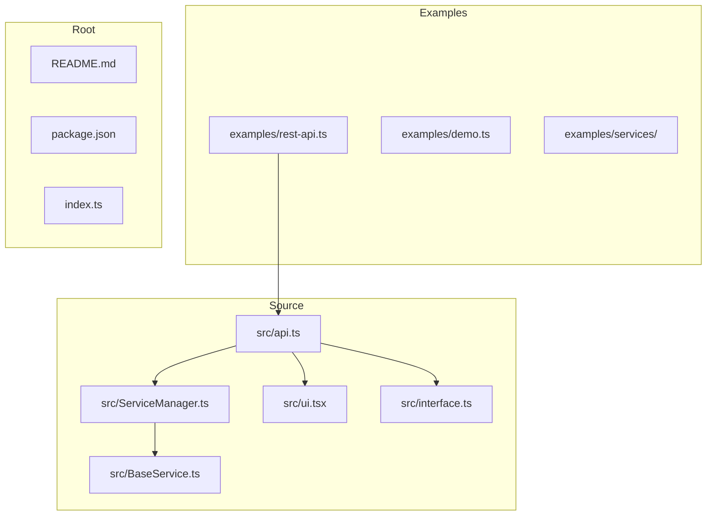
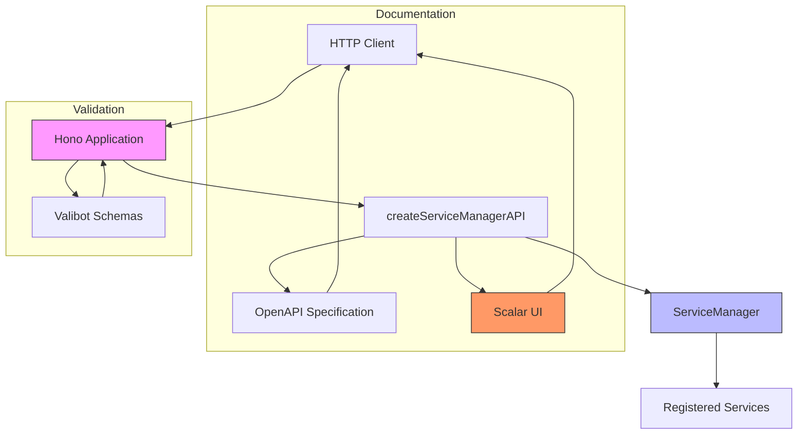
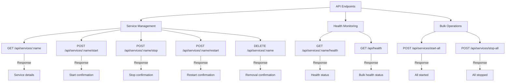
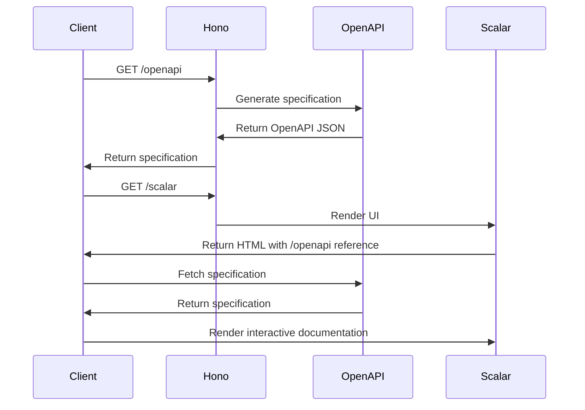

# API Integration

<cite>
**Referenced Files in This Document**   
- [examples/rest-api.ts](file://examples/rest-api.ts)
- [src/api.ts](file://src/api.ts)
- [src/ServiceManager.ts](file://src/ServiceManager.ts)
- [README.md](file://README.md)
</cite>

## Table of Contents
1. [Introduction](#introduction)
2. [Project Structure](#project-structure)
3. [Core Components](#core-components)
4. [Architecture Overview](#architecture-overview)
5. [Detailed Component Analysis](#detailed-component-analysis)
6. [Dependency Analysis](#dependency-analysis)
7. [Performance Considerations](#performance-considerations)
8. [Troubleshooting Guide](#troubleshooting-guide)
9. [Conclusion](#conclusion)

## Introduction
The j8s framework provides a comprehensive REST API for service orchestration using the Hono web framework. This documentation details how the `createServiceManagerAPI` function exposes service management capabilities over HTTP, enabling remote control and monitoring of services in distributed systems. The API supports full lifecycle management of services including starting, stopping, restarting, and removing services, along with comprehensive health monitoring capabilities. Built-in OpenAPI specification generation and Scalar UI integration provide automated API documentation and interactive exploration. The framework is designed for integration with monitoring dashboards and remote orchestration scenarios, making it suitable for production environments requiring service management at scale.

## Project Structure
The j8s project follows a modular structure with clear separation between core functionality and examples. The API integration components are organized across multiple directories, with the core API implementation in the src directory and practical usage examples in the examples directory.



**Diagram sources**
- [examples/rest-api.ts](file://examples/rest-api.ts)
- [src/api.ts](file://src/api.ts)
- [src/ServiceManager.ts](file://src/ServiceManager.ts)

**Section sources**
- [examples/rest-api.ts](file://examples/rest-api.ts)
- [src/api.ts](file://src/api.ts)
- [src/ServiceManager.ts](file://src/ServiceManager.ts)

## Core Components
The REST API integration in j8s revolves around the `createServiceManagerAPI` function, which creates a Hono application exposing service management endpoints. The API connects to a `ServiceManager` instance that controls service lifecycle operations. Key components include route handlers for service operations, OpenAPI specification generation, and Scalar UI integration for interactive documentation. The API validates requests using Valibot schemas and provides comprehensive response validation. Service operations are mapped to corresponding methods on the ServiceManager, which handles the actual service orchestration. The architecture supports both individual service operations and bulk operations for starting or stopping all services simultaneously.

**Section sources**
- [src/api.ts](file://src/api.ts#L69-L125)
- [examples/rest-api.ts](file://examples/rest-api.ts#L0-L53)

## Architecture Overview
The REST API architecture in j8s follows a clean separation between the HTTP interface and the service orchestration logic. The `createServiceManagerAPI` function acts as an adapter between the Hono web framework and the ServiceManager class, exposing service management capabilities over HTTP. The architecture includes multiple layers: the HTTP server layer using @hono/node-server, the routing and validation layer using Hono's middleware system, the API specification layer with OpenAPI generation, and the interactive documentation layer with Scalar UI. The ServiceManager maintains the state of all registered services and handles operations like starting, stopping, and health checking. The API endpoints are designed to be idempotent where appropriate and provide consistent response formats for both success and error conditions.



**Diagram sources**
- [src/api.ts](file://src/api.ts#L69-L125)
- [examples/rest-api.ts](file://examples/rest-api.ts#L0-L53)

## Detailed Component Analysis

### REST API Implementation
The REST API implementation in j8s provides comprehensive service management capabilities through a well-structured set of endpoints. The API is built on Hono, a lightweight web framework for JavaScript/TypeScript, and follows REST principles for resource management. Each endpoint corresponds to a specific service operation, with appropriate HTTP methods and status codes. The implementation includes request validation using Valibot schemas to ensure data integrity and proper error handling to provide meaningful feedback to clients. The API automatically generates OpenAPI specifications, enabling API discovery and client code generation. The Scalar UI integration provides an interactive interface for exploring and testing the API endpoints with customizable themes.

#### API Endpoints and Operations


**Diagram sources**
- [src/api.ts](file://src/api.ts#L124-L184)
- [examples/rest-api.ts](file://examples/rest-api.ts#L111-L143)

**Section sources**
- [src/api.ts](file://src/api.ts#L124-L184)
- [examples/rest-api.ts](file://examples/rest-api.ts#L111-L143)

### OpenAPI and Scalar Integration
The j8s framework includes built-in support for OpenAPI specification generation and Scalar UI integration, providing comprehensive API documentation and interactive exploration capabilities. When enabled in the API configuration, the OpenAPI specification is automatically generated and served at the `/openapi` endpoint. This specification includes detailed information about all available endpoints, request/response formats, parameters, and status codes. The Scalar UI is served at the `/scalar` endpoint and provides an interactive interface for testing API endpoints directly from the browser. The integration supports customizable themes, with options including 'deepSpace', 'default', 'moon', and several others, allowing organizations to match their branding requirements.

#### OpenAPI Specification Generation


**Diagram sources**
- [src/api.ts](file://src/api.ts#L69-L125)
- [src/api.ts](file://src/api.ts#L124-L184)

**Section sources**
- [src/api.ts](file://src/api.ts#L69-L125)
- [README.md](file://README.md#L229-L280)

### HTTP Server Setup
The HTTP server setup in j8s uses the @hono/node-server package to create a Node.js HTTP server that serves the Hono application. The setup process involves creating a ServiceManager instance, configuring the API with desired options, and then starting the server on a specified port. The server configuration is minimal, requiring only the fetch handler from the Hono application and the desired port number. This approach follows the adapter pattern, allowing the API to be deployed in various environments with minimal configuration changes. The server setup also includes console logging to inform users of the available endpoints and documentation URLs once the server is running.

#### Server Configuration Flow
```mermaid
flowchart LR
A[Create ServiceManager] --> B[Add Services]
B --> C[Create API with createServiceManagerAPI]
C --> D[Configure Options]
D --> E[Start Server with serve()]
E --> F[Log Available Endpoints]
style A fill:#f9f,stroke:#333
style B fill:#f9f,stroke:#333
style C fill:#f9f,stroke:#333
style D fill:#f9f,stroke:#333
style E fill:#f96,stroke:#333
style F fill:#f96,stroke:#333
```

**Diagram sources**
- [examples/rest-api.ts](file://examples/rest-api.ts#L111-L143)
- [src/api.ts](file://src/api.ts#L124-L184)

**Section sources**
- [examples/rest-api.ts](file://examples/rest-api.ts#L111-L143)
- [README.md](file://README.md#L229-L280)

## Dependency Analysis
The REST API integration in j8s has a well-defined dependency structure that separates concerns and enables extensibility. The core dependencies include Hono for the web framework, hono-openapi for OpenAPI specification generation, valibot for request validation, and @scalar/hono-api-reference for the interactive documentation UI. The API implementation depends on the ServiceManager class for service orchestration capabilities but maintains loose coupling through interface-based design. This allows the API layer to remain independent of the specific implementation details of service management. The framework also supports worker threads through the WorkerService class, enabling services to run in separate execution contexts while still being manageable through the same API interface.

```mermaid
graph TD
API[createServiceManagerAPI] --> Hono[Hono]
API --> OpenAPI[hono-openapi]
API --> Valibot[valibot]
API --> Scalar[@scalar/hono-api-reference]
API --> ServiceManager[ServiceManager]
ServiceManager --> BaseService[BaseService]
ServiceManager --> WorkerService[WorkerService]
ServiceManager --> Cron[cron]
style API fill:#f9f,stroke:#333
style Hono fill:#bbf,stroke:#333
style OpenAPI fill:#bbf,stroke:#333
style Valibot fill:#bbf,stroke:#333
style Scalar fill:#f96,stroke:#333
```

**Diagram sources**
- [src/api.ts](file://src/api.ts#L0-L67)
- [src/ServiceManager.ts](file://src/ServiceManager.ts#L0-L351)

**Section sources**
- [src/api.ts](file://src/api.ts#L0-L67)
- [src/ServiceManager.ts](file://src/ServiceManager.ts#L0-L351)

## Performance Considerations
The j8s REST API is designed with performance in mind, leveraging Hono's lightweight architecture for efficient request handling. The framework minimizes overhead by using asynchronous operations throughout the service lifecycle management. Health checks are implemented to be non-blocking, allowing the API to respond quickly even when services are performing intensive operations. The bulk operations for starting or stopping all services use Promise.all for parallel execution, reducing the total time required for mass operations. The OpenAPI specification generation is cached after the initial request, preventing unnecessary computation on subsequent requests. The framework also includes timeout handling for cron jobs and long-running services, preventing individual service operations from blocking the API indefinitely.

## Troubleshooting Guide
When integrating with the j8s REST API, several common issues may arise. If the API server fails to start, verify that the specified port is not already in use by another process. For authentication-related issues, note that the current implementation does not include built-in authentication, so additional middleware would need to be added for secure deployments. If service operations are not working as expected, check that the service names in the URL path match exactly with the registered service names, as the matching is case-sensitive. For OpenAPI or Scalar UI issues, ensure that the API configuration has the respective features enabled. When services fail to start, examine the service's start method for unhandled exceptions, as these will be caught and reported by the ServiceManager with appropriate error messages.

**Section sources**
- [src/api.ts](file://src/api.ts#L124-L184)
- [examples/rest-api.ts](file://examples/rest-api.ts#L111-L143)

## Conclusion
The j8s framework provides a robust and comprehensive REST API for service orchestration, making it well-suited for distributed systems and monitoring dashboards. The integration with Hono provides a lightweight and efficient HTTP interface, while the built-in OpenAPI specification generation and Scalar UI enable easy API discovery and client development. The API exposes full lifecycle management capabilities for services, allowing remote control of service operations through standard HTTP requests. For production deployments, it is recommended to add authentication middleware, implement proper error logging, and consider rate limiting to protect against abuse. The framework's modular design allows for easy extension and customization to meet specific deployment requirements while maintaining a clean separation between the API interface and the underlying service orchestration logic.