# Basic Services

<cite>
**Referenced Files in This Document**   
- [demo.ts](file://examples/demo.ts)
- [BaseService.ts](file://src/BaseService.ts)
- [ServiceManager.ts](file://src/ServiceManager.ts)
- [WorkerService.ts](file://src/WorkerService.ts)
- [interface.ts](file://src/interface.ts)
- [logService.ts](file://examples/services/logService.ts)
</cite>

## Table of Contents
1. [Introduction](#introduction)
2. [Core Architecture](#core-architecture)
3. [Creating a Service by Extending BaseService](#creating-a-service-by-extending-baseservice)
4. [Service Lifecycle Management](#service-lifecycle-management)
5. [Service Registration and Orchestration](#service-registration-and-orchestration)
6. [Restart Policies and Failure Handling](#restart-policies-and-failure-handling)
7. [Cron-Based Scheduling](#cron-based-scheduling)
8. [Health Check Implementation](#health-check-implementation)
9. [Worker Service Integration](#worker-service-integration)
10. [Graceful Shutdown Handling](#graceful-shutdown-handling)
11. [Execution Flow and Service Coordination](#execution-flow-and-service-coordination)
12. [Common Issues and Best Practices](#common-issues-and-best-practices)

## Introduction
This document provides a comprehensive guide to the service orchestration framework demonstrated in `demo.ts`. It explains how to create, manage, and coordinate services using the BaseService and ServiceManager classes. The framework supports various service types including long-running services, worker-based services, and cron-scheduled tasks. Key features include lifecycle management, restart policies, health monitoring, and graceful shutdown handling. This documentation walks through the implementation details and usage patterns to help developers build robust, maintainable services within this ecosystem.

## Core Architecture
The service orchestration framework is built around three core components: BaseService, ServiceManager, and WorkerService. These classes work together to provide a unified interface for service lifecycle management, monitoring, and coordination. The architecture follows a clear separation of concerns where BaseService defines the contract for all services, ServiceManager handles orchestration and state management, and WorkerService enables off-thread execution.

```mermaid
classDiagram
class IService {
<<interface>>
+string name
+start() Promise~void~
+stop() Promise~void~
+healthCheck() Promise~HealthCheckResult~
}
class BaseService {
+string name
+constructor(name)
+abstract start() Promise~void~
+abstract stop() Promise~void~
+healthCheck() Promise~HealthCheckResult~
}
class ServiceManager {
+services IService[]
+addService(service, config)
+removeService(name)
+startService(name)
+stopService(name)
+startAllServices()
+stopAllServices()
+healthCheckService(name)
+healthCheckAllServices()
}
class WorkerService {
+string name
+options WorkerServiceOptions
+start() Promise~void~
+stop() Promise~void~
+healthCheck() Promise~HealthCheckResult~
}
class ServiceConfig {
+restartPolicy RestartPolicy
+maxRetries number
+cronJob CronJobConfig
}
class HealthCheckResult {
+status ServiceStatus
+details Record~string, any~
}
IService <|-- BaseService
IService <|-- WorkerService
BaseService <|-- SimpleService
BaseService <|-- CronService
ServiceManager --> "0..*" IService : manages
ServiceManager --> "0..*" ServiceEntry : contains
WorkerService --> WorkerServiceOptions
BaseService --> HealthCheckResult
ServiceConfig --> RestartPolicy
ServiceConfig --> CronJobConfig
```

**Diagram sources**
- [BaseService.ts](file://src/BaseService.ts#L1-L25)
- [ServiceManager.ts](file://src/ServiceManager.ts#L1-L351)
- [WorkerService.ts](file://src/WorkerService.ts#L1-L193)
- [interface.ts](file://src/interface.ts#L1-L44)

**Section sources**
- [BaseService.ts](file://src/BaseService.ts#L1-L25)
- [ServiceManager.ts](file://src/ServiceManager.ts#L1-L351)
- [WorkerService.ts](file://src/WorkerService.ts#L1-L193)
- [interface.ts](file://src/interface.ts#L1-L44)

## Creating a Service by Extending BaseService
To create a custom service, extend the BaseService class and implement the required abstract methods. The BaseService constructor requires a service name, which becomes the unique identifier within the ServiceManager. When extending BaseService, developers must implement the start() and stop() methods to define the service's behavior during startup and shutdown. The base class provides a default healthCheck implementation that can be extended to expose custom metrics.

**Diagram sources**
- [BaseService.ts](file://src/BaseService.ts#L1-L25)
- [demo.ts](file://examples/demo.ts#L10-L98)

**Section sources**
- [BaseService.ts](file://src/BaseService.ts#L1-L25)
- [demo.ts](file://examples/demo.ts#L10-L98)

## Service Lifecycle Management
Service lifecycle management is handled through the start() and stop() methods defined in the BaseService interface. The start() method initializes the service, performs any necessary setup, and begins its primary operation. The stop() method handles cleanup, resource release, and graceful termination. The framework supports both long-running services and short-lived tasks, with proper error handling and state management throughout the lifecycle.

### SimpleService Lifecycle Implementation
The SimpleService class demonstrates a typical long-running service pattern with periodic execution. During startup, it simulates initialization with a delay, then sets up an interval timer for periodic logging. The shutdown process clears the interval and simulates cleanup with another delay.

**Diagram sources**
- [demo.ts](file://examples/demo.ts#L18-L42)

**Section sources**
- [demo.ts](file://examples/demo.ts#L18-L42)

### CronService Lifecycle Implementation
The CronService class represents a task-based service that performs work and then completes. Unlike long-running services, cron jobs execute their work once per trigger and then finish. The start() method runs the task logic and returns when complete, while the stop() method handles any necessary cleanup.

**Diagram sources**
- [demo.ts](file://examples/demo.ts#L60-L84)

**Section sources**
- [demo.ts](file://examples/demo.ts#L60-L84)

## Service Registration and Orchestration
Services are registered with the ServiceManager using the addService() method, which accepts both the service instance and a configuration object. The ServiceManager maintains a registry of all services and provides methods to control them individually or collectively. This centralized management enables coordinated startup, shutdown, and monitoring of multiple services.

**Diagram sources**
- [demo.ts](file://examples/demo.ts#L100-L153)

**Section sources**
- [demo.ts](file://examples/demo.ts#L100-L153)

## Restart Policies and Failure Handling
The framework provides robust restart policies to handle service failures and ensure system reliability. Services can be configured with different restart behaviors based on their criticality and failure patterns. The ServiceManager tracks restart attempts and applies exponential backoff to prevent overwhelming the system during repeated failures.

### Restart Policy Types
The framework supports four restart policies:
- **always**: Always restart the service when it stops, regardless of exit status
- **unless-stopped**: Restart unless explicitly stopped by the user
- **on-failure**: Only restart if the service exits with an error
- **no**: Never restart the service automatically

**Diagram sources**
- [ServiceManager.ts](file://src/ServiceManager.ts#L238-L286)
- [interface.ts](file://src/interface.ts#L5-L6)

**Section sources**
- [ServiceManager.ts](file://src/ServiceManager.ts#L238-L286)
- [interface.ts](file://src/interface.ts#L5-L6)

## Cron-Based Scheduling
The framework supports cron-based scheduling through the cronJob configuration option. Services can be configured to run at specific times or intervals using standard cron expressions. The ServiceManager integrates with the cron package to manage scheduled execution, including timeout handling to prevent long-running tasks from blocking subsequent executions.

### Cron Configuration Options
The cronJob configuration object supports:
- **schedule**: Cron expression defining when to run the service
- **timeout**: Maximum execution time in milliseconds before forced termination

**Diagram sources**
- [interface.ts](file://src/interface.ts#L19-L23)
- [demo.ts](file://examples/demo.ts#L118-L148)

**Section sources**
- [interface.ts](file://src/interface.ts#L19-L23)
- [demo.ts](file://examples/demo.ts#L118-L148)

## Health Check Implementation
Health checks provide runtime monitoring and metrics exposure for services. The BaseService includes a default healthCheck method that returns basic status information, which can be extended to include custom metrics. The ServiceManager overrides the status field with its managed state, ensuring consistent health reporting across all services.

### SimpleService Health Check
The SimpleService extends the base healthCheck implementation to include memory usage and process uptime metrics. It calls the parent implementation using super.healthCheck() and merges the results with service-specific details.

**Diagram sources**
- [demo.ts](file://examples/demo.ts#L44-L53)
- [BaseService.ts](file://src/BaseService.ts#L20-L25)

**Section sources**
- [demo.ts](file://examples/demo.ts#L44-L53)
- [BaseService.ts](file://src/BaseService.ts#L20-L25)

## Worker Service Integration
The framework supports worker thread integration through the WorkerService class and createWorkerService factory function. Worker services enable off-thread execution for CPU-intensive tasks or isolation of potentially unstable code. The WorkerService uses RPC (Remote Procedure Call) to communicate with the worker thread, allowing seamless method invocation across thread boundaries.

### Worker Service Creation
Worker services are created using the createWorkerService factory function, which accepts a service name, worker script path, and optional configuration. The factory returns a WorkerService instance that can be registered with the ServiceManager like any other service.

**Diagram sources**
- [WorkerService.ts](file://src/WorkerService.ts#L1-L193)
- [demo.ts](file://examples/demo.ts#L105-L112)
- [index.ts](file://src/index.ts#L168-L181)

**Section sources**
- [WorkerService.ts](file://src/WorkerService.ts#L1-L193)
- [demo.ts](file://examples/demo.ts#L105-L112)

## Graceful Shutdown Handling
The framework provides mechanisms for graceful shutdown through signal handling. Services can register handlers for SIGINT (Ctrl+C) and SIGTERM signals to perform cleanup operations before process termination. This ensures that services can release resources, save state, and stop gracefully when the application is shutting down.

### Signal Handling Implementation
The demo application sets up a shutdown function that stops all services and exits the process. This function is registered as a handler for both SIGINT and SIGTERM signals, providing a consistent shutdown procedure regardless of how the termination request is received.

**Diagram sources**
- [demo.ts](file://examples/demo.ts#L155-L163)

**Section sources**
- [demo.ts](file://examples/demo.ts#L155-L163)

## Execution Flow and Service Coordination
The framework enables coordinated execution of multiple services with different types and configurations. The ServiceManager handles the startup sequence, ensuring all services are properly initialized and monitored. Services can run concurrently with independent lifecycles, while the manager provides centralized control and visibility.

### Service Startup Sequence
When startAllServices() is called, the ServiceManager iterates through all registered services and starts them in sequence. Each service's start() method is called, and the manager handles errors and restart policies according to the service configuration.

**Diagram sources**
- [demo.ts](file://examples/demo.ts#L149-L153)
- [ServiceManager.ts](file://src/ServiceManager.ts#L198-L212)

**Section sources**
- [demo.ts](file://examples/demo.ts#L149-L153)
- [ServiceManager.ts](file://src/ServiceManager.ts#L198-L212)

## Common Issues and Best Practices
When working with the service orchestration framework, several common issues and best practices should be considered to ensure reliable and maintainable code.

### Unhandled Rejections
Ensure all asynchronous operations are properly handled with try/catch blocks or error callbacks. Unhandled promise rejections can cause services to fail unexpectedly and may not trigger the configured restart policies.

### Timeout Considerations
For long-running operations, consider implementing timeouts to prevent services from hanging indefinitely. The cronJob timeout configuration provides built-in support for this, but custom services should implement their own timeout mechanisms when appropriate.

### Resource Cleanup
Always implement proper cleanup in the stop() method, including clearing intervals, closing connections, and releasing any allocated resources. This prevents memory leaks and ensures services can be restarted reliably.

### Error Handling
Implement comprehensive error handling in both start() and stop() methods. The framework will handle service failures according to the configured restart policy, but services should still log meaningful error messages to aid debugging.

**Section sources**
- [ServiceManager.ts](file://src/ServiceManager.ts#L58-L152)
- [WorkerService.ts](file://src/WorkerService.ts#L114-L170)
- [demo.ts](file://examples/demo.ts#L15-L42)