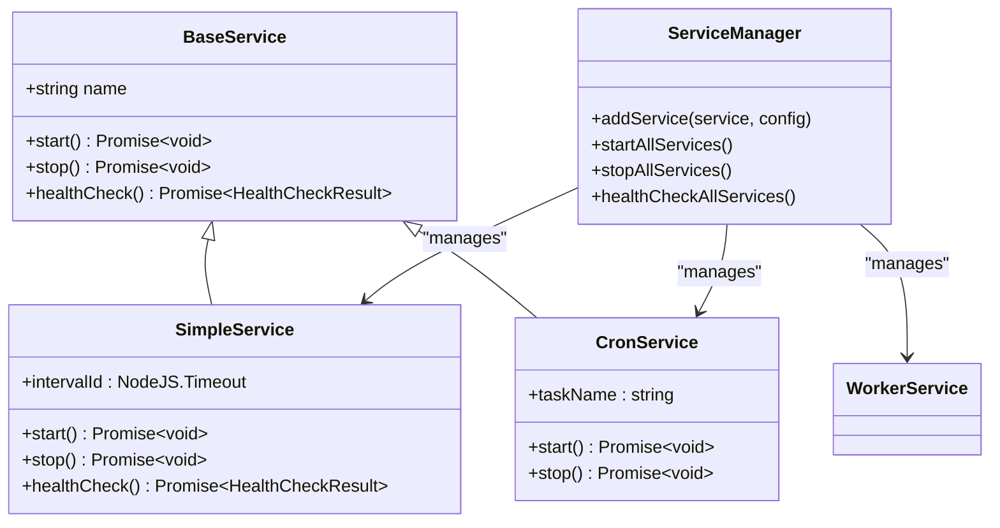
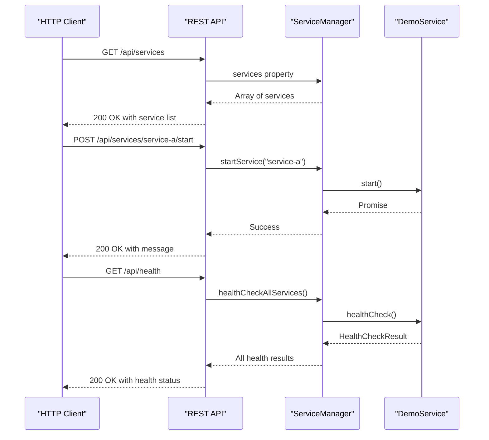
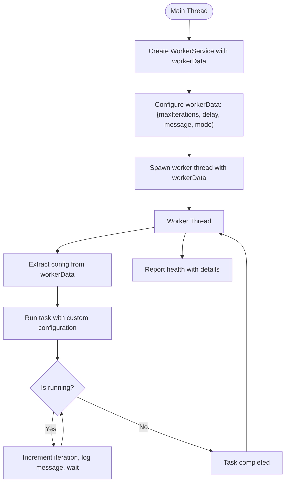
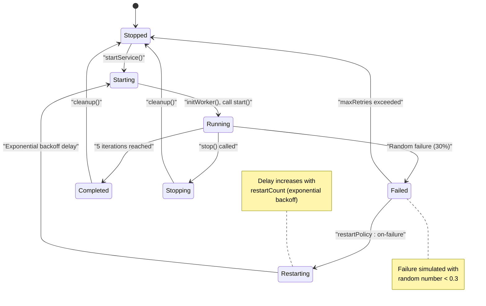
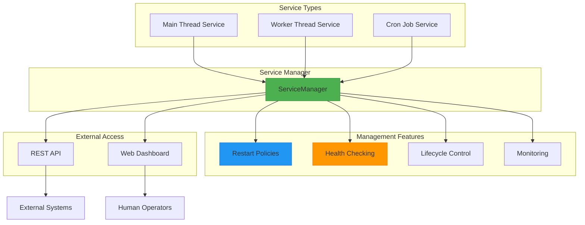
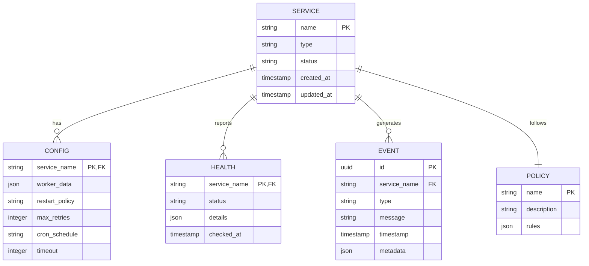

# Examples

<cite>
**Referenced Files in This Document**   
- [demo.ts](file://examples/demo.ts)
- [rest-api.ts](file://examples/rest-api.ts)
- [worker-with-data.ts](file://examples/services/worker-with-data.ts)
- [worker-failure.ts](file://examples/services/worker-failure.ts)
- [BaseService.ts](file://src/BaseService.ts)
- [WorkerService.ts](file://src/WorkerService.ts)
- [ServiceManager.ts](file://src/ServiceManager.ts)
- [api.ts](file://src/api.ts)
- [expose.ts](file://src/expose.ts)
</cite>

## Table of Contents
1. [Introduction](#introduction)
2. [Basic Service Example](#basic-service-example)
3. [REST API Integration Example](#rest-api-integration-example)
4. [Worker with Data Passing Example](#worker-with-data-passing-example)
5. [Worker Failure Handling Example](#worker-failure-handling-example)
6. [Orchestrating Multiple Services](#orchestrating-multiple-services)
7. [Real-World Use Cases](#real-world-use-cases)
8. [Conclusion](#conclusion)

## Introduction
This document presents practical examples from the j8s codebase, demonstrating various service patterns and integration scenarios. The examples range from basic services to advanced worker-based implementations with data passing and failure handling. Each example showcases key architectural patterns including service lifecycle management, REST API integration, worker thread communication, and fault tolerance mechanisms. The examples are organized by complexity to provide a progressive learning path for understanding the j8s framework.

## Basic Service Example

The `demo.ts` example demonstrates the fundamental concepts of service creation and management in j8s. It showcases how to create services that run in the main thread, worker threads, and scheduled cron jobs.

The example begins by defining a `SimpleService` class that extends `BaseService`. This service implements the core lifecycle methods: `start()`, `stop()`, and `healthCheck()`. The `start()` method initializes a repeating interval that logs a message every 5 seconds, simulating ongoing work. The `stop()` method cleans up the interval and performs graceful shutdown.

A `CronService` class is also defined to demonstrate scheduled tasks. Multiple instances of this service are configured with different cron schedules, including hourly execution, every 15 seconds, and business hours on weekdays.

The `ServiceManager` orchestrates all services, handling their lifecycle and restart policies. Worker services are created using the `createWorkerService` helper function, which simplifies worker thread creation by handling the underlying RPC communication.

**Diagram sources**
- [demo.ts](file://examples/demo.ts#L20-L166)
- [BaseService.ts](file://src/BaseService.ts#L1-L26)

**Section sources**
- [demo.ts](file://examples/demo.ts#L1-L166)
- [BaseService.ts](file://src/BaseService.ts#L1-L26)

## REST API Integration Example

The `rest-api.ts` example demonstrates how to expose service management functionality through a REST API using the Hono framework. This enables external systems to monitor and control services via HTTP endpoints.

The example creates a `DemoService` class that extends `BaseService` with custom start, stop, and health check implementations. Three service instances are created with different configurations: one with "always" restart policy, another with "on-failure" policy, and a cron job service that runs every 15 seconds.

The core of this example is the `createServiceManagerAPI` function, which generates a complete REST API for the `ServiceManager`. This API provides endpoints for listing services, checking health, and controlling service lifecycle (start, stop, restart). The API also includes OpenAPI specification and Scalar documentation UI for easy exploration.

The server is started on port 3200, exposing endpoints such as `/api/services` for service management and `/api/health` for system-wide health monitoring. The web UI is available at the root path, providing a dashboard for service management.

**Diagram sources**
- [rest-api.ts](file://examples/rest-api.ts#L1-L144)
- [api.ts](file://src/api.ts#L1-L499)

**Section sources**
- [rest-api.ts](file://examples/rest-api.ts#L1-L144)
- [api.ts](file://src/api.ts#L1-L499)

## Worker with Data Passing Example

The `worker-with-data.ts` example demonstrates how to pass custom configuration data to worker threads using the `workerData` property. This pattern enables dynamic worker behavior based on runtime parameters.

The `WorkerWithDataService` implements the `IService` interface and accesses configuration data passed from the main thread through `workerData`. The constructor extracts parameters such as `maxIterations`, `delay`, `message`, and `mode` from the worker data, allowing the worker's behavior to be customized without code changes.

This example showcases the worker service pattern where long-running tasks execute in separate threads, preventing blocking of the main event loop. The service can operate in different modes (e.g., "normal" or "verbose") based on the configuration, demonstrating how the same worker code can exhibit different behaviors.

The health check method returns detailed information about the worker's state, including uptime, iteration count, and configuration parameters, providing comprehensive monitoring capabilities.

**Diagram sources**
- [worker-with-data.ts](file://examples/services/worker-with-data.ts#L1-L80)
- [WorkerService.ts](file://src/WorkerService.ts#L1-L194)

**Section sources**
- [worker-with-data.ts](file://examples/services/worker-with-data.ts#L1-L80)
- [WorkerService.ts](file://src/WorkerService.ts#L1-L194)

## Worker Failure Handling Example

The `worker-failure.ts` example demonstrates fault tolerance and restart policies in worker-based services. It simulates a long-running task with a high probability of failure to test the service manager's error handling capabilities.

The `WorkerFailureService` implements a task that runs in a loop, generating random numbers and failing with a 30% probability. This simulates real-world scenarios where external dependencies or processing errors can cause service failures.

The service manager's restart policy handles these failures automatically. When the worker throws an error, the service manager catches it and schedules a restart with exponential backoff. The restart count increases with each attempt, and after a configurable number of retries, the service stops attempting to restart.

This example showcases the resilience pattern where transient failures are handled gracefully, allowing the system to recover from temporary issues without manual intervention.

**Diagram sources**
- [worker-failure.ts](file://examples/services/worker-failure.ts#L1-L69)
- [ServiceManager.ts](file://src/ServiceManager.ts#L1-L352)

**Section sources**
- [worker-failure.ts](file://examples/services/worker-failure.ts#L1-L69)
- [ServiceManager.ts](file://src/ServiceManager.ts#L1-L352)

## Orchestrating Multiple Services

The examples demonstrate how multiple services can be orchestrated together using the `ServiceManager`. This central component coordinates the lifecycle of various service types, including main thread services, worker services, and cron jobs.

The `demo.ts` example shows how different services with varying restart policies can coexist. The logging service uses "on-failure" restart policy with a maximum of 3 retries, while the main service uses "always" restart policy. This allows fine-grained control over service resilience based on their criticality and failure modes.

Cron jobs are integrated seamlessly into the service manager, allowing scheduled tasks to benefit from the same monitoring, health checking, and error handling as regular services. The service manager handles the complexity of scheduling, execution, and timeout management for cron jobs.

The REST API example demonstrates how external systems can interact with the orchestrated services, enabling centralized monitoring and control of the entire service ecosystem.

**Diagram sources**
- [demo.ts](file://examples/demo.ts#L1-L166)
- [ServiceManager.ts](file://src/ServiceManager.ts#L1-L352)
- [api.ts](file://src/api.ts#L1-L499)

**Section sources**
- [demo.ts](file://examples/demo.ts#L1-L166)
- [ServiceManager.ts](file://src/ServiceManager.ts#L1-L352)

## Real-World Use Cases

The examples map directly to common real-world scenarios in distributed systems and microservices architectures.

The worker with data pattern demonstrated in `worker-with-data.ts` is ideal for background processing tasks such as data transformation, file processing, or batch operations. By passing configuration through `workerData`, the same worker code can handle different processing requirements, making it reusable across multiple use cases.

The failure handling example with `worker-failure.ts` models fault-tolerant systems that must continue operating despite transient failures. This pattern is essential for systems that process critical data or provide essential services where downtime is unacceptable.

The REST API integration enables health monitoring and remote management of services, which is crucial for production systems. Operations teams can monitor service health, restart failed services, or perform maintenance without direct access to the server.

The cron job functionality supports scheduled maintenance tasks, data backups, report generation, and other time-based operations that are common in enterprise applications.

**Diagram sources**
- [demo.ts](file://examples/demo.ts#L1-L166)
- [rest-api.ts](file://examples/rest-api.ts#L1-L144)
- [worker-with-data.ts](file://examples/services/worker-with-data.ts#L1-L80)
- [worker-failure.ts](file://examples/services/worker-failure.ts#L1-L69)

**Section sources**
- [demo.ts](file://examples/demo.ts#L1-L166)
- [rest-api.ts](file://examples/rest-api.ts#L1-L144)

## Conclusion
The j8s examples demonstrate a comprehensive approach to service management in Node.js applications. From basic services to advanced worker patterns with data passing and failure handling, the framework provides robust tools for building resilient, maintainable systems. The integration of REST APIs enables external monitoring and control, while the service manager orchestrates multiple services with different configurations and policies. These patterns are directly applicable to real-world scenarios such as background processing, health monitoring, and fault-tolerant systems, making j8s a powerful solution for complex service architectures.