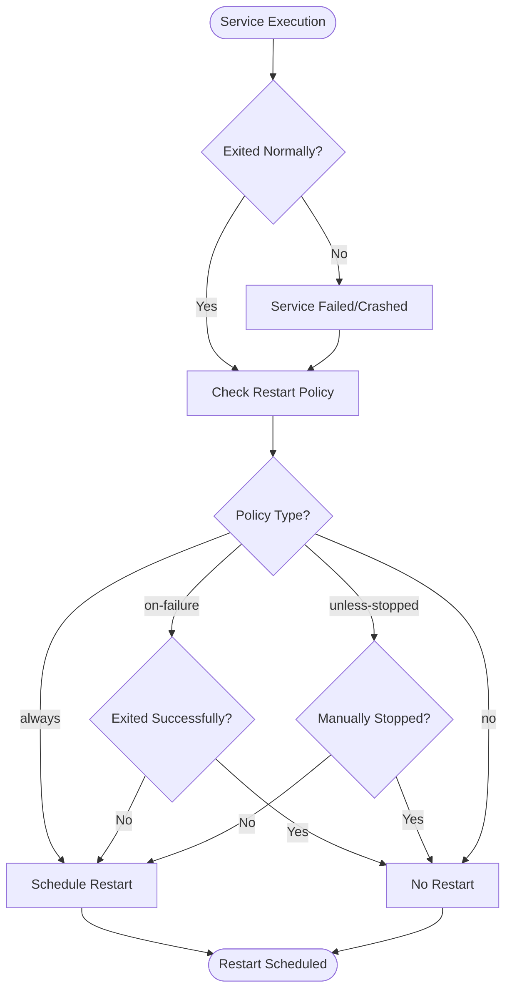
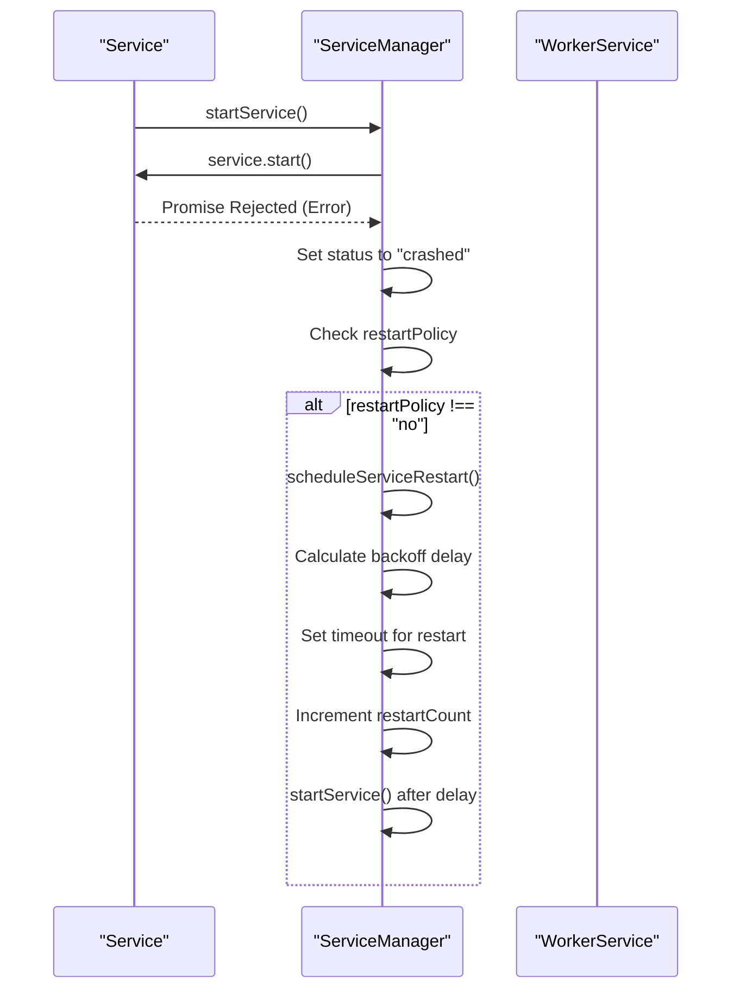
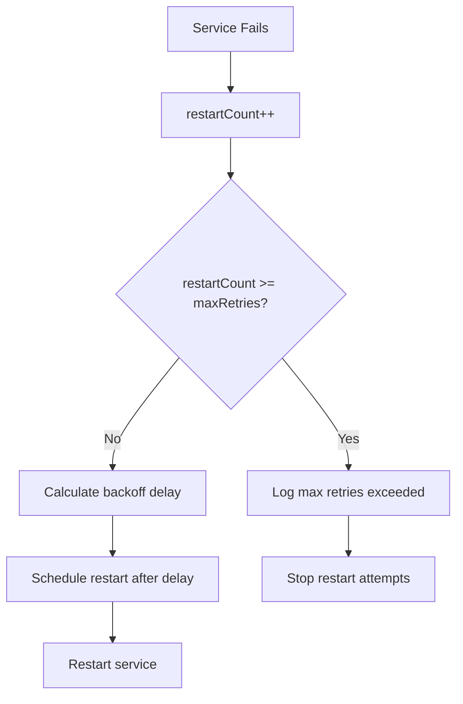
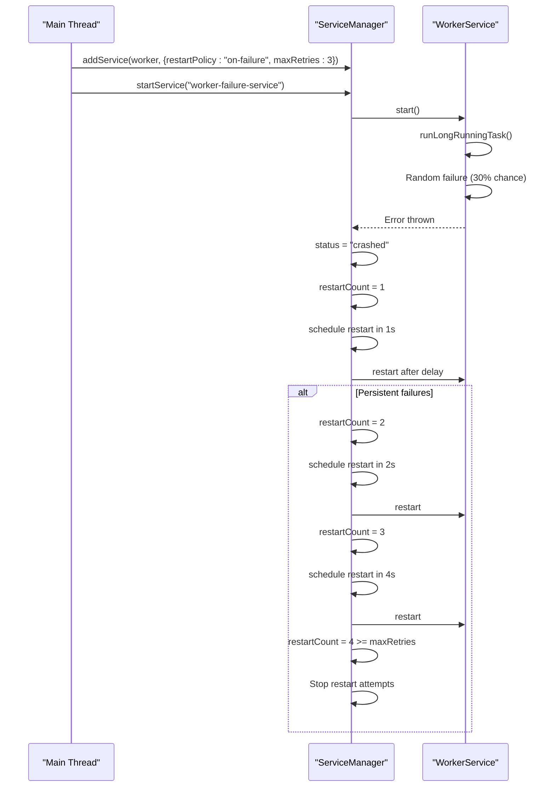
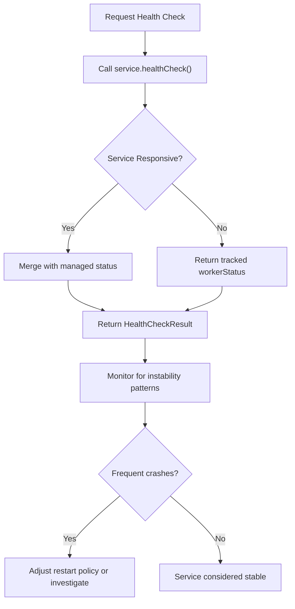

# Failure Handling

<cite>
**Referenced Files in This Document**   
- [demo.ts](file://examples/demo.ts)
- [worker-restart-policy.ts](file://examples/worker-restart-policy.ts)
- [ServiceManager.ts](file://src/ServiceManager.ts)
- [WorkerService.ts](file://src/WorkerService.ts)
- [services/worker-failure.ts](file://examples/services/worker-failure.ts)
- [interface.ts](file://src/interface.ts)
</cite>

## Table of Contents
1. [Introduction](#introduction)
2. [Restart Policies Overview](#restart-policies-overview)
3. [ServiceManager Failure Detection and Restart Logic](#servicemanager-failure-detection-and-restart-logic)
4. [Max Retries and Restart Limiting](#max-retries-and-restart-limiting)
5. [Worker Service Failure Scenario](#worker-service-failure-scenario)
6. [Health Check Integration and Monitoring](#health-check-integration-and-monitoring)
7. [Failure Simulation and Resilience Testing](#failure-simulation-and-resilience-testing)
8. [Log Interpretation During Restart Sequences](#log-interpretation-during-restart-sequences)
9. [Timeout Configuration for Hanging Processes](#timeout-configuration-for-hanging-processes)
10. [Trade-offs Between Aggressive Restarts and System Stability](#trade-offs-between-aggressive-restarts-and-system-stability)

## Introduction
This document provides a comprehensive analysis of failure handling and restart policy enforcement in the j8s service orchestration framework. It examines how the system automatically detects service crashes and applies configurable restart policies to maintain system resilience. Using practical examples from `demo.ts` and `worker-restart-policy.ts`, this guide demonstrates the behavior of different restart policies ('always', 'on-failure', 'unless-stopped', 'no') when services crash or terminate unexpectedly. The document also explains the role of `maxRetries` in preventing infinite restart loops during persistent failures and details how the `ServiceManager` component orchestrates the entire failure recovery process.

**Section sources**
- [demo.ts](file://examples/demo.ts#L0-L166)
- [worker-restart-policy.ts](file://examples/worker-restart-policy.ts#L0-L57)

## Restart Policies Overview
The j8s framework supports four distinct restart policies that determine how services behave after failure or termination:

- **"always"**: The service will be restarted regardless of how it exited, whether through normal completion, error, or manual stop.
- **"on-failure"**: The service will only be restarted if it exits due to an error or crashes during execution.
- **"unless-stopped"**: The service will be restarted automatically after any failure, but not if it was explicitly stopped by the user.
- **"no"**: No automatic restart will occur under any circumstances.

In the `demo.ts` example, the main service is configured with a "always" policy, ensuring continuous operation even after failures, while the worker service uses "on-failure" with a maximum of 3 retry attempts. These policies are defined in the `ServiceConfig` interface and applied when services are added to the `ServiceManager`.

**Diagram sources**
- [interface.ts](file://src/interface.ts#L27-L27)
- [demo.ts](file://examples/demo.ts#L90-L100)

**Section sources**
- [interface.ts](file://src/interface.ts#L27-L28)
- [demo.ts](file://examples/demo.ts#L90-L100)

## ServiceManager Failure Detection and Restart Logic
The `ServiceManager` class is responsible for detecting service failures and enforcing restart policies accordingly. When a service's `start()` method rejects with an error, the `ServiceManager` catches this exception and updates the service status to "crashed". It then evaluates the configured restart policy to determine whether a restart should be initiated.

The failure detection mechanism works by wrapping service start operations in promise handlers. As shown in `ServiceManager.ts`, when a service fails, the catch block triggers the restart logic by calling `scheduleServiceRestart()`. This method implements exponential backoff, with delays starting at 1 second and doubling with each subsequent attempt, up to a maximum of 30 seconds. This prevents overwhelming the system with rapid restart attempts during transient failures.

**Diagram sources**
- [ServiceManager.ts](file://src/ServiceManager.ts#L104-L152)
- [WorkerService.ts](file://src/WorkerService.ts#L114-L170)

**Section sources**
- [ServiceManager.ts](file://src/ServiceManager.ts#L104-L152)

## Max Retries and Restart Limiting
The `maxRetries` configuration parameter plays a critical role in preventing infinite restart loops when services experience persistent failures. When a service is configured with `restartPolicy: "on-failure"`, the `ServiceManager` tracks the number of consecutive restart attempts in the `restartCount` property of the `ServiceEntry`.

As demonstrated in `worker-restart-policy.ts`, when `maxRetries` is set to 3, the system will attempt to restart the service up to three times after failures. After the third unsuccessful attempt, the restart mechanism is disabled, and the service remains in a "crashed" state. This safeguard prevents resource exhaustion and allows operators to investigate the root cause of persistent failures.

The `scheduleServiceRestart()` method in `ServiceManager.ts` contains the logic that enforces this limit. Before scheduling a restart, it checks whether the current `restartCount` has reached the `maxRetries` threshold. If the limit is exceeded, an error message is logged, and no further restart attempts are made.

**Diagram sources**
- [ServiceManager.ts](file://src/ServiceManager.ts#L227-L238)
- [worker-restart-policy.ts](file://examples/worker-restart-policy.ts#L37-L56)

**Section sources**
- [ServiceManager.ts](file://src/ServiceManager.ts#L227-L238)
- [worker-restart-policy.ts](file://examples/worker-restart-policy.ts#L37-L56)

## Worker Service Failure Scenario
The `worker-restart-policy.ts` example demonstrates a realistic failure scenario using a worker service that intentionally throws errors. The `worker-failure.ts` service implements a long-running task that generates a random number each second and has a 30% chance of throwing an error. This simulates a service with intermittent failures that might occur in production environments.

When this worker service is added to the `ServiceManager` with `restartPolicy: "on-failure"` and `maxRetries: 3`, the system automatically handles each failure by scheduling a restart with exponential backoff. The monitoring loop in `worker-restart-policy.ts` periodically checks the service health and displays both the current status and restart count, providing visibility into the recovery process.

The scenario shows how the system eventually stops attempting restarts after three consecutive failures, as evidenced by the log message "Service has reached max retries (3). Will not restart further." This behavior protects system stability while still providing resilience against transient issues.

**Diagram sources**
- [worker-restart-policy.ts](file://examples/worker-restart-policy.ts#L0-L57)
- [services/worker-failure.ts](file://examples/services/worker-failure.ts#L0-L69)

**Section sources**
- [worker-restart-policy.ts](file://examples/worker-restart-policy.ts#L0-L57)
- [services/worker-failure.ts](file://examples/services/worker-failure.ts#L0-L69)

## Health Check Integration and Monitoring
Health checks in j8s provide critical visibility into service stability and failure recovery status. The `healthCheckService()` method in `ServiceManager.ts` returns a `HealthCheckResult` that includes both the service's self-reported health information and the manager's authoritative status. This ensures that even if a service becomes unresponsive, the system can still report its actual operational state.

In the worker service example, the health check response includes details such as uptime and iteration count, which can be used to monitor service stability over time. When a service is restarting, the health status will reflect "crashed" until the new instance becomes healthy. Monitoring systems can use this information to trigger alerts when services enter unstable states or exceed expected restart thresholds.

The integration between health checks and restart policies creates a feedback loop where monitoring data can inform operational decisions about whether to adjust restart policies, increase `maxRetries`, or investigate underlying issues causing persistent failures.

**Diagram sources**
- [ServiceManager.ts](file://src/ServiceManager.ts#L147-L193)
- [WorkerService.ts](file://src/WorkerService.ts#L172-L192)

**Section sources**
- [ServiceManager.ts](file://src/ServiceManager.ts#L147-L193)

## Failure Simulation and Resilience Testing
The j8s framework provides built-in capabilities for simulating failures to test system resilience. The `worker-failure.ts` example demonstrates this by implementing a service that intentionally throws errors with a configurable probability. This allows developers to verify that restart policies are working correctly and that the system behaves as expected under failure conditions.

To simulate failures for testing, developers can:
1. Create services that throw errors under specific conditions
2. Configure services with different restart policies and maxRetries values
3. Monitor the restart behavior and timing
4. Verify that health checks accurately reflect service state
5. Confirm that the system stops restarting after reaching maxRetries

The `worker-restart-policy.ts` example includes a monitoring loop that logs the service status and restart count every 2 seconds, providing real-time feedback during resilience testing. This approach enables thorough validation of failure handling logic before deploying to production environments.

**Section sources**
- [services/worker-failure.ts](file://examples/services/worker-failure.ts#L0-L69)
- [worker-restart-policy.ts](file://examples/worker-restart-policy.ts#L0-L57)

## Log Interpretation During Restart Sequences
Understanding log output is essential for diagnosing issues during restart sequences. The j8s framework produces detailed logs that trace the entire failure and recovery process. Key log messages to monitor include:

- `"Service 'name' failed:"` - Indicates a service has crashed and provides the error details
- `"Scheduling restart for service 'name' in Xms (attempt Y)"` - Shows a restart is planned with exponential backoff
- `"Actually restarting service 'name' now..."` - Confirms the restart is executing
- `"Service 'name' exceeded max restart attempts (Z)"` - Indicates the restart limit has been reached

In the worker restart example, the log output includes timestamps and the current restart count, making it easy to correlate events and understand the timing of restart attempts. This information is invaluable for debugging persistent failures and tuning restart policy parameters for specific services.

**Section sources**
- [ServiceManager.ts](file://src/ServiceManager.ts#L235-L245)
- [worker-restart-policy.ts](file://examples/worker-restart-policy.ts#L37-L56)

## Timeout Configuration for Hanging Processes
While not directly demonstrated in the provided examples, proper timeout configuration is crucial for preventing hanging processes that can consume system resources indefinitely. Services that perform long-running operations should implement internal timeouts or be configured with external timeout mechanisms to ensure they don't become unresponsive.

For cron jobs and other scheduled tasks, the `cronJob.timeout` configuration option can terminate services that exceed their expected execution time. This complements the restart policy system by ensuring that stuck services are terminated and can then be restarted according to policy, rather than remaining in a hung state indefinitely.

**Section sources**
- [ServiceManager.ts](file://src/ServiceManager.ts#L315-L325)

## Trade-offs Between Aggressive Restarts and System Stability
Choosing the appropriate restart policy involves balancing service availability against system stability. Aggressive policies like "always" maximize uptime but risk overwhelming the system with rapid restart attempts during persistent failures. More conservative policies like "on-failure" with limited `maxRetries` protect system resources but may leave services down if transient issues persist beyond the retry limit.

The examples demonstrate this trade-off: the worker service uses "on-failure" with `maxRetries: 3` to handle transient errors while preventing infinite restart loops. This approach acknowledges that some failures are temporary and can be resolved by restarting, while others indicate deeper issues that require human intervention.

When configuring restart policies, consider:
- The criticality of the service
- The nature of expected failures (transient vs. persistent)
- System resource constraints
- Dependencies on external services
- Monitoring and alerting capabilities

**Section sources**
- [demo.ts](file://examples/demo.ts#L90-L100)
- [worker-restart-policy.ts](file://examples/worker-restart-policy.ts#L20-L21)