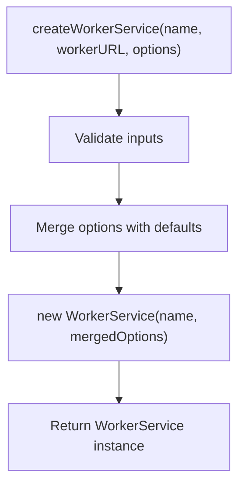
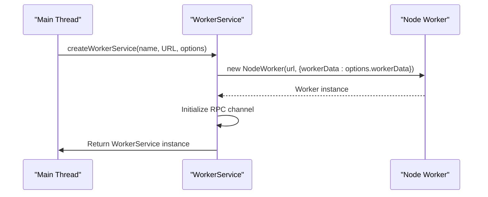
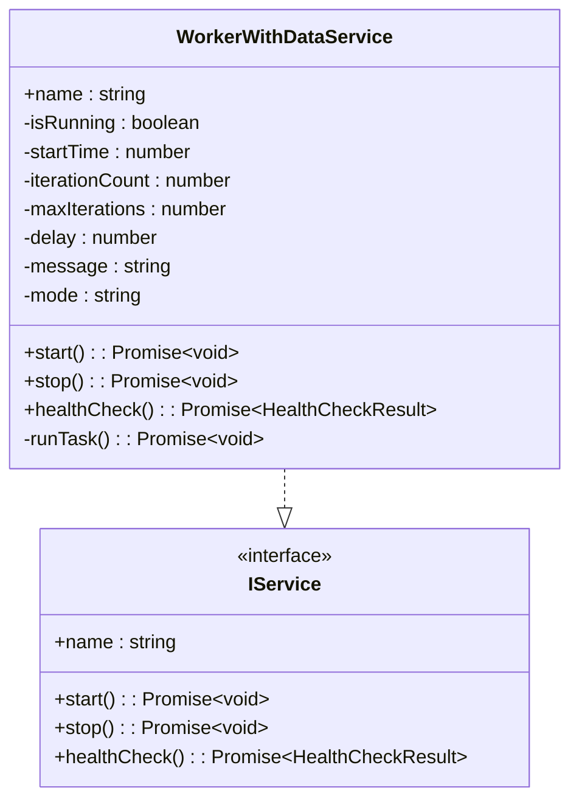
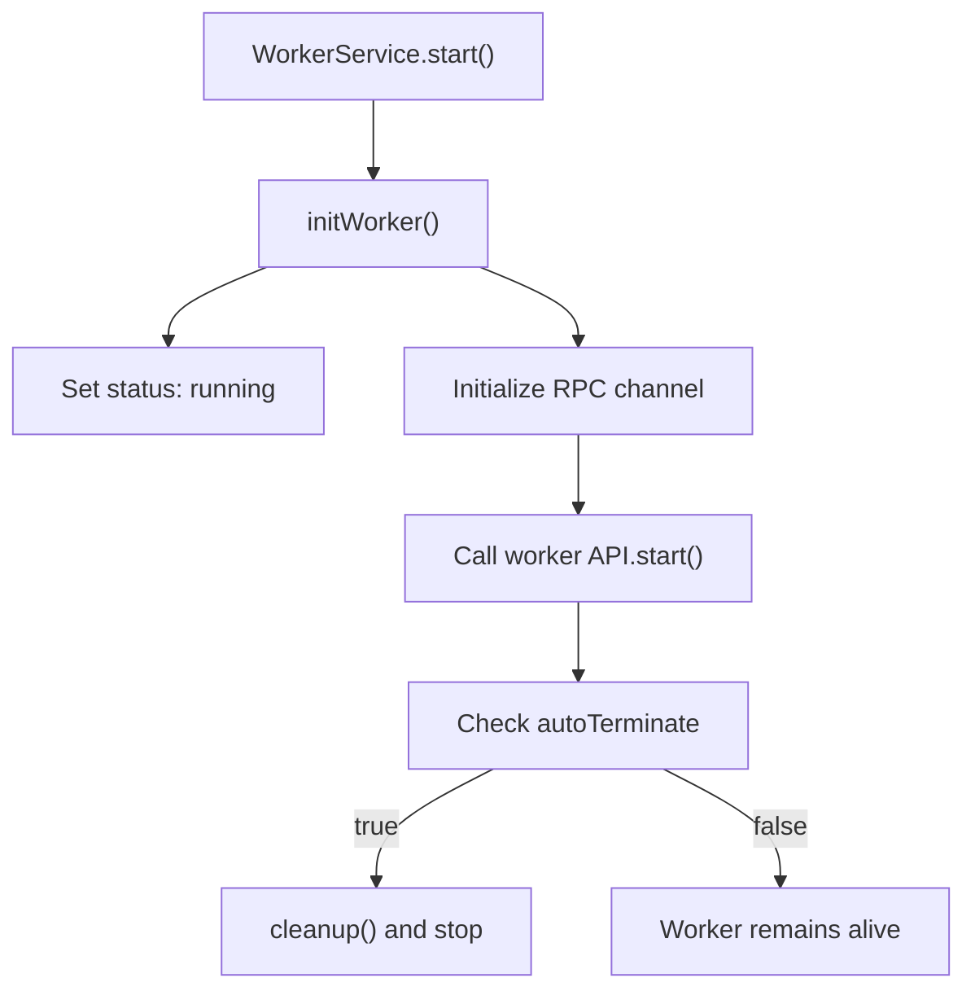
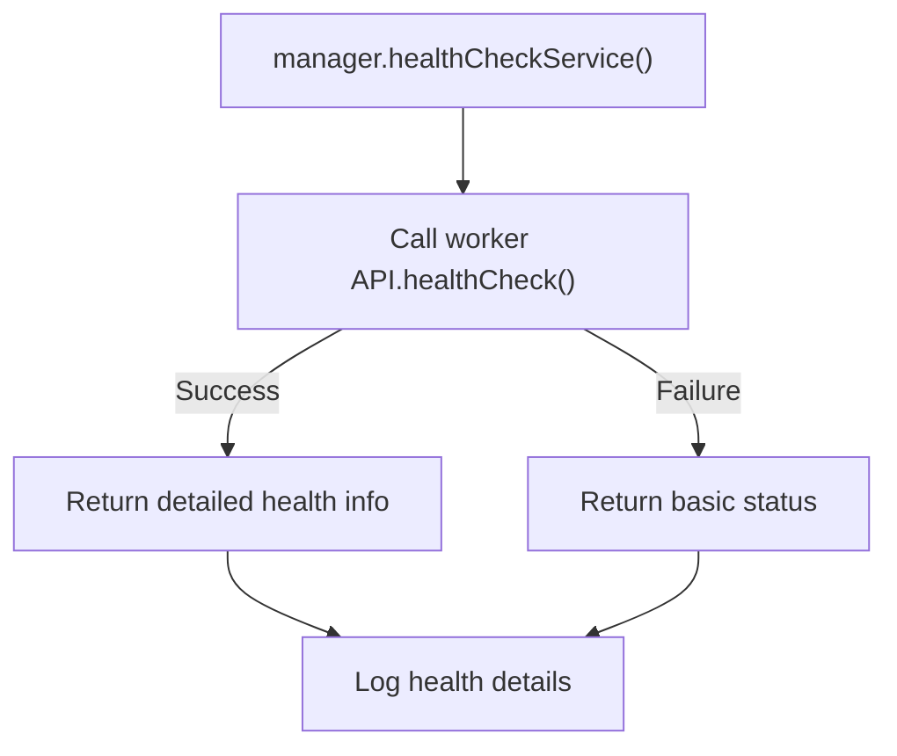
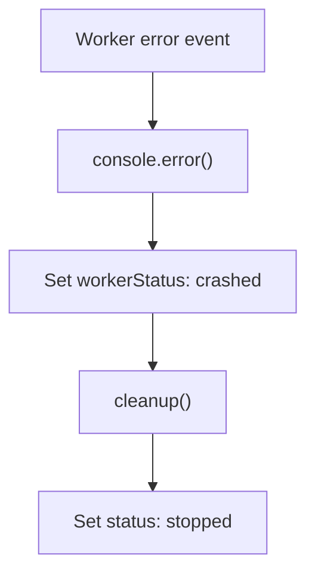

# Worker Integration

<cite>
**Referenced Files in This Document**   
- [examples/worker-with-data.ts](file://examples/worker-with-data.ts)
- [examples/services/worker-with-data.ts](file://examples/services/worker-with-data.ts)
- [src/WorkerService.ts](file://src/WorkerService.ts)
- [src/expose.ts](file://src/expose.ts)
- [src/BaseService.ts](file://src/BaseService.ts)
- [index.ts](file://index.ts)
</cite>

## Table of Contents
1. [Introduction](#introduction)
2. [Worker Service Creation and Configuration](#worker-service-creation-and-configuration)
3. [Data Flow and Serialization in Worker Threads](#data-flow-and-serialization-in-worker-threads)
4. [Main Thread to Worker Communication](#main-thread-to-worker-communication)
5. [Worker-Side Implementation and RPC Exposure](#worker-side-implementation-and-rpc-exposure)
6. [Lifecycle Management and Auto-Termination](#lifecycle-management-and-auto-termination)
7. [Health Monitoring and Status Reporting](#health-monitoring-and-status-reporting)
8. [Best Practices for Worker Code Structure](#best-practices-for-worker-code-structure)
9. [Error Handling and Resilience](#error-handling-and-resilience)
10. [Performance Considerations and Limitations](#performance-considerations-and-limitations)

## Introduction
This document provides a comprehensive guide to integrating worker threads using the `j8s` framework, with a focus on custom data transfer and long-running task management. It details how the `createWorkerService` function enables offloading computational work to separate threads by specifying a worker module URL and passing initialization data via `workerData`. The analysis centers on the `worker-with-data.ts` example, which demonstrates configuration serialization, operational mode handling, and persistent worker execution through `autoTerminate: false`. The document also covers RPC communication patterns, health monitoring, and performance implications of data serialization between threads.

## Worker Service Creation and Configuration

The `createWorkerService` function serves as the primary mechanism for creating worker-based services. It accepts a service name, worker module URL, and configuration options including `workerData` and `autoTerminate`. This function abstracts the complexity of worker instantiation by wrapping the `WorkerService` class constructor and ensuring consistent default values.



**Diagram sources**
- [index.ts](file://index.ts#L155-L181)
- [src/WorkerService.ts](file://src/WorkerService.ts#L0-L36)

**Section sources**
- [index.ts](file://index.ts#L155-L181)
- [src/WorkerService.ts](file://src/WorkerService.ts#L0-L36)

## Data Flow and Serialization in Worker Threads

Data transfer between the main thread and worker threads occurs through the `workerData` property in `WorkerOptions`. When a worker is created, any data passed in `workerData` is serialized using the structured clone algorithm and made available in the worker context via the `workerData` global variable from `worker_threads`.

```mermaid
flowchart LR
MainThread["Main Thread"] --> |Serialized workerData| WorkerThread["Worker Thread"]
WorkerThread --> |RPC via expose()| MainThread
```

The `worker-with-data.ts` example demonstrates how complex configuration objects containing `maxIterations`, `delay`, and `message` fields are passed from the main thread and accessed in the worker. These values are deserialized and used to configure the worker's behavior at runtime.

**Diagram sources**
- [examples/worker-with-data.ts](file://examples/worker-with-data.ts#L8-L14)
- [examples/services/worker-with-data.ts](file://examples/services/worker-with-data.ts#L15-L19)

**Section sources**
- [examples/worker-with-data.ts](file://examples/worker-with-data.ts#L8-L14)
- [examples/services/worker-with-data.ts](file://examples/services/worker-with-data.ts#L15-L19)

## Main Thread to Worker Communication

The communication flow begins in the main thread where `createWorkerService` initializes a `WorkerService` with custom configuration. The `workerData` object is merged into `WorkerOptions` during worker initialization and transferred to the worker context.



**Diagram sources**
- [src/WorkerService.ts](file://src/WorkerService.ts#L34-L45)
- [examples/worker-with-data.ts](file://examples/worker-with-data.ts#L8-L14)

**Section sources**
- [src/WorkerService.ts](file://src/WorkerService.ts#L34-L45)
- [examples/worker-with-data.ts](file://examples/worker-with-data.ts#L8-L14)

## Worker-Side Implementation and RPC Exposure

In the worker thread, the `workerData` global variable contains the serialized data passed from the main thread. The worker implementation accesses this data during construction to initialize its configuration. The `expose` function from `j8s` establishes an RPC channel, allowing the main thread to invoke methods on the worker service.



The `WorkerWithDataService` class implements the `IService` interface and uses the configuration from `workerData` to control its execution parameters. The `expose()` function wraps the service instance in an RPC channel, enabling remote method invocation from the main thread.

**Diagram sources**
- [examples/services/worker-with-data.ts](file://examples/services/worker-with-data.ts#L0-L80)
- [src/expose.ts](file://src/expose.ts#L0-L54)

**Section sources**
- [examples/services/worker-with-data.ts](file://examples/services/worker-with-data.ts#L0-L80)
- [src/expose.ts](file://src/expose.ts#L0-L54)

## Lifecycle Management and Auto-Termination

The `autoTerminate` option controls whether the worker thread automatically shuts down after completing its `start()` method. When set to `false`, the worker remains alive for long-running tasks, allowing it to maintain state and respond to subsequent RPC calls.



The `WorkerService` class manages the worker lifecycle through `start()`, `stop()`, and `cleanup()` methods. The `cleanup()` method ensures proper resource disposal by terminating the worker and destroying the RPC channel.

**Diagram sources**
- [src/WorkerService.ts](file://src/WorkerService.ts#L114-L170)
- [src/WorkerService.ts](file://src/WorkerService.ts#L67-L117)

**Section sources**
- [src/WorkerService.ts](file://src/WorkerService.ts#L114-L170)
- [src/WorkerService.ts](file://src/WorkerService.ts#L67-L117)

## Health Monitoring and Status Reporting

Health checks provide insight into the worker's operational state and performance metrics. The `healthCheck()` method returns status information that includes worker-specific details such as uptime, iteration count, and configuration parameters.



The health check result includes both the operational status and detailed metrics extracted from the worker's internal state, enabling monitoring systems to track performance and detect anomalies.

**Diagram sources**
- [src/WorkerService.ts](file://src/WorkerService.ts#L172-L193)
- [examples/services/worker-with-data.ts](file://examples/services/worker-with-data.ts#L42-L57)

**Section sources**
- [src/WorkerService.ts](file://src/WorkerService.ts#L172-L193)
- [examples/services/worker-with-data.ts](file://examples/services/worker-with-data.ts#L42-L57)

## Best Practices for Worker Code Structure

Effective worker implementation follows several key patterns:
- Initialize configuration from `workerData` in the constructor
- Implement the `IService` interface consistently
- Use async methods for all service operations
- Maintain internal state for health monitoring
- Structure long-running tasks as async loops

The separation of concerns between the worker service wrapper and the actual business logic enables reusable, testable code. The `expose()` function eliminates boilerplate RPC setup code, allowing developers to focus on core functionality.

**Section sources**
- [examples/services/worker-with-data.ts](file://examples/services/worker-with-data.ts#L0-L80)
- [src/expose.ts](file://src/expose.ts#L0-L54)

## Error Handling and Resilience

The framework provides robust error handling through event listeners on the worker instance. Error events are logged and trigger worker status updates to "crashed", while message errors set the status to "unhealthy". The `ServiceManager` can then apply restart policies based on these status changes.



The `try/catch` blocks in `start()` and `stop()` methods ensure that initialization and shutdown errors are properly handled and propagated to the service manager.

**Diagram sources**
- [src/WorkerService.ts](file://src/WorkerService.ts#L55-L65)
- [src/WorkerService.ts](file://src/WorkerService.ts#L114-L170)

**Section sources**
- [src/WorkerService.ts](file://src/WorkerService.ts#L55-L65)
- [src/WorkerService.ts](file://src/WorkerService.ts#L114-L170)

## Performance Considerations and Limitations

While worker threads enable parallel execution, data transfer between threads incurs serialization overhead. Large `workerData` objects can significantly impact startup time due to structured cloning. The serialization process cannot handle functions, symbols, or certain built-in objects, limiting the types of data that can be transferred.

For optimal performance:
- Minimize the size of `workerData`
- Avoid transferring complex objects with circular references
- Use `autoTerminate: false` for long-running workers to amortize startup costs
- Consider streaming large data sets rather than passing them in `workerData`

The RPC communication layer adds minimal overhead for method calls, making it suitable for frequent interactions between main and worker threads once initialized.

**Section sources**
- [examples/worker-with-data.ts](file://examples/worker-with-data.ts#L8-L14)
- [src/WorkerService.ts](file://src/WorkerService.ts#L34-L45)
- [examples/services/worker-with-data.ts](file://examples/services/worker-with-data.ts#L15-L19)