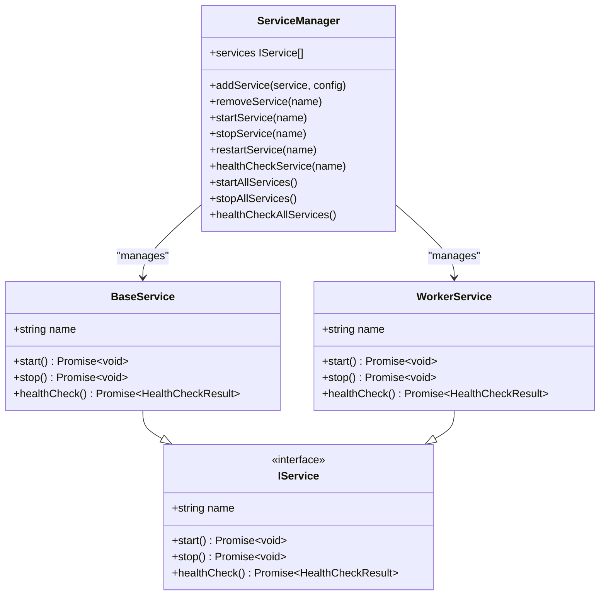

# Introduction

<cite>
**Referenced Files in This Document**   
- [README.md](file://README.md)
- [src/ServiceManager.ts](file://src/ServiceManager.ts)
- [src/BaseService.ts](file://src/BaseService.ts)
- [src/WorkerService.ts](file://src/WorkerService.ts)
- [src/api.ts](file://src/api.ts)
- [examples/demo.ts](file://examples/demo.ts)
- [examples/rest-api.ts](file://examples/rest-api.ts)
- [index.ts](file://index.ts)
</cite>

## Table of Contents
1. [Introduction](#introduction)
2. [Core Value Proposition](#core-value-proposition)
3. [Architectural Vision](#architectural-vision)
4. [Key Features and Capabilities](#key-features-and-capabilities)
5. [Real-World Use Cases](#real-world-use-cases)
6. [Getting Started and Examples](#getting-started-and-examples)

## Core Value Proposition

The j8s framework is a lightweight service orchestration solution designed for JavaScript and TypeScript applications, enabling the management of multiple services within a single Node.js process using worker threads. Its primary value lies in abstracting complex lifecycle management, allowing developers to focus on business logic rather than infrastructure concerns.

j8s provides robust lifecycle management for services, ensuring predictable behavior during startup, execution, and shutdown. It supports configurable restart policies—`always`, `unless-stopped`, `on-failure`, and `no`—enabling resilience and fault tolerance based on application requirements. Services can be scheduled using cron expressions, making j8s ideal for automated background tasks such as data backups, report generation, or periodic data synchronization.

Health monitoring is built-in, with each service implementing a `healthCheck()` method that returns structured status information. The ServiceManager overrides the reported status with its own managed state (e.g., `running`, `stopped`, `crashed`), ensuring accurate system-wide health visibility. This integration enables proactive monitoring and automated recovery.

Additionally, j8s offers a fully featured REST API powered by Hono, complete with OpenAPI/Swagger specifications and Scalar API documentation UI. This allows external systems to query service status, start/stop services, and monitor health, facilitating integration into larger observability and DevOps toolchains.

**Section sources**
- [README.md](file://README.md#L1-L423)
- [src/ServiceManager.ts](file://src/ServiceManager.ts#L1-L351)
- [src/interface.ts](file://src/interface.ts#L1-L44)

## Architectural Vision

At the core of j8s is the `ServiceManager`, which acts as the central orchestrator for all registered services. It maintains a registry of services, tracks their status, enforces restart policies, manages cron schedules, and exposes control endpoints via REST. The ServiceManager ensures consistent behavior across services regardless of their execution context.

Services in j8s are implemented by extending `BaseService` for main-thread execution or using `WorkerService` for worker-thread isolation. This modular architecture promotes separation of concerns and enables developers to choose the appropriate execution model per service.

`BaseService` provides a clean abstraction for long-running or one-off tasks in the main thread, requiring only the implementation of `start()`, `stop()`, and `healthCheck()` methods. `WorkerService` wraps a worker thread and exposes the same interface via RPC using `@kunkun/kkrpc`, enabling seamless communication between the main thread and workers.

The `expose()` utility simplifies worker implementation by automatically setting up the RPC channel, eliminating boilerplate code. This allows worker services to be defined and exposed with minimal configuration, enhancing developer experience.

**Section sources**
- [src/ServiceManager.ts](file://src/ServiceManager.ts#L1-L351)
- [src/BaseService.ts](file://src/BaseService.ts#L1-L25)
- [src/WorkerService.ts](file://src/WorkerService.ts#L1-L193)
- [src/expose.ts](file://src/expose.ts#L1-L55)
- [index.ts](file://index.ts#L1-L182)

## Key Features and Capabilities

j8s supports two primary service execution models: main-thread services and worker-thread services. Main-thread services, implemented via `BaseService`, are suitable for lightweight, cooperative tasks that do not block the event loop. Worker-thread services, created using `createWorkerService()`, run in isolated threads, providing fault isolation and preventing a single misbehaving service from affecting others.

Restart policies are a critical feature for maintaining system reliability. When a service fails, j8s evaluates the configured `restartPolicy` and optionally restarts the service with exponential backoff. The `on-failure` policy, combined with `maxRetries`, limits retry attempts to prevent infinite restart loops.

Cron-based scheduling allows services to be triggered at specific intervals using standard cron syntax. The `cronJob` configuration supports optional timeouts, ensuring that long-running tasks are terminated gracefully. This is particularly useful for batch processing jobs that should not exceed a certain duration.

The REST API, created via `createServiceManagerAPI()`, exposes full control over service lifecycle and health monitoring. Endpoints include starting, stopping, restarting, and removing services, as well as retrieving health status for individual or all services. With OpenAPI support and Scalar UI, the API is self-documenting and easily integrable with monitoring tools.

Type safety is enforced through TypeScript interfaces such as `IService`, `ServiceConfig`, and `HealthCheckResult`, ensuring consistent service contracts and reducing runtime errors. The framework’s modular design allows for easy extension and integration with existing Node.js applications.

**Diagram sources**  
- [src/interface.ts](file://src/interface.ts#L1-L44)
- [src/BaseService.ts](file://src/BaseService.ts#L1-L25)
- [src/WorkerService.ts](file://src/WorkerService.ts#L1-L193)
- [src/ServiceManager.ts](file://src/ServiceManager.ts#L1-L351)

**Section sources**
- [README.md](file://README.md#L1-L423)
- [src/api.ts](file://src/api.ts#L1-L498)
- [index.ts](file://index.ts#L1-L182)

## Real-World Use Cases

j8s is well-suited for applications requiring background job processing, such as sending emails, processing uploads, or syncing data with external APIs. By defining these tasks as services with appropriate restart policies, developers ensure reliability even in the face of transient failures.

In monolithic applications, j8s enables microservice-like isolation by running different components in separate worker threads. This prevents a single faulty module from crashing the entire process and allows independent lifecycle management.

Automated task scheduling is another key use case. For example, a daily backup service can be configured with a cron schedule of `0 0 * * *` to run at midnight, with a timeout to prevent indefinite execution. Similarly, metrics collection or health reporting tasks can be scheduled at regular intervals.

The built-in REST API makes j8s ideal for embedded service management in larger systems, where external tools need to monitor or control internal services. Combined with Scalar UI, it provides an intuitive dashboard for operators and developers.

**Section sources**
- [examples/demo.ts](file://examples/demo.ts#L1-L166)
- [examples/rest-api.ts](file://examples/rest-api.ts#L1-L144)
- [examples/restart-policy.ts](file://examples/restart-policy.ts#L1-L75)

## Getting Started and Examples

The j8s framework is designed for rapid onboarding. Developers can begin by defining a service class that extends `BaseService`, implementing the required methods. The service is then registered with a `ServiceManager` instance along with optional configuration such as restart policies or cron schedules.

Worker services are created using `createWorkerService()`, which takes a name, worker file URL, and optional configuration. The worker file implements the `IService` interface and uses `expose()` to make the service available to the main thread.

Comprehensive examples are available in the `examples/` directory, including:
- `demo.ts`: Demonstrates multiple service types, including main-thread, worker, and cron services
- `rest-api.ts`: Shows integration with the REST API and web UI
- `restart-policy.ts`: Illustrates failure handling and restart behavior
- `services/logService.ts`: Example worker service with health monitoring

These examples serve as practical starting points for integrating j8s into new or existing projects.

**Section sources**
- [README.md](file://README.md#L1-L423)
- [examples/demo.ts](file://examples/demo.ts#L1-L166)
- [examples/rest-api.ts](file://examples/rest-api.ts#L1-L144)
- [examples/services/logService.ts](file://examples/services/logService.ts#L1-L43)