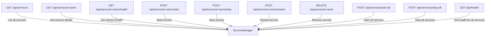
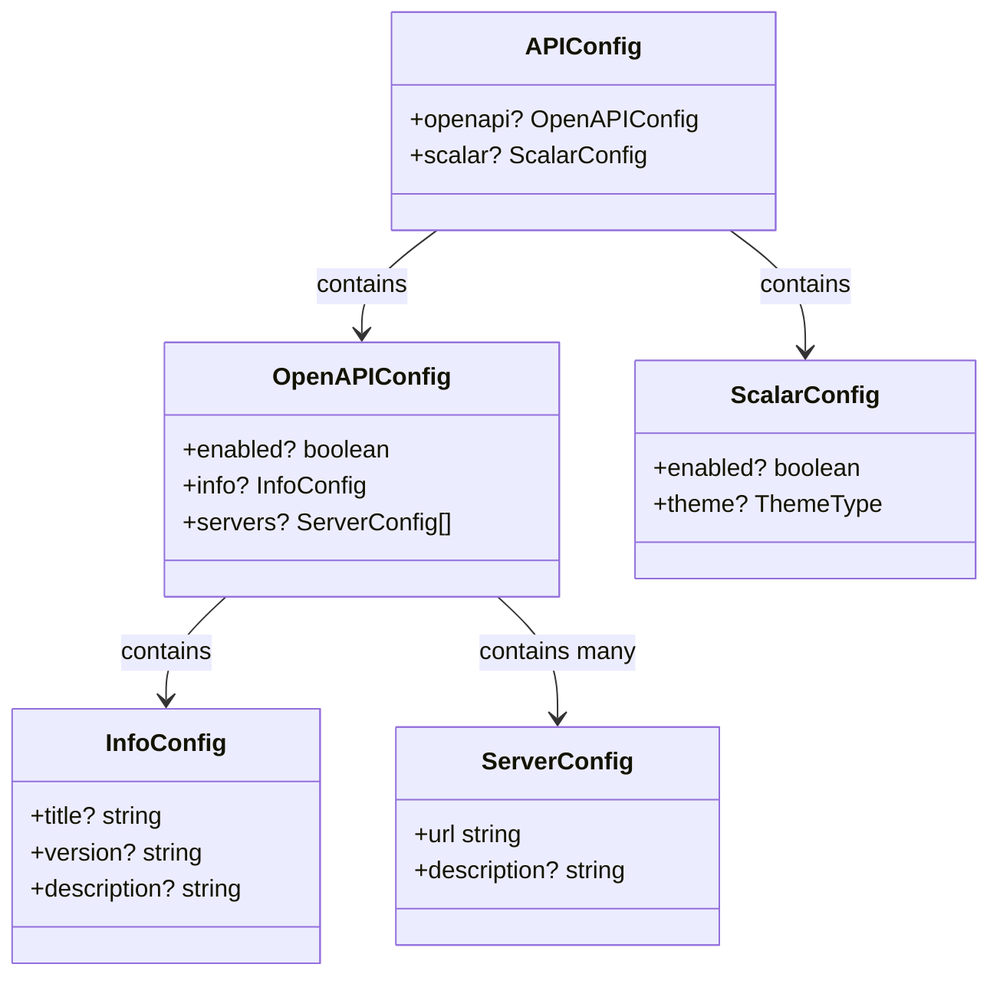
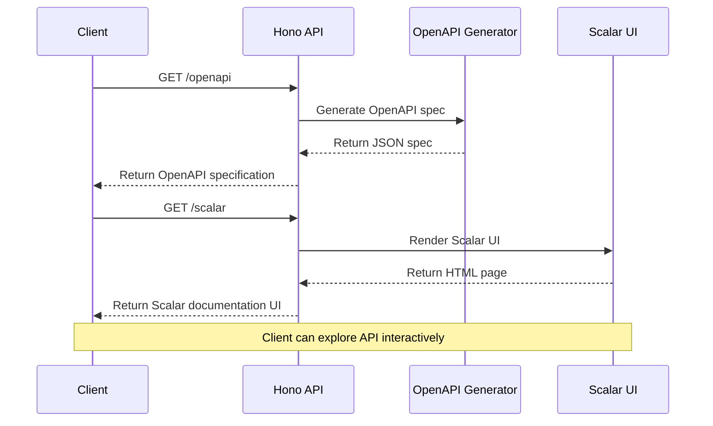
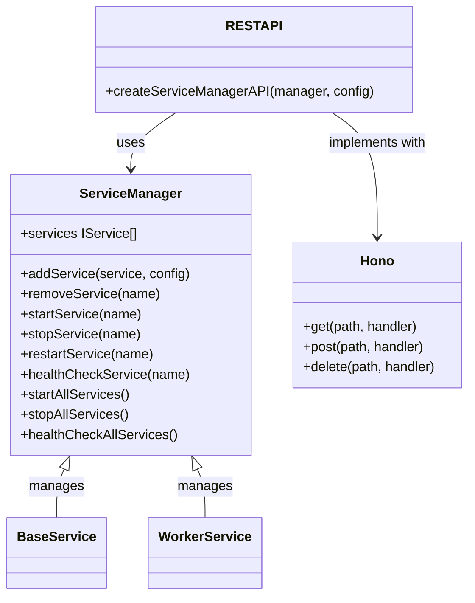

# REST API

<cite>
**Referenced Files in This Document**   
- [examples/rest-api.ts](file://examples/rest-api.ts)
- [src/api.ts](file://src/api.ts)
- [src/interface.ts](file://src/interface.ts)
- [api.ts](file://api.ts)
- [README.md](file://README.md)
</cite>

## Table of Contents
1. [Introduction](#introduction)
2. [API Overview](#api-overview)
3. [Endpoint Reference](#endpoint-reference)
4. [Request/Response Schemas](#requestresponse-schemas)
5. [API Configuration](#api-configuration)
6. [OpenAPI and Scalar Integration](#openapi-and-scalar-integration)
7. [ServiceManager Integration](#servicemanager-integration)
8. [Security and Rate Limiting](#security-and-rate-limiting)
9. [Client Implementation Guidelines](#client-implementation-guidelines)
10. [Debugging Tips](#debugging-tips)
11. [Common Use Cases](#common-use-cases)

## Introduction

The j8s framework provides a comprehensive REST API for managing and monitoring services through HTTP endpoints. Built on the Hono web framework, this API enables remote orchestration of services, health monitoring, and lifecycle management. The API is designed for integration into monitoring systems, orchestration platforms, and DevOps tooling, supporting common use cases like remote monitoring, automated deployment workflows, and service orchestration.

The REST API is tightly integrated with the ServiceManager class, which serves as the central controller for all services in the system. Through this API, users can perform all service management operations programmatically, making it ideal for building automated workflows and integrating j8s into larger system architectures.

**Section sources**
- [README.md](file://README.md#L229-L280)
- [examples/rest-api.ts](file://examples/rest-api.ts#L0-L53)

## API Overview

The j8s REST API provides a complete set of endpoints for service management and monitoring. The API follows RESTful principles with predictable URL patterns and standard HTTP methods. All endpoints are prefixed with `/api` and organized around resource types such as services and health checks.

The API is built using Hono, a lightweight web framework for JavaScript and TypeScript that provides excellent performance and developer experience. Hono's middleware system enables features like request validation, OpenAPI documentation generation, and error handling. The API is created through the `createServiceManagerAPI` function, which takes a ServiceManager instance and optional configuration parameters to generate a fully functional REST interface.

Key features of the API include:
- Full CRUD operations for service lifecycle management
- Real-time health monitoring endpoints
- Batch operations for starting and stopping all services
- Comprehensive error handling with standardized error responses
- Request validation using valibot schemas
- Built-in OpenAPI/Swagger documentation

The API supports both JSON request and response payloads, with all endpoints returning appropriate HTTP status codes to indicate success or failure conditions.

**Section sources**
- [src/api.ts](file://src/api.ts#L0-L67)
- [examples/rest-api.ts](file://examples/rest-api.ts#L49-L109)

## Endpoint Reference

### Service Management Endpoints



**Diagram sources**
- [src/api.ts](file://src/api.ts#L124-L184)
- [examples/rest-api.ts](file://examples/rest-api.ts#L111-L143)

#### List All Services
- **HTTP Method**: GET
- **URL Pattern**: `/api/services`
- **Description**: Returns a list of all registered services with their names
- **Authentication**: None required
- **Response Schema**: `ServicesListResponseSchema`
- **Example**: `GET http://localhost:3200/api/services`

#### Get Service Details
- **HTTP Method**: GET
- **URL Pattern**: `/api/services/:name`
- **Description**: Returns detailed information about a specific service including its name, status, and health information
- **Authentication**: None required
- **Response Schema**: `ServiceResponseSchema`
- **Example**: `GET http://localhost:3200/api/services/service-a`

#### Get Service Health
- **HTTP Method**: GET
- **URL Pattern**: `/api/services/:name/health`
- **Description**: Returns the current health status of a specific service
- **Authentication**: None required
- **Response Schema**: `HealthCheckResponseSchema`
- **Example**: `GET http://localhost:3200/api/services/service-a/health`

#### Start Service
- **HTTP Method**: POST
- **URL Pattern**: `/api/services/:name/start`
- **Description**: Starts a specific service if it is not already running
- **Authentication**: None required
- **Response Schema**: `MessageResponseSchema`
- **Example**: `POST http://localhost:3200/api/services/service-a/start`

#### Stop Service
- **HTTP Method**: POST
- **URL Pattern**: `/api/services/:name/stop`
- **Description**: Stops a specific service if it is currently running
- **Authentication**: None required
- **Response Schema**: `MessageResponseSchema`
- **Example**: `POST http://localhost:3200/api/services/service-a/stop`

#### Restart Service
- **HTTP Method**: POST
- **URL Pattern**: `/api/services/:name/restart`
- **Description**: Restarts a specific service by first stopping it and then starting it again
- **Authentication**: None required
- **Response Schema**: `MessageResponseSchema`
- **Example**: `POST http://localhost:3200/api/services/service-a/restart`

#### Remove Service
- **HTTP Method**: DELETE
- **URL Pattern**: `/api/services/:name`
- **Description**: Removes a service from the service manager
- **Authentication**: None required
- **Response Schema**: `MessageResponseSchema`
- **Example**: `DELETE http://localhost:3200/api/services/service-a`

#### Start All Services
- **HTTP Method**: POST
- **URL Pattern**: `/api/services/start-all`
- **Description**: Starts all registered services simultaneously
- **Authentication**: None required
- **Response Schema**: `MessageResponseSchema`
- **Example**: `POST http://localhost:3200/api/services/start-all`

#### Stop All Services
- **HTTP Method**: POST
- **URL Pattern**: `/api/services/stop-all`
- **Description**: Stops all running services simultaneously
- **Authentication**: None required
- **Response Schema**: `MessageResponseSchema`
- **Example**: `POST http://localhost:3200/api/services/stop-all`

#### Health Check for All Services
- **HTTP Method**: GET
- **URL Pattern**: `/api/health`
- **Description**: Returns health status for all registered services
- **Authentication**: None required
- **Response Schema**: `AllHealthCheckResponseSchema`
- **Example**: `GET http://localhost:3200/api/health`

**Section sources**
- [src/api.ts](file://src/api.ts#L124-L498)
- [README.md](file://README.md#L281-L300)

## Request/Response Schemas

The j8s REST API uses valibot for request validation and response schema definition. All endpoints have clearly defined request and response schemas that ensure data integrity and provide clear documentation for API consumers.

### Request Validation Schemas

```mermaid
classDiagram
class ServiceNameSchema {
+string name
}
ServiceNameSchema : Validates service name parameter
ServiceNameSchema : Used in endpoints with : name parameter
```

**Diagram sources**
- [src/api.ts](file://src/api.ts#L0-L20)

### Response Schemas

#### Services List Response
```json
{
  "services": [
    {
      "name": "string"
    }
  ]
}
```

#### Service Response
```json
{
  "name": "string",
  "status": "string",
  "health": {
    "status": "string",
    "details": {
      "property1": "any",
      "property2": "any"
    }
  }
}
```

#### Health Check Response
```json
{
  "status": "string",
  "details": {
    "property1": "any",
    "property2": "any"
  }
}
```

#### All Health Check Response
```json
{
  "service-a": {
    "status": "string",
    "details": {
      "property1": "any",
      "property2": "any"
    }
  },
  "service-b": {
    "status": "string",
    "details": {
      "property1": "any",
      "property2": "any"
    }
  }
}
```

#### Error Response
```json
{
  "error": "string"
}
```

#### Message Response
```json
{
  "message": "string"
}
```

The `HealthCheckResult` interface defines the structure of health check responses:

```typescript
interface HealthCheckResult {
  status: ServiceStatus;
  details?: Record<string, any>;
}
```

Where `ServiceStatus` is a union type that can be one of: "stopped", "running", "stopping", "crashed", or "unhealthy".

**Section sources**
- [src/interface.ts](file://src/interface.ts#L0-L44)
- [src/api.ts](file://src/api.ts#L20-L67)

## API Configuration

The `createServiceManagerAPI` function accepts an optional configuration object that allows customization of the API behavior and documentation. This configuration enables developers to tailor the API to their specific deployment requirements.



**Diagram sources**
- [src/api.ts](file://src/api.ts#L69-L125)
- [README.md](file://README.md#L380-L400)

### Configuration Options

#### OpenAPI Configuration
- **enabled**: Boolean flag to enable or disable OpenAPI documentation generation
- **info**: Object containing metadata about the API
  - **title**: The title of the API
  - **version**: The version of the API
  - **description**: A description of the API
- **servers**: Array of server objects that describe where the API is hosted
  - **url**: The base URL of the server
  - **description**: A description of the server

#### Scalar Configuration
- **enabled**: Boolean flag to enable or disable the Scalar API reference UI
- **theme**: The visual theme for the Scalar documentation UI (options include "deepSpace", "default", "alternate", "moon", "purple", "solarized", "bluePlanet", "saturn", "kepler", "elysiajs", "fastify", "mars", "laserwave", or "none")

When OpenAPI documentation is enabled, it is available at the `/openapi` endpoint. When Scalar is enabled, the interactive documentation UI is available at the `/scalar` endpoint.

**Section sources**
- [src/api.ts](file://src/api.ts#L69-L125)
- [README.md](file://README.md#L380-L400)

## OpenAPI and Scalar Integration

The j8s REST API includes built-in support for OpenAPI/Swagger documentation and the Scalar API reference UI. This integration provides comprehensive, machine-readable API documentation that can be used for client SDK generation, testing, and exploration.



**Diagram sources**
- [src/api.ts](file://src/api.ts#L124-L144)
- [package.json](file://package.json#L0-L36)

The OpenAPI integration is powered by the `hono-openapi` package, which automatically generates OpenAPI 3.0 specifications from the Hono route definitions and validation schemas. This ensures that the documentation is always in sync with the actual API implementation.

The Scalar integration provides an interactive API documentation interface that allows users to explore endpoints, view request/response schemas, and even make test requests directly from the browser. Scalar is configured to consume the OpenAPI specification generated by the API.

To enable these features, set the appropriate configuration options when creating the API:

```typescript
const app = createServiceManagerAPI(serviceManager, {
  openapi: {
    enabled: true,
    info: {
      title: "Demo Service Manager API",
      version: "1.0.0",
    },
  },
  scalar: {
    enabled: true,
    theme: "deepSpace",
  },
});
```

Once enabled, the OpenAPI specification is available at `/openapi` and the Scalar UI is available at `/scalar`.

**Section sources**
- [src/api.ts](file://src/api.ts#L124-L144)
- [package.json](file://package.json#L0-L36)

## ServiceManager Integration

The REST API is tightly integrated with the ServiceManager class, which serves as the central controller for all services in the j8s framework. The API acts as a HTTP interface to the ServiceManager's functionality, translating HTTP requests into method calls on the ServiceManager instance.



**Diagram sources**
- [src/api.ts](file://src/api.ts#L0-L498)
- [src/interface.ts](file://src/interface.ts#L0-L44)

The integration works by creating a Hono application that routes HTTP requests to appropriate ServiceManager methods. Each API endpoint corresponds to a specific ServiceManager method:

- `GET /api/services` → `serviceManager.services`
- `GET /api/services/:name` → `serviceManager.services.find()` + `healthCheckService()`
- `POST /api/services/:name/start` → `serviceManager.startService()`
- `POST /api/services/:name/stop` → `serviceManager.stopService()`
- `POST /api/services/:name/restart` → `serviceManager.restartService()`
- `DELETE /api/services/:name` → `serviceManager.removeService()`
- `GET /api/services/:name/health` → `serviceManager.healthCheckService()`
- `GET /api/health` → `serviceManager.healthCheckAllServices()`
- `POST /api/services/start-all` → `serviceManager.startAllServices()`
- `POST /api/services/stop-all` → `serviceManager.stopAllServices()`

The API also integrates with the web UI provided by j8s, which is mounted at the root path (`/`). This UI provides a dashboard for managing services and is built using HTMX for dynamic content updates without full page reloads.

**Section sources**
- [src/api.ts](file://src/api.ts#L0-L498)
- [src/ui.tsx](file://src/ui.tsx#L0-L50)

## Security and Rate Limiting

The current implementation of the j8s REST API does not include built-in authentication or authorization mechanisms. All endpoints are accessible without credentials, making the API suitable for development and internal network environments but requiring additional security measures for production deployments.

For production use, it is recommended to place the API behind a reverse proxy or API gateway that can provide:
- Authentication (API keys, JWT, OAuth, etc.)
- Authorization and access control
- Rate limiting and throttling
- Request logging and monitoring
- SSL/TLS termination

While the API does not have built-in rate limiting, the Hono framework supports middleware that can be used to implement rate limiting strategies. Developers can extend the API by adding rate limiting middleware before or after creating the service manager API.

Security considerations for deploying the j8s REST API include:
- Exposing the API only on internal networks or through secure tunnels
- Implementing firewall rules to restrict access to trusted IP addresses
- Using reverse proxies with authentication for external access
- Regularly updating dependencies to address security vulnerabilities
- Monitoring API usage for suspicious activity

The API does include request validation using valibot, which helps prevent certain types of attacks by ensuring that input data conforms to expected schemas. Error responses are standardized and do not leak implementation details that could be useful to attackers.

**Section sources**
- [src/api.ts](file://src/api.ts#L0-L498)
- [README.md](file://README.md#L229-L280)

## Client Implementation Guidelines

When implementing clients for the j8s REST API, consider the following best practices:

### HTTP Client Configuration
- Use a modern HTTP client library appropriate for your programming language
- Set appropriate timeouts for requests (typically 30 seconds for read timeout)
- Implement retry logic for transient failures, especially for service start/stop operations
- Use connection pooling for improved performance when making multiple requests

### Error Handling
- Handle HTTP 404 responses when accessing services that do not exist
- Handle HTTP 500 responses for server-side errors during service operations
- Parse error responses to provide meaningful feedback to users
- Implement exponential backoff for retrying failed requests

### Connection Management
- For monitoring use cases, implement long-running clients that periodically poll health endpoints
- For orchestration use cases, create short-lived clients that perform specific operations and terminate
- Consider using HTTP keep-alive for multiple sequential operations to reduce connection overhead

### Example Implementation Patterns
- **Monitoring**: Periodically call `GET /api/health` to monitor overall system health
- **Orchestration**: Call `POST /api/services/start-all` during system startup and `POST /api/services/stop-all` during shutdown
- **Service Management**: Use the individual service endpoints to manage specific services based on application needs

The OpenAPI specification available at `/openapi` can be used to generate client SDKs in various programming languages, ensuring type-safe interactions with the API.

**Section sources**
- [src/api.ts](file://src/api.ts#L0-L498)
- [examples/rest-api.ts](file://examples/rest-api.ts#L0-L144)

## Debugging Tips

When working with the j8s REST API, the following debugging tips can help identify and resolve issues:

### Common Issues and Solutions
- **404 Not Found**: Verify the endpoint URL and ensure the service name is correct
- **500 Internal Server Error**: Check server logs for detailed error messages
- **Service fails to start**: Verify that the service implementation does not have startup errors
- **Health checks failing**: Ensure the service's `healthCheck()` method is implemented correctly

### Debugging Tools and Techniques
- Use the Scalar UI at `/scalar` to explore the API and test endpoints interactively
- Enable verbose logging in the service implementations to trace startup and shutdown sequences
- Monitor the server console output for diagnostic messages from the ServiceManager
- Use the `GET /api/health` endpoint to quickly assess the overall system status

### Logging and Monitoring
- Implement comprehensive logging in service `start()`, `stop()`, and `healthCheck()` methods
- Use the details field in `HealthCheckResult` to include diagnostic information
- Monitor the API server logs for request/response patterns and error conditions
- Implement external monitoring of the API endpoints to detect availability issues

### Testing Strategies
- Test individual service endpoints before testing batch operations
- Verify that service state changes are reflected in subsequent status queries
- Test error conditions by attempting operations on non-existent services
- Validate that the API responses conform to the documented schemas

**Section sources**
- [examples/rest-api.ts](file://examples/rest-api.ts#L0-L144)
- [src/api.ts](file://src/api.ts#L0-L498)

## Common Use Cases

The j8s REST API supports several common use cases for service management and monitoring:

### Remote Monitoring
The API enables remote monitoring of service health and status. Monitoring systems can periodically call `GET /api/health` to collect health information for all services and trigger alerts based on unhealthy services. The detailed health information in the `details` field can be used for diagnostic purposes.

### Orchestration
The API provides complete control over service lifecycle management, making it ideal for orchestration scenarios. Deployment pipelines can use the API to start and stop services during deployment processes. The `start-all` and `stop-all` endpoints simplify bulk operations for system startup and shutdown.

### Dashboard Integration
The built-in web UI at the root path (`/`) provides a dashboard for managing services. This UI can be extended or customized to meet specific operational needs. The API endpoints can also be used to build custom dashboards with specific visualizations and workflows.

### Automated Recovery
By combining health checks with service control endpoints, automated recovery systems can be implemented. For example, a monitoring process could detect an unhealthy service and automatically restart it using the restart endpoint.

### Development and Testing
During development, the API allows developers to programmatically control services, making it easier to test different scenarios and configurations. The OpenAPI documentation provides clear guidance on available endpoints and expected request/response formats.

These use cases demonstrate the flexibility and power of the j8s REST API for managing JavaScript/TypeScript services in various environments and scenarios.

**Section sources**
- [examples/rest-api.ts](file://examples/rest-api.ts#L0-L144)
- [README.md](file://README.md#L229-L280)