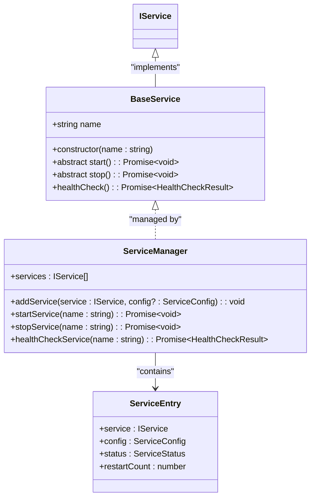
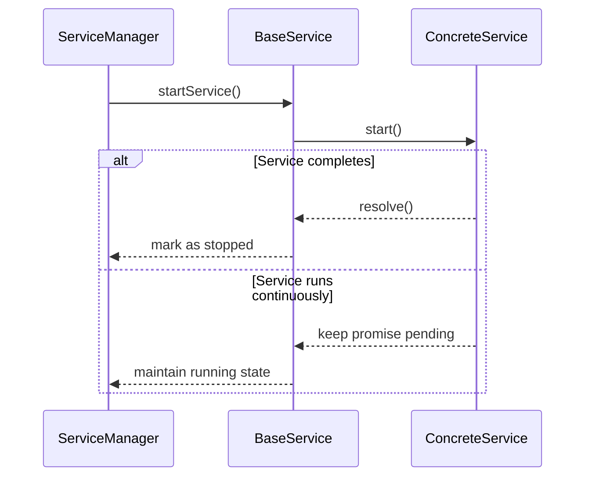
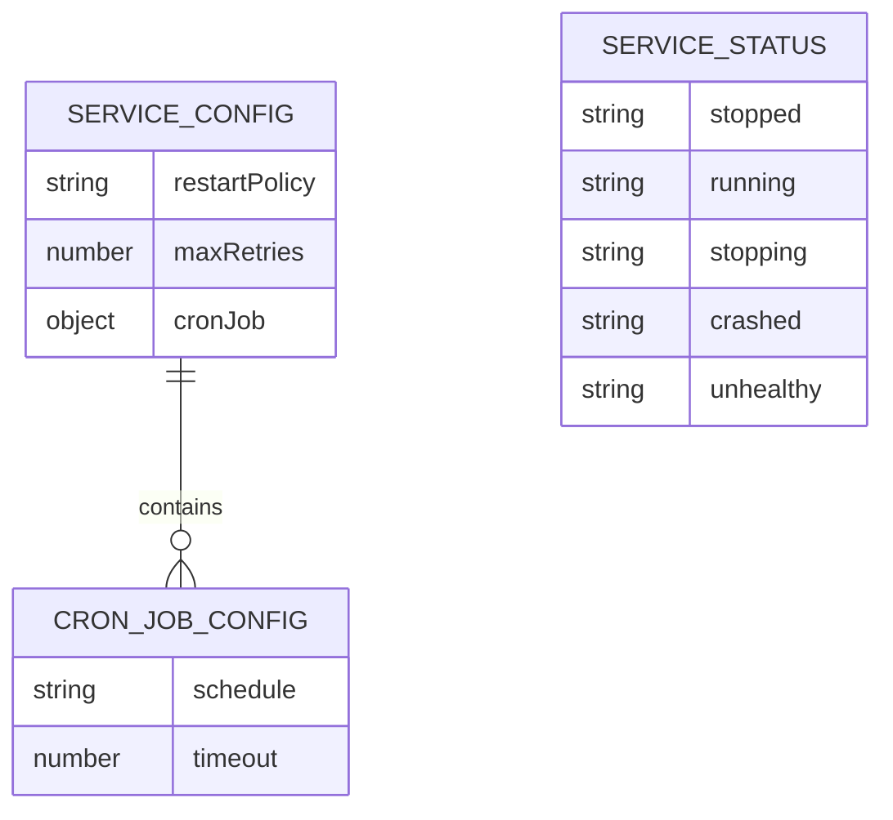
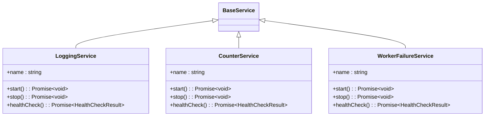
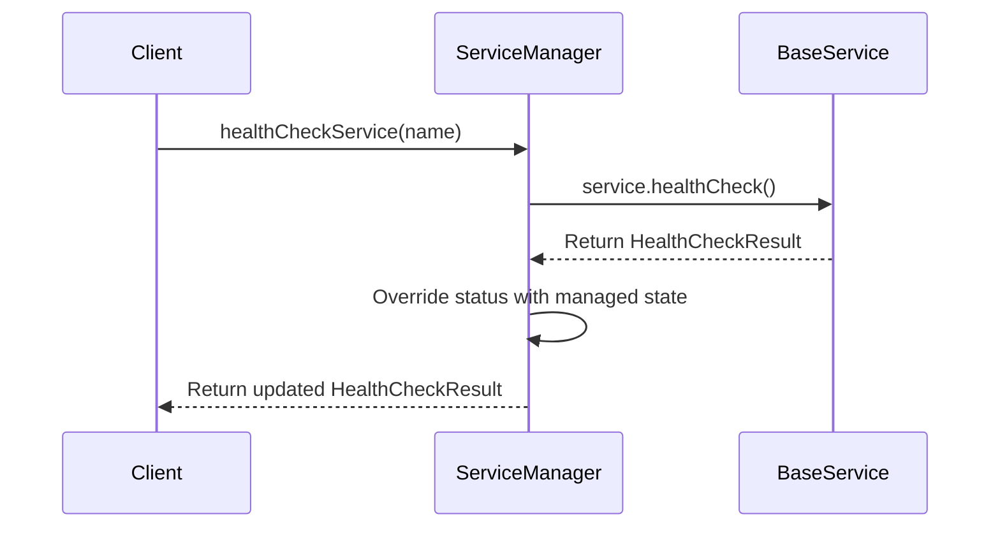

# BaseService Implementation

<cite>
**Referenced Files in This Document**   
- [BaseService.ts](file://src/BaseService.ts)
- [ServiceManager.ts](file://src/ServiceManager.ts)
- [interface.ts](file://src/interface.ts)
- [demo.ts](file://examples/demo.ts)
- [rest-api.ts](file://examples/rest-api.ts)
- [logService.ts](file://examples/services/logService.ts)
- [simpleWorker.ts](file://examples/services/simpleWorker.ts)
- [worker-failure.ts](file://examples/services/worker-failure.ts)
- [worker-with-data.ts](file://examples/services/worker-with-data.ts)
</cite>

## Table of Contents
1. [Introduction](#introduction)
2. [Core Architecture](#core-architecture)
3. [BaseService Lifecycle Methods](#baseservice-lifecycle-methods)
4. [ServiceManager Integration](#servicemanager-integration)
5. [Service Configuration Options](#service-configuration-options)
6. [Implementation Examples](#implementation-examples)
7. [Error Handling and Restart Policies](#error-handling-and-restart-policies)
8. [Health Check Mechanism](#health-check-mechanism)
9. [Best Practices for Extending BaseService](#best-practices-for-extending-baseservice)
10. [Troubleshooting Guide](#troubleshooting-guide)

## Introduction

The BaseService class in j8s serves as the foundational building block for creating custom services that operate within the main thread. It provides a standardized interface and lifecycle management framework, enabling consistent service behavior across applications. This document details the implementation, usage patterns, and integration points for BaseService, with emphasis on proper extension techniques and interaction with the ServiceManager.

**Section sources**
- [BaseService.ts](file://src/BaseService.ts#L1-L24)
- [interface.ts](file://src/interface.ts#L1-L44)

## Core Architecture

The BaseService implementation follows a clean separation of concerns between service definition and lifecycle management. The class is designed as an abstract base class that enforces implementation of core lifecycle methods while delegating state tracking to the ServiceManager.



**Diagram sources**
- [BaseService.ts](file://src/BaseService.ts#L1-L24)
- [ServiceManager.ts](file://src/ServiceManager.ts#L1-L351)
- [interface.ts](file://src/interface.ts#L1-L44)

**Section sources**
- [BaseService.ts](file://src/BaseService.ts#L1-L24)
- [ServiceManager.ts](file://src/ServiceManager.ts#L1-L351)

## BaseService Lifecycle Methods

BaseService defines two abstract methods that must be implemented by all subclasses: start() and stop(). These methods form the core lifecycle interface for services.

The start() method should initialize the service, begin any long-running operations, and return a Promise that resolves when the service has completed its task or remains pending for continuously running services. The stop() method is responsible for gracefully terminating the service, cleaning up resources, and resolving its Promise upon completion.



**Diagram sources**
- [BaseService.ts](file://src/BaseService.ts#L1-L24)
- [ServiceManager.ts](file://src/ServiceManager.ts#L58-L102)

**Section sources**
- [BaseService.ts](file://src/BaseService.ts#L1-L24)
- [demo.ts](file://examples/demo.ts#L15-L58)
- [rest-api.ts](file://examples/rest-api.ts#L15-L53)

## ServiceManager Integration

The ServiceManager acts as the central coordinator for all BaseService instances, managing their lifecycle, status, and health checks. When a service is added to the ServiceManager via addService(), it becomes subject to centralized control.

ServiceManager maintains a ServiceEntry for each registered service, tracking its configuration, status, and runtime metadata. The manager handles asynchronous execution of service methods, error propagation, and restart scheduling according to configured policies.

```mermaid
flowchart TD
A[ServiceManager.addService] --> B[Create ServiceEntry]
B --> C[Store in serviceMap]
C --> D{Has cronJob?}
D --> |Yes| E[Setup CronJob]
D --> |No| F[Ready for manual start]
G[ServiceManager.startService] --> H[Set status=running]
H --> I[Call service.start()]
I --> J[Handle Promise asynchronously]
J --> K{Success?}
K --> |Yes| L[Set status=stopped]
K --> |No| M[Handle failure and restart policy]
```

**Diagram sources**
- [ServiceManager.ts](file://src/ServiceManager.ts#L1-L351)

**Section sources**
- [ServiceManager.ts](file://src/ServiceManager.ts#L1-L351)
- [interface.ts](file://src/interface.ts#L1-L44)

## Service Configuration Options

Services can be configured with various options when registered with the ServiceManager through the ServiceConfig interface. Key configuration properties include restartPolicy, maxRetries, and cronJob settings.

The restartPolicy determines how the ServiceManager responds to service failures, with options including "always", "unless-stopped", "on-failure", and "no". The cronJob configuration enables scheduled execution of services using cron expressions, with optional timeout limits to prevent runaway tasks.



**Diagram sources**
- [interface.ts](file://src/interface.ts#L1-L44)
- [ServiceManager.ts](file://src/ServiceManager.ts#L1-L351)

**Section sources**
- [interface.ts](file://src/interface.ts#L1-L44)
- [ServiceManager.ts](file://src/ServiceManager.ts#L1-L351)
- [README.md](file://README.md#L187-L228)

## Implementation Examples

Several examples in the codebase demonstrate proper implementation patterns for extending BaseService. The logService.ts example shows a simple service with interval-based logging, while simpleWorker.ts implements a counter service that runs until completion.

The worker-failure.ts example demonstrates error handling in long-running tasks, and worker-with-data.ts shows how to access configuration data passed from the main thread. These examples illustrate various service patterns including finite tasks, continuous operations, and worker-thread services.



**Diagram sources**
- [logService.ts](file://examples/services/logService.ts#L1-L43)
- [simpleWorker.ts](file://examples/services/simpleWorker.ts#L1-L60)
- [worker-failure.ts](file://examples/services/worker-failure.ts#L1-L69)
- [worker-with-data.ts](file://examples/services/worker-with-data.ts#L1-L80)

**Section sources**
- [logService.ts](file://examples/services/logService.ts#L1-L43)
- [simpleWorker.ts](file://examples/services/simpleWorker.ts#L1-L60)
- [worker-failure.ts](file://examples/services/worker-failure.ts#L1-L69)
- [worker-with-data.ts](file://examples/services/worker-with-data.ts#L1-L80)

## Error Handling and Restart Policies

The ServiceManager implements robust error handling for BaseService instances, capturing unhandled rejections in the start() method and applying configured restart policies. When a service's start() method rejects, the manager logs the error, updates the service status to "crashed", and schedules restarts according to the restartPolicy.

The restart mechanism uses exponential backoff with a maximum delay of 30 seconds, preventing overwhelming the system with rapid restart attempts. The maxRetries parameter limits the number of restart attempts for the "on-failure" policy, providing protection against infinite restart loops.

```mermaid
flowchart TD
A[Service start() fails] --> B[Status = crashed]
B --> C{restartPolicy = "no"?}
C --> |Yes| D[No restart]
C --> |No| E{restartCount < maxRetries?}
E --> |No| F[Stop restarting]
E --> |Yes| G[Calculate delay with exponential backoff]
G --> H[Schedule restart after delay]
H --> I[Increment restartCount]
I --> J[Call startService()]
```

**Diagram sources**
- [ServiceManager.ts](file://src/ServiceManager.ts#L1-L351)

**Section sources**
- [ServiceManager.ts](file://src/ServiceManager.ts#L1-L351)
- [restart-policy.ts](file://examples/restart-policy.ts#L1-L46)
- [restart.ts](file://examples/restart.ts#L1-L53)

## Health Check Mechanism

BaseService includes a default healthCheck() method that returns a minimal health check result. Subclasses can override this method to provide service-specific health information while relying on the ServiceManager to supply the authoritative status.

The ServiceManager intercepts health check results from services and overrides the status field with its internally tracked state, ensuring consistency between the actual service state and reported health. This prevents services from misrepresenting their status and provides a single source of truth for service health.



**Diagram sources**
- [BaseService.ts](file://src/BaseService.ts#L1-L24)
- [ServiceManager.ts](file://src/ServiceManager.ts#L1-L351)

**Section sources**
- [BaseService.ts](file://src/BaseService.ts#L1-L24)
- [ServiceManager.ts](file://src/ServiceManager.ts#L1-L351)
- [logService.ts](file://examples/services/logService.ts#L1-L43)

## Best Practices for Extending BaseService

When extending BaseService, implementers should follow several best practices to ensure reliable operation. Services should properly clean up timers and other resources in the stop() method, and long-running services should maintain their start() promise until stopped.

For services that need to run continuously, the start() method should return a Promise that only resolves when stop() is called, typically implemented using a polling mechanism that checks a running flag. Error handling should be comprehensive, with appropriate logging and graceful degradation when possible.

```mermaid
flowchart TD
A[Extend BaseService] --> B[Implement start()]
B --> C{Finite or Continuous?}
C --> |Finite| D[Return resolved Promise when done]
C --> |Continuous| E[Return Promise that resolves on stop()]
A --> F[Implement stop()]
F --> G[Clean up resources]
G --> H[Clear timers/intervals]
H --> I[Set running flag to false]
A --> J[Override healthCheck() if needed]
J --> K[Include service-specific metrics]
K --> L[Don't set status field]
```

**Diagram sources**
- [demo.ts](file://examples/demo.ts#L15-L58)
- [rest-api.ts](file://examples/rest-api.ts#L15-L53)

**Section sources**
- [demo.ts](file://examples/demo.ts#L15-L58)
- [rest-api.ts](file://examples/rest-api.ts#L15-L53)
- [BaseService.ts](file://src/BaseService.ts#L1-L24)

## Troubleshooting Guide

Common issues when implementing BaseService extensions include unhandled promise rejections, improper resource cleanup, and incorrect handling of long-running operations. Ensure that all asynchronous operations in start() are properly awaited or handled, and that all timers and intervals are cleared in stop().

For services that fail to start, verify that the start() method doesn't throw synchronously and that any asynchronous initialization is properly chained. When services don't respond to stop() calls, check that the running flag is properly updated and that the start() promise can resolve.

```mermaid
flowchart TD
A[Service fails to start] --> B[Check for synchronous exceptions]
B --> C[Verify async initialization chain]
C --> D[Ensure no immediate Promise rejection]
A --> E[Service doesn't stop] --> F[Check stop() implementation]
F --> G[Verify timers are cleared]
G --> H[Ensure start() Promise can resolve]
A --> I[Memory leaks] --> J[Check for unclosed resources]
J --> K[Verify event listeners are removed]
K --> L[Ensure intervals are cleared]
A --> M[Status inconsistencies] --> N[Don't set status in healthCheck()]
N --> O[Rely on ServiceManager for status]
```

**Diagram sources**
- [ServiceManager.ts](file://src/ServiceManager.ts#L1-L351)
- [BaseService.ts](file://src/BaseService.ts#L1-L24)

**Section sources**
- [ServiceManager.ts](file://src/ServiceManager.ts#L1-L351)
- [BaseService.ts](file://src/BaseService.ts#L1-L24)
- [worker-failure.ts](file://examples/services/worker-failure.ts#L1-L69)