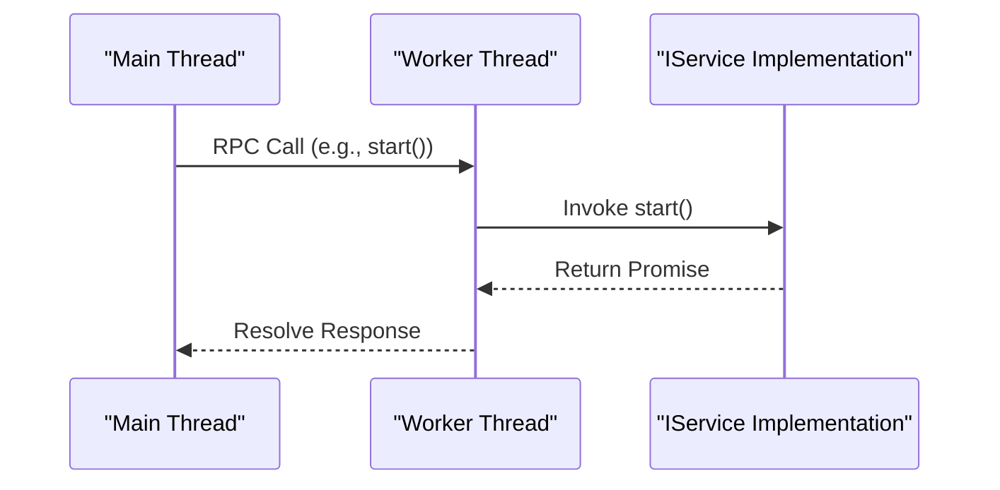
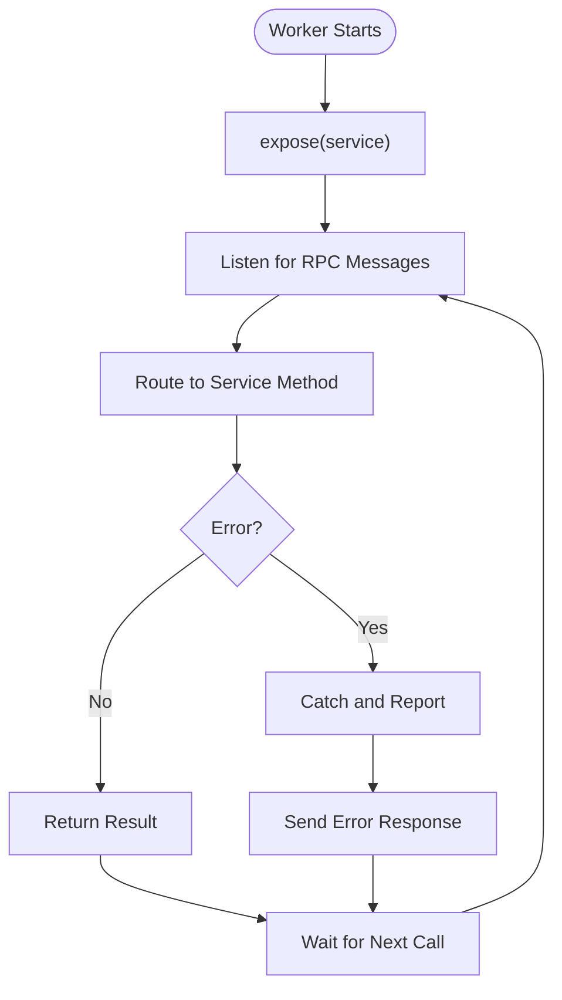

# RPC Exposure in Workers

<cite>
**Referenced Files in This Document**   
- [src/expose.ts](file://src/expose.ts)
- [src/interface.ts](file://src/interface.ts)
- [src/WorkerService.ts](file://src/WorkerService.ts)
- [examples/services/simpleWorker.ts](file://examples/services/simpleWorker.ts)
- [index.ts](file://index.ts)
</cite>

## Table of Contents
1. [Introduction](#introduction)
2. [Core Mechanism of expose()](#core-mechanism-of-expose)
3. [Worker-Thread RPC Communication](#worker-thread-rpc-communication)
4. [Implementation Example: simpleWorker.ts](#implementation-example-simpleworkerts)
5. [Underlying RPC Infrastructure](#underlying-rpc-infrastructure)
6. [Common Issues and Troubleshooting](#common-issues-and-troubleshooting)
7. [Best Practices for Worker Scripts](#best-practices-for-worker-scripts)
8. [Conclusion](#conclusion)

## Introduction
The `expose()` function in j8s enables seamless Remote Procedure Call (RPC) communication between the main thread and worker threads in Node.js environments. By abstracting the complexity of inter-thread messaging, `expose()` allows developers to expose service implementations in workers with minimal boilerplate. This document explains how `expose()` works, its integration with the `@kunkun/kkrpc` library, and best practices for building reliable worker-based services.

## Core Mechanism of expose()
The `expose()` function simplifies the process of making a service remotely accessible from the main thread by setting up a bidirectional RPC channel. It accepts an implementation of the `IService` interface and automatically configures the necessary communication infrastructure.

Internally, `expose()` creates a `WorkerChildIO` instance to manage message passing within the worker thread. It then initializes an `RPCChannel` using this IO interface, exposing the provided service object so that methods like `start`, `stop`, and `healthCheck` can be invoked remotely.

This abstraction eliminates the need for manual setup of message listeners and serializers, allowing developers to focus on business logic rather than communication plumbing.

**Section sources**
- [src/expose.ts](file://src/expose.ts#L1-L54)
- [src/interface.ts](file://src/interface.ts#L14-L19)

## Worker-Thread RPC Communication
j8s uses a structured RPC model to enable method invocation across thread boundaries. The communication flow is bidirectional:
- The main thread uses `WorkerService` to control lifecycle operations.
- The worker thread uses `expose()` to register a service instance.
- Method calls are serialized and transmitted via `@kunkun/kkrpc`.

When the main thread calls `start()` on a `WorkerService`, the request is sent through `WorkerParentIO` to the worker, where it is deserialized and dispatched to the exposed service’s `start()` method. Responses are returned asynchronously through the same channel.

This mechanism ensures that services running in isolated worker threads can be managed uniformly alongside main-thread services.

**Diagram sources**
- [src/WorkerService.ts](file://src/WorkerService.ts#L34-L65)
- [src/expose.ts](file://src/expose.ts#L10-L15)

## Implementation Example: simpleWorker.ts
The `simpleWorker.ts` example demonstrates how to use `expose()` to create a worker-hosted counter service. The `CounterService` class implements the `IService` interface with standard methods: `start`, `stop`, and `healthCheck`.

Upon calling `expose(new CounterService())`, the worker becomes capable of receiving remote method invocations. The `start()` method initiates a timer that increments a counter every second until reaching a maximum value, while `stop()` clears the interval. The `healthCheck()` method returns runtime state including current count and progress.

This pattern enables long-running or isolated tasks to be cleanly encapsulated and controlled from the main application.

**Section sources**
- [examples/services/simpleWorker.ts](file://examples/services/simpleWorker.ts#L0-L59)
- [src/interface.ts](file://src/interface.ts#L14-L19)

## Underlying RPC Infrastructure
The RPC functionality in j8s is powered by the `@kunkun/kkrpc` dependency, which handles message serialization, event routing, and connection management. Two key components facilitate communication:
- `WorkerChildIO`: Used in the worker thread to receive messages from the parent.
- `WorkerParentIO`: Used in the main thread to send messages to the worker.

These IO interfaces implement the `DestroyableIoInterface`, ensuring proper cleanup during shutdown. The `RPCChannel` wraps these interfaces, providing a type-safe proxy for remote method calls.

Message payloads are serialized using structured cloning or JSON, depending on configuration, ensuring compatibility with Node.js worker messaging. Events such as `error` and `messageerror` are monitored to detect communication failures.

**Section sources**
- [src/expose.ts](file://src/expose.ts#L1-L54)
- [src/WorkerService.ts](file://src/WorkerService.ts#L0-L36)

## Common Issues and Troubleshooting
Despite its robust design, several issues may arise when using `expose()`:

- **Method Invocation Failures**: Occur when the worker is not properly initialized or the service throws an unhandled exception. Ensure all async methods are properly awaited and errors are caught.

- **Type Mismatches**: If the service does not fully implement the `IService` interface, method calls may fail. Use TypeScript interfaces to enforce correct implementation.

- **Connection Leaks**: Failure to destroy IO interfaces can lead to memory leaks. The `cleanup()` method in `WorkerService` ensures `io.destroy()` is called before terminating the worker.

- **Auto-Termination Conflicts**: When `autoTerminate` is enabled, premature termination may occur if `start()` completes before asynchronous tasks finish. Avoid enabling auto-termination for long-running services.

- **Uncaught Errors in Workers**: Unhandled rejections or exceptions in the worker can crash the thread. Wrap critical logic in try-catch blocks and log errors appropriately.

**Section sources**
- [src/WorkerService.ts](file://src/WorkerService.ts#L150-L193)
- [src/expose.ts](file://src/expose.ts#L10-L15)

## Best Practices for Worker Scripts
To ensure reliability and maintainability when using `expose()`, follow these best practices:

- **Implement Proper Cleanup**: Always clean up timers, intervals, and listeners in the `stop()` method to prevent resource leaks.

- **Use Error Boundaries**: Wrap method logic in try-catch blocks to prevent unhandled exceptions from crashing the worker.

- **Handle Timeouts Gracefully**: For long-running operations, implement timeout mechanisms and allow cancellation via `stop()`.

- **Pass Configuration via workerData**: Use the `workerData` option in `createWorkerService()` to pass initialization parameters securely.

- **Monitor Health State**: Implement meaningful `healthCheck()` responses that reflect internal state and operational readiness.

- **Avoid Blocking the Event Loop**: Offload CPU-intensive tasks to workers and keep the main thread responsive.

- **Ensure Destroyable IO Usage**: Always destroy IO interfaces during cleanup to prevent dangling connections.

**Diagram sources**
- [src/expose.ts](file://src/expose.ts#L10-L15)
- [src/WorkerService.ts](file://src/WorkerService.ts#L100-L120)

## Conclusion
The `expose()` function in j8s provides a powerful yet simple way to enable RPC communication between the main thread and worker threads. By leveraging `@kunkun/kkrpc`, it abstracts away the complexity of inter-thread messaging, allowing developers to focus on implementing service logic. With proper error handling, cleanup, and configuration, worker-based services can be made robust and scalable. Following best practices ensures reliable operation in production environments, making j8s a valuable tool for orchestrating JavaScript services across threads.