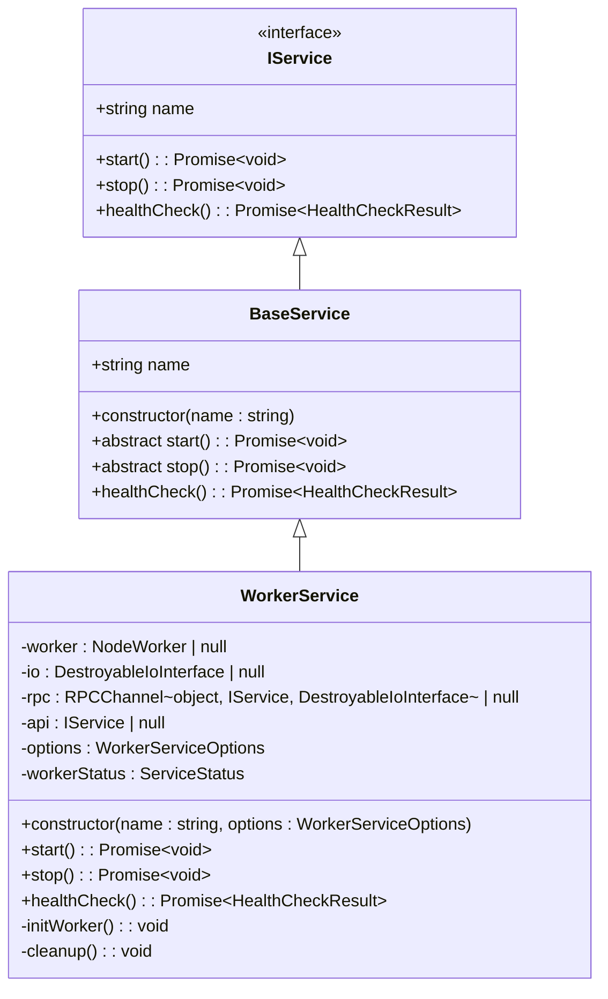
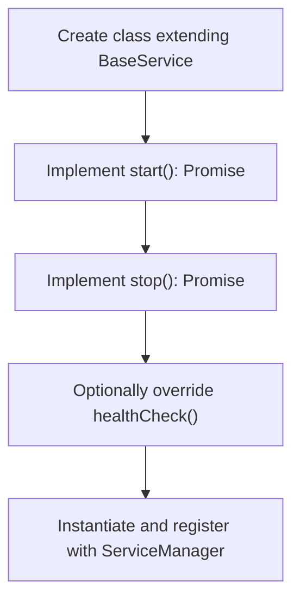
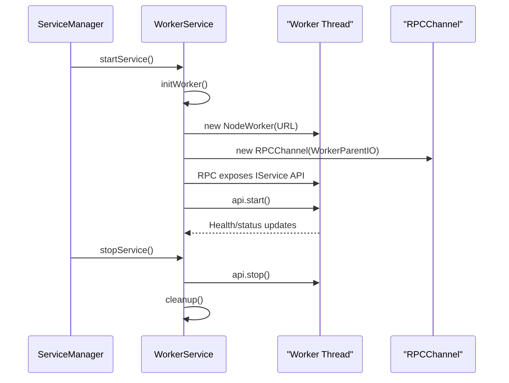
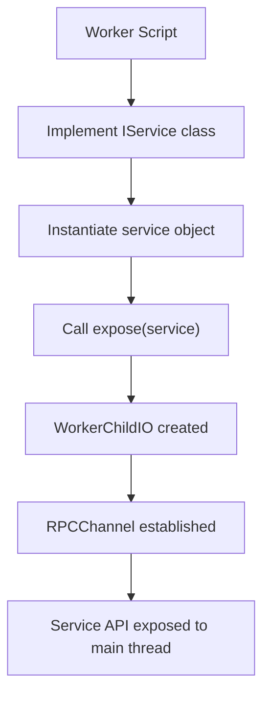
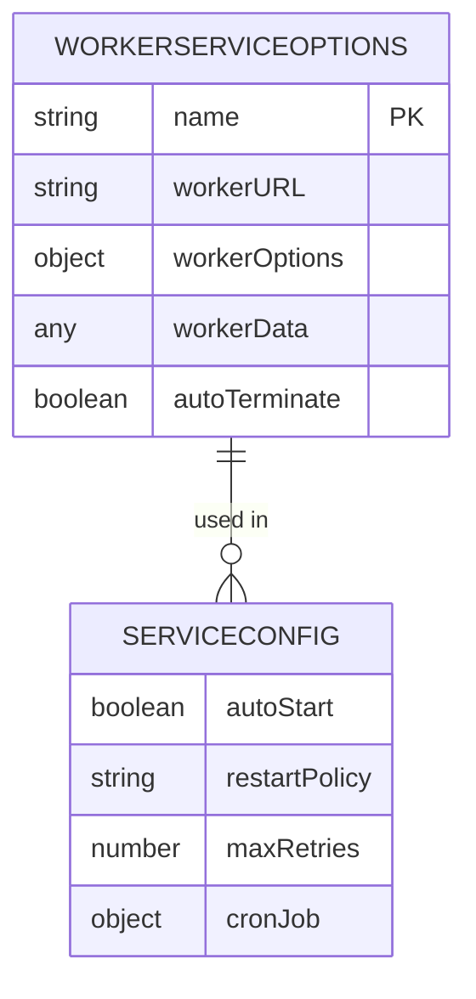
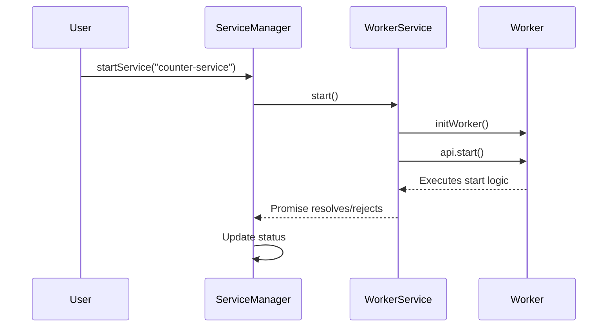

# Service Implementation

<cite>
**Referenced Files in This Document**   
- [BaseService.ts](file://src/BaseService.ts)
- [WorkerService.ts](file://src/WorkerService.ts)
- [ServiceManager.ts](file://src/ServiceManager.ts)
- [expose.ts](file://src/expose.ts)
- [simpleWorker.ts](file://examples/services/simpleWorker.ts)
- [interface.ts](file://src/interface.ts)
</cite>

## Table of Contents
1. [Introduction](#introduction)
2. [Core Service Base Classes](#core-service-base-classes)
3. [Creating Main-Thread Services with BaseService](#creating-main-thread-services-with-baseservice)
4. [Creating Worker-Thread Services with WorkerService](#creating-worker-thread-services-with-workerservice)
5. [Exposing Services in Workers with expose()](#exposing-services-in-workers-with-expose)
6. [Service Lifecycle Methods and Hooks](#service-lifecycle-methods-and-hooks)
7. [Service Configuration Options](#service-configuration-options)
8. [ServiceManager and Service Lifecycle Orchestration](#servicemanager-and-service-lifecycle-orchestration)
9. [Error Handling and Common Issues](#error-handling-and-common-issues)
10. [Best Practices and Service Isolation](#best-practices-and-service-isolation)

## Introduction
This document provides a comprehensive guide to implementing custom services within the j8s framework. It details the two primary service types—main-thread services extending `BaseService` and worker-thread services extending `WorkerService`—and explains how to manage their lifecycle, configuration, and communication. The guide covers the use of the `expose()` function for enabling RPC in worker threads, demonstrates service creation with real examples, and outlines the interaction between `ServiceManager` and individual services. Special attention is given to error handling, restart policies, and isolation strategies to ensure robust and maintainable service implementations.

## Core Service Base Classes

The j8s framework provides two foundational classes for service implementation: `BaseService` for main-thread execution and `WorkerService` for worker-thread execution. Both classes implement the `IService` interface, which defines the contract for service lifecycle management.

**Diagram sources**
- [BaseService.ts](file://src/BaseService.ts#L1-L25)
- [WorkerService.ts](file://src/WorkerService.ts#L1-L193)
- [interface.ts](file://src/interface.ts#L14-L19)

**Section sources**
- [BaseService.ts](file://src/BaseService.ts#L1-L25)
- [WorkerService.ts](file://src/WorkerService.ts#L1-L193)
- [interface.ts](file://src/interface.ts#L14-L19)

## Creating Main-Thread Services with BaseService

To create a service that runs on the main thread, extend the `BaseService` class. This base class provides a minimal implementation of the `IService` interface, requiring subclasses to implement the `start` and `stop` methods. The `name` property is automatically managed via the constructor.

When implementing a main-thread service, developers must define the core logic within the `start` method, which is expected to return a `Promise<void>`. The `stop` method should handle graceful shutdown, including cleanup of timers, connections, or other resources. The `healthCheck` method is optionally overridden to provide custom health monitoring.

**Section sources**
- [BaseService.ts](file://src/BaseService.ts#L1-L25)

## Creating Worker-Thread Services with WorkerService

Worker-thread services are implemented by extending `WorkerService`, which encapsulates the complexity of Node.js `worker_threads` and RPC communication. This class manages the lifecycle of a worker thread, including initialization, error handling, and cleanup.

The `WorkerService` constructor accepts a configuration object (`WorkerServiceOptions`) that specifies the worker script URL, optional worker options, custom data (`workerData`), and whether the worker should auto-terminate after execution. The service internally manages the `NodeWorker` instance, sets up an `RPCChannel` for communication, and monitors worker events such as errors and message failures.

**Diagram sources**
- [WorkerService.ts](file://src/WorkerService.ts#L1-L193)

**Section sources**
- [WorkerService.ts](file://src/WorkerService.ts#L1-L193)

## Exposing Services in Workers with expose()

The `expose()` function simplifies service implementation within worker threads by abstracting the RPC setup. Instead of manually creating an `RPCChannel` and `WorkerChildIO`, developers can simply call `expose(service)` with an instance of a class that implements `IService`.

This function automatically sets up the necessary IO interface (`WorkerChildIO`) and RPC channel, exposing the provided service object to the main thread. This enables seamless method invocation and health checks from the `ServiceManager` without requiring boilerplate code in the worker.

**Diagram sources**
- [expose.ts](file://src/expose.ts#L1-L55)

**Section sources**
- [expose.ts](file://src/expose.ts#L1-L55)

## Service Lifecycle Methods and Hooks

All services must implement two core lifecycle methods: `start()` and `stop()`. These are abstract in `BaseService` and fully implemented in `WorkerService`. The `start()` method initializes the service, while `stop()` ensures graceful shutdown.

While `onStart` and `onStop` hooks are not explicitly defined in the current codebase, the framework allows for such patterns through method overrides or event listeners. For example, `WorkerService` internally calls `initWorker()` before starting and `cleanup()` after stopping, which can be considered internal hooks.

The `healthCheck()` method is provided by default but can be overridden to return detailed status information, such as processing progress or resource usage.

**Section sources**
- [BaseService.ts](file://src/BaseService.ts#L1-L25)
- [WorkerService.ts](file://src/WorkerService.ts#L1-L193)

## Service Configuration Options

Services can be configured through several options, particularly when using `WorkerService` or registering with `ServiceManager`.

### WorkerServiceOptions
- **name**: Unique identifier for the service
- **workerURL**: Path or URL to the worker script
- **workerOptions**: Additional options passed to `NodeWorker`
- **workerData**: Custom data serialized and passed to the worker
- **autoTerminate**: If true, worker terminates after `start()` completes

### ServiceConfig (for ServiceManager)
- **autoStart**: Whether the service starts automatically when added
- **restartPolicy**: One of "no", "on-failure", or "always"
- **maxRetries**: Maximum number of restart attempts
- **cronJob**: Schedule and timeout for periodic execution

**Section sources**
- [WorkerService.ts](file://src/WorkerService.ts#L1-L193)
- [ServiceManager.ts](file://src/ServiceManager.ts#L1-L351)

## ServiceManager and Service Lifecycle Orchestration

The `ServiceManager` class is responsible for managing the lifecycle of all registered services. It maintains a map of service entries, each containing the service instance, configuration, status, and metadata such as restart count and running promises.

When a service is added via `addService()`, it is registered with optional configuration. The `startService()` method transitions the service to "running" status and invokes `start()`, handling both immediate and asynchronous failures. If a service fails and the restart policy allows, `scheduleServiceRestart()` is called with exponential backoff.

For worker services, `ServiceManager` interacts with the `WorkerService` instance, which in turn communicates with the worker thread via RPC. This layered architecture ensures that lifecycle commands are properly routed and status is consistently tracked.

**Diagram sources**
- [ServiceManager.ts](file://src/ServiceManager.ts#L1-L351)
- [WorkerService.ts](file://src/WorkerService.ts#L1-L193)

**Section sources**
- [ServiceManager.ts](file://src/ServiceManager.ts#L1-L351)

## Error Handling and Common Issues

A common issue in worker-based services is unhandled rejections or errors within the worker thread, which can cause silent failures. The `WorkerService` class addresses this by attaching error listeners to the worker:

- `error` event: Logs the error and sets status to "crashed"
- `messageerror` event: Logs message errors and sets status to "unhealthy"

The `ServiceManager` further enhances resilience by implementing restart policies. If a service fails during `start()`, it can be automatically restarted based on the configured policy (`on-failure`, `always`, or `no`). Exponential backoff is used to prevent overwhelming the system during repeated failures.

To prevent unhandled rejections, ensure all async operations in `start()` and `stop()` are properly awaited and errors are caught. Use structured logging to trace execution flow and diagnose issues.

**Section sources**
- [WorkerService.ts](file://src/WorkerService.ts#L1-L193)
- [ServiceManager.ts](file://src/ServiceManager.ts#L1-L351)

## Best Practices and Service Isolation

To ensure robust and maintainable services:

1. **Isolate worker logic**: Keep worker scripts focused and avoid shared mutable state.
2. **Use workerData for configuration**: Pass initialization parameters via `workerData` instead of hardcoding.
3. **Implement health checks**: Provide meaningful health details to aid monitoring.
4. **Handle cleanup in stop()**: Always release resources like timers, sockets, or file handles.
5. **Leverage restart policies**: Use `on-failure` for critical services to improve availability.
6. **Avoid long-running synchronous operations**: Prevent blocking the event loop in main-thread services.

By following these practices and leveraging the j8s service framework, developers can build scalable, fault-tolerant, and maintainable services with minimal boilerplate.

**Section sources**
- [WorkerService.ts](file://src/WorkerService.ts#L1-L193)
- [ServiceManager.ts](file://src/ServiceManager.ts#L1-L351)
- [expose.ts](file://src/expose.ts#L1-L55)
- [simpleWorker.ts](file://examples/services/simpleWorker.ts#L1-L60)