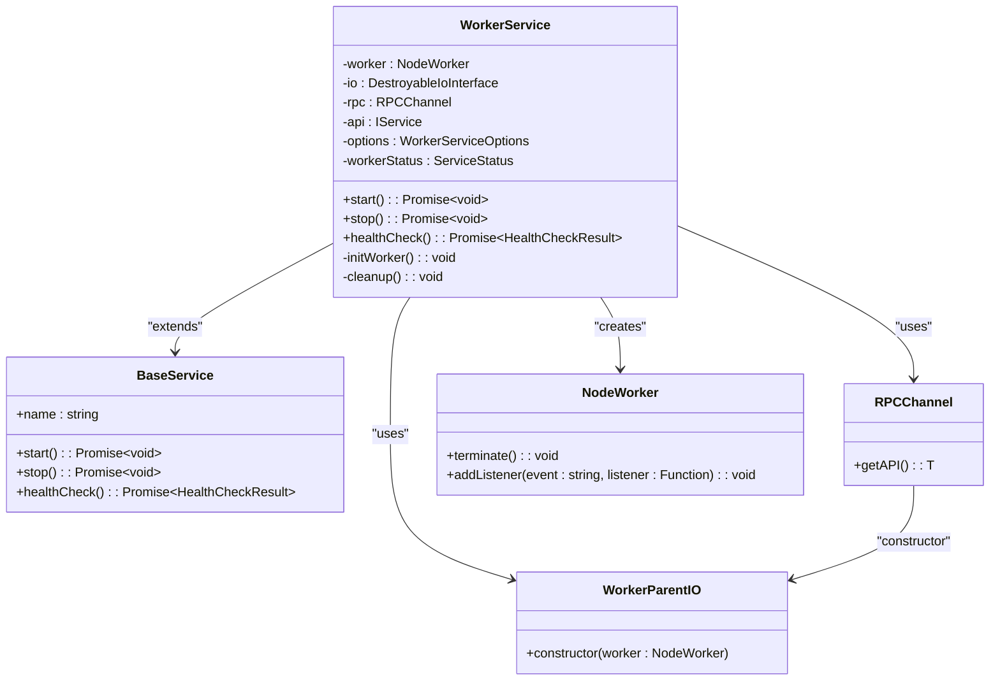
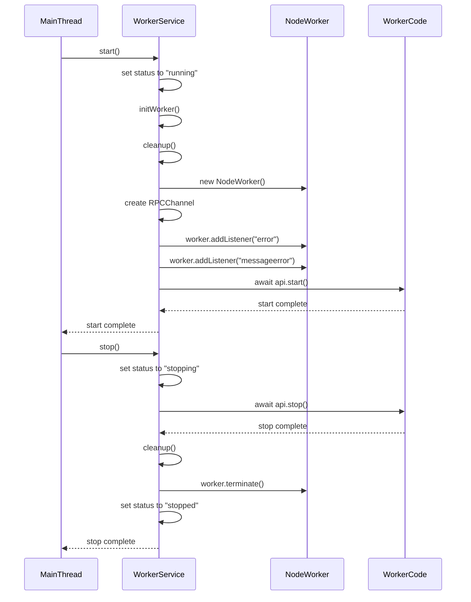
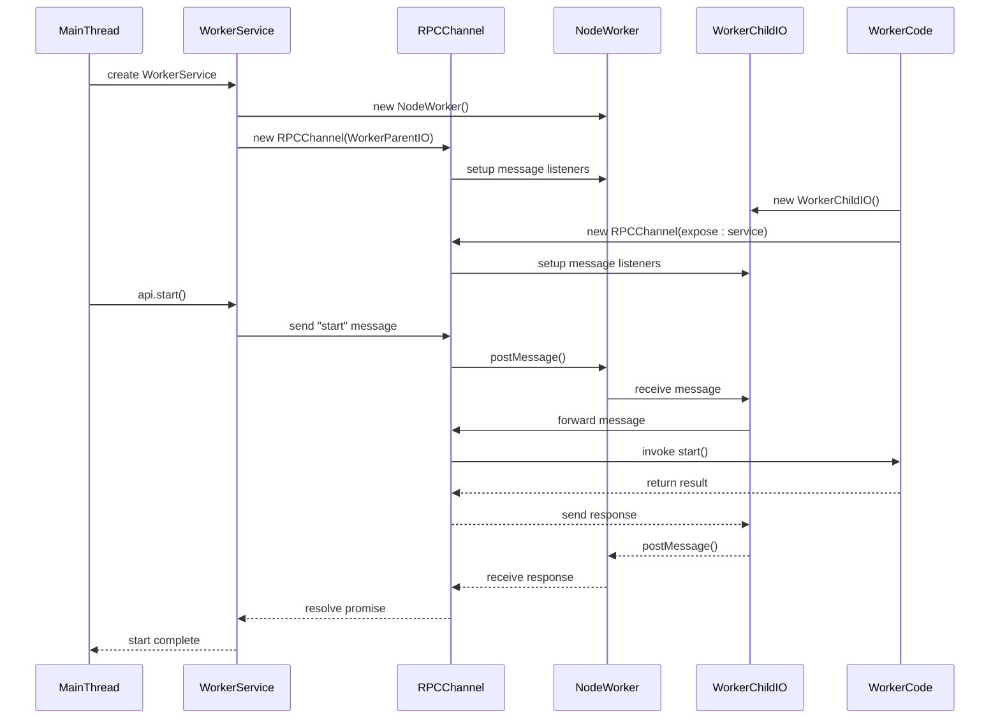
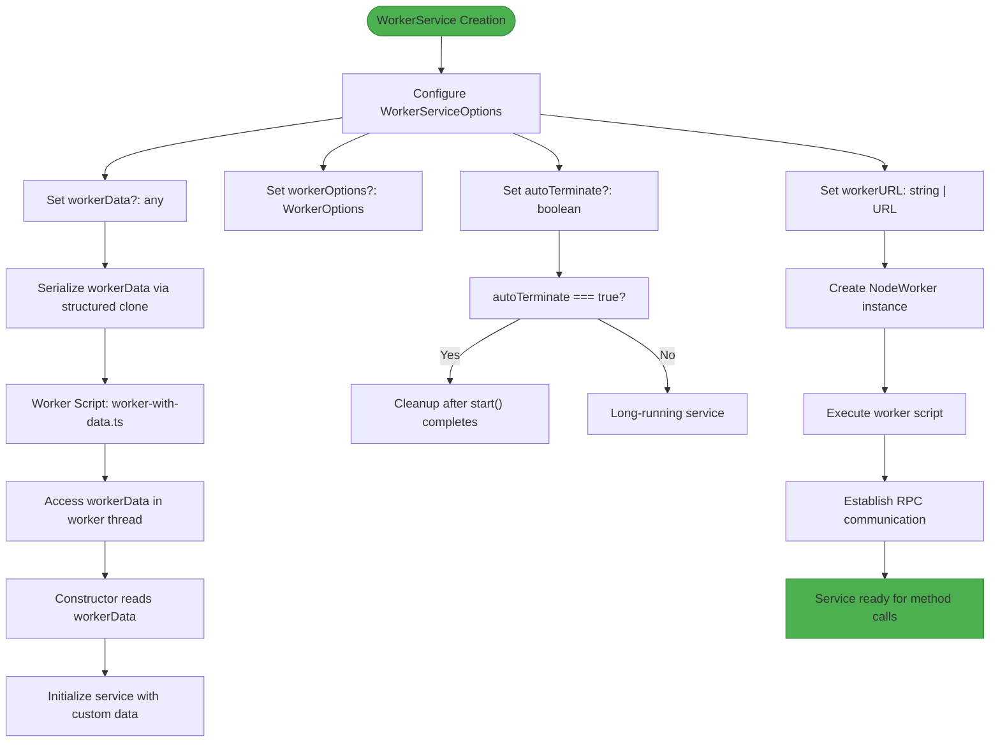
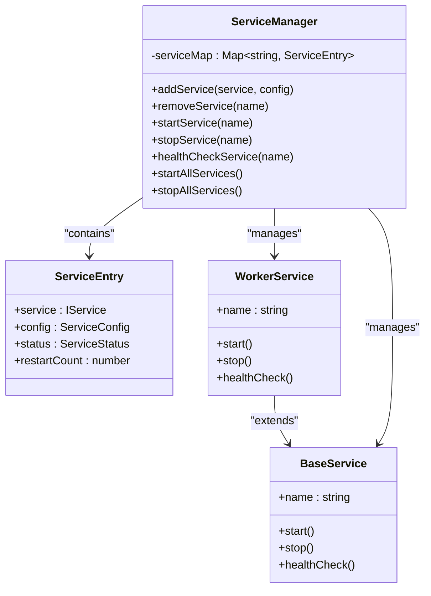

# WorkerService Implementation

<cite>
**Referenced Files in This Document**   
- [WorkerService.ts](file://src/WorkerService.ts)
- [BaseService.ts](file://src/BaseService.ts)
- [expose.ts](file://src/expose.ts)
- [simpleWorker.ts](file://examples/services/simpleWorker.ts)
- [worker-with-data.ts](file://examples/services/worker-with-data.ts)
- [ServiceManager.ts](file://src/ServiceManager.ts)
</cite>

## Table of Contents
1. [Introduction](#introduction)
2. [Core Architecture](#core-architecture)
3. [Worker Initialization and Lifecycle](#worker-initialization-and-lifecycle)
4. [RPC Communication and API Exposure](#rpc-communication-and-api-exposure)
5. [Worker Configuration and Data Passing](#worker-configuration-and-data-passing)
6. [Health Check and Status Management](#health-check-and-status-management)
7. [Integration with ServiceManager](#integration-with-servicemanager)
8. [Usage Examples](#usage-examples)
9. [Common Pitfalls and Solutions](#common-pitfalls-and-solutions)
10. [Conclusion](#conclusion)

## Introduction
The `WorkerService` class in j8s provides a robust mechanism for running services in isolated Node.js worker threads, enabling parallel execution and improved application stability. By extending `BaseService`, it inherits core service management capabilities while adding specialized functionality for worker thread management. This implementation leverages RPC (Remote Procedure Call) communication to coordinate between the main thread and worker threads, allowing services to run independently while maintaining centralized control through the `ServiceManager`. The design supports both long-running services and short-lived tasks through configurable options like `autoTerminate`, making it versatile for various use cases from background processing to scheduled jobs.

**Section sources**
- [WorkerService.ts](file://src/WorkerService.ts#L1-L36)
- [BaseService.ts](file://src/BaseService.ts#L1-L25)

## Core Architecture
The `WorkerService` architecture is built around several key components that work together to manage worker threads effectively. At its core, the service creates a `NodeWorker` instance that runs in a separate thread, providing isolation from the main application thread. Communication between threads is established through an `RPCChannel` using `WorkerParentIO` for the main thread and `WorkerChildIO` in the worker. This bidirectional communication channel enables method calls and data exchange between threads while maintaining type safety through TypeScript generics. The service maintains its own internal state tracking via `workerStatus`, which synchronizes with the `ServiceManager`'s status management. This architecture allows for clean separation of concerns, where the main thread handles service orchestration while worker threads focus on executing business logic.



**Diagram sources**
- [WorkerService.ts](file://src/WorkerService.ts#L1-L36)
- [BaseService.ts](file://src/BaseService.ts#L1-L25)

**Section sources**
- [WorkerService.ts](file://src/WorkerService.ts#L1-L36)
- [expose.ts](file://src/expose.ts#L1-L55)

## Worker Initialization and Lifecycle
The lifecycle management of `WorkerService` is centered around the `start()` and `stop()` methods, which handle the complete initialization and termination process of worker threads. During initialization in the `start()` method, the service first sets its status to "running" and calls `initWorker()` to create a fresh worker instance. The `initWorker()` method begins by calling `cleanup()` to ensure any existing worker resources are properly released, preventing resource leaks. It then creates a new `NodeWorker` with the specified `workerURL` and merged `workerOptions`, including any `workerData` that needs to be passed to the worker thread. The worker's lifecycle events are monitored through event listeners for "error" and "messageerror", which update the service status accordingly and trigger cleanup procedures when issues occur. The `stop()` method follows a graceful shutdown pattern, first attempting to stop the worker service via RPC before cleaning up resources and terminating the worker thread.



**Diagram sources**
- [WorkerService.ts](file://src/WorkerService.ts#L34-L170)

**Section sources**
- [WorkerService.ts](file://src/WorkerService.ts#L34-L170)

## RPC Communication and API Exposure
Remote Procedure Call (RPC) communication is the backbone of inter-thread interaction in the `WorkerService` implementation. The `RPCChannel` establishes a bidirectional communication link between the main thread and worker thread, allowing method calls to be proxied across thread boundaries. In the main thread, `WorkerService` creates an `RPCChannel` using `WorkerParentIO` as the transport layer, which wraps the `NodeWorker` instance. This channel exposes the worker's service API through `getAPI()`, returning a proxy object that can be used to call methods on the worker service. On the worker side, the `expose()` function handles the counterpart setup by creating a `WorkerChildIO` instance and an `RPCChannel` that exposes the service implementation. This design enables seamless method invocation across threads while abstracting away the complexity of message passing. The type-safe generics in `RPCChannel<object, IService, DestroyableIoInterface>` ensure that both ends of the communication adhere to the expected interfaces.



**Diagram sources**
- [WorkerService.ts](file://src/WorkerService.ts#L34-L65)
- [expose.ts](file://src/expose.ts#L1-L55)

**Section sources**
- [WorkerService.ts](file://src/WorkerService.ts#L34-L65)
- [expose.ts](file://src/expose.ts#L1-L55)

## Worker Configuration and Data Passing
The `WorkerServiceOptions` interface provides flexible configuration for worker threads, with three key properties: `workerURL`, `workerOptions`, and `workerData`. The `workerURL` specifies the path to the worker script file, which must implement the `IService` interface. The `workerOptions` property allows passing standard Node.js worker options such as environment variables, resource limits, and thread names, which are merged with any worker data configuration. The `workerData` property is particularly important as it enables passing initial data to the worker thread, which becomes accessible through Node.js's built-in `workerData` global in the worker context. This data passing mechanism supports complex objects and is serialized using the structured clone algorithm, allowing for rich configuration of worker behavior. The `autoTerminate` option provides additional control over the worker lifecycle, automatically cleaning up resources after the `start()` method completes, which is ideal for short-lived tasks or batch processing jobs.



**Diagram sources**
- [WorkerService.ts](file://src/WorkerService.ts#L1-L36)
- [worker-with-data.ts](file://examples/services/worker-with-data.ts#L1-L41)

**Section sources**
- [WorkerService.ts](file://src/WorkerService.ts#L1-L36)
- [worker-with-data.ts](file://examples/services/worker-with-data.ts#L1-L41)

## Health Check and Status Management
Health monitoring in `WorkerService` combines local status tracking with delegated health checks to provide comprehensive service monitoring. The `healthCheck()` method first evaluates the local `workerStatus` to determine if the worker is in a running state and if the API proxy is available. When the worker is operational, it delegates the health check by calling `api.healthCheck()` through the RPC channel, allowing the worker service to report its internal health status with detailed metrics. If the worker is not running or the RPC call fails, the method falls back to returning the locally tracked status, ensuring that health information is always available even when the worker is unresponsive. This dual approach provides both immediate status information and detailed health diagnostics. The status synchronization between threads is maintained through the `workerStatus` field, which is updated during lifecycle events and error conditions, ensuring that the `ServiceManager` receives accurate status updates for service orchestration.

```mermaid
flowchart TD
Start([healthCheck() called]) --> CheckStatus["Check workerStatus === 'running'?"]
CheckStatus --> |No| ReturnLocal["Return local status"]
CheckStatus --> |Yes| CheckAPI["Check api !== null?"]
CheckAPI --> |No| ReturnLocal
CheckAPI --> |Yes| CallRemote["Call api.healthCheck()"]
CallRemote --> |Success| ReturnRemote["Return worker's health result"]
CallRemote --> |Failure| LogError["Log error, return 'unhealthy'"]
LogError --> ReturnUnhealthy["Return { status: 'unhealthy' }"]
ReturnLocal --> End([Return status])
ReturnRemote --> End
ReturnUnhealthy --> End
style Start fill:#2196F3,stroke:#1976D2
style End fill:#2196F3,stroke:#1976D2
```

**Diagram sources**
- [WorkerService.ts](file://src/WorkerService.ts#L172-L193)

**Section sources**
- [WorkerService.ts](file://src/WorkerService.ts#L172-L193)
- [ServiceManager.ts](file://src/ServiceManager.ts#L180-L200)

## Integration with ServiceManager
The `WorkerService` integrates seamlessly with the `ServiceManager` to provide centralized service orchestration and lifecycle management. When a `WorkerService` instance is added to the `ServiceManager` via `addService()`, it becomes part of the managed service collection and inherits the manager's restart policies, cron scheduling, and health monitoring capabilities. The `ServiceManager` maintains the authoritative status of each service, overriding the status returned by individual health checks with its own tracked state. This ensures consistent status reporting across all services, whether they run in the main thread or worker threads. The integration also enables advanced features like automatic restart on failure, where the `ServiceManager` can detect when a `WorkerService` has crashed and automatically restart it according to the configured restart policy. This tight integration allows developers to treat worker-based services identically to regular services in terms of management, while still benefiting from the isolation and parallelism provided by worker threads.



**Diagram sources**
- [ServiceManager.ts](file://src/ServiceManager.ts#L1-L351)
- [WorkerService.ts](file://src/WorkerService.ts#L1-L36)

**Section sources**
- [ServiceManager.ts](file://src/ServiceManager.ts#L1-L351)
- [WorkerService.ts](file://src/WorkerService.ts#L1-L36)

## Usage Examples
The j8s framework provides practical examples demonstrating various `WorkerService` use cases. The `simpleWorker.ts` example shows a basic counter service that runs in a worker thread, illustrating the fundamental pattern of implementing `IService` and using the `expose()` function to make the service available to the main thread. This example demonstrates a service with periodic tasks using `setInterval()` and proper cleanup in the `stop()` method. The `worker-with-data.ts` example showcases more advanced functionality by passing configuration data through `workerData`, allowing the worker service to be customized at creation time. This pattern enables dynamic behavior based on input parameters, such as different execution modes or configuration settings. Both examples follow the same structure: implementing the `IService` interface with `start()`, `stop()`, and `healthCheck()` methods, then exposing the service instance using the `expose()` function. These examples can be instantiated in the main thread using `createWorkerService()` with appropriate options, including the worker script path and any custom data to pass to the worker.

```mermaid
flowchart TD
subgraph MainThread
A[createWorkerService] --> B[ServiceManager]
B --> C[startService]
C --> D[RPC Call: start()]
end
subgraph WorkerThread
E[expose(service)] --> F[RPCChannel]
F --> G[Handle start() call]
G --> H[Execute business logic]
H --> I[Update internal state]
I --> J[Return result]
end
D --> E
J --> C
style MainThread fill:#f0f8ff,stroke:#4682b4
style WorkerThread fill:#f5f5dc,stroke:#8b4513
```

**Diagram sources**
- [simpleWorker.ts](file://examples/services/simpleWorker.ts#L1-L59)
- [worker-with-data.ts](file://examples/services/worker-with-data.ts#L1-L79)
- [WorkerService.ts](file://src/WorkerService.ts#L1-L36)

**Section sources**
- [simpleWorker.ts](file://examples/services/simpleWorker.ts#L1-L59)
- [worker-with-data.ts](file://examples/services/worker-with-data.ts#L1-L79)

## Common Pitfalls and Solutions
Several common issues can arise when working with `WorkerService`, but the framework provides mechanisms to address them. Worker initialization failures may occur due to invalid script paths or syntax errors in the worker code; these are caught in the `initWorker()` try-catch block and result in the service status being set to "crashed". Message errors during RPC communication are handled by the "messageerror" event listener, which logs the error and sets the status to "unhealthy" without terminating the worker, allowing for potential recovery. Unhandled exceptions in worker code can cause the worker to terminate unexpectedly; these are caught by the "error" event listener, which triggers cleanup and status updates. A key solution pattern is proper error handling in both the main thread and worker thread, with comprehensive try-catch blocks around critical operations. Resource cleanup is essential, particularly in the `cleanup()` method which ensures IO channels are destroyed and workers are terminated to prevent memory leaks. For debugging, the framework provides detailed error logging with service names, making it easier to identify the source of issues in complex applications with multiple worker services.

**Section sources**
- [WorkerService.ts](file://src/WorkerService.ts#L34-L117)
- [expose.ts](file://src/expose.ts#L1-L55)

## Conclusion
The `WorkerService` implementation in j8s provides a powerful and flexible solution for running services in isolated worker threads, enabling parallel execution and improved application resilience. By extending `BaseService` and leveraging RPC communication, it offers a consistent interface for service management while providing the benefits of thread isolation. The architecture supports both long-running services and short-lived tasks through configurable options like `autoTerminate`, making it suitable for a wide range of use cases from background processing to scheduled jobs. Integration with `ServiceManager` ensures that worker-based services can be managed alongside regular services with consistent lifecycle management, health monitoring, and restart policies. The framework simplifies complex threading operations through abstractions like the `expose()` function, reducing boilerplate code and minimizing the potential for errors. With proper error handling, resource cleanup, and status synchronization, `WorkerService` provides a robust foundation for building scalable and maintainable applications that can take full advantage of Node.js worker threads.