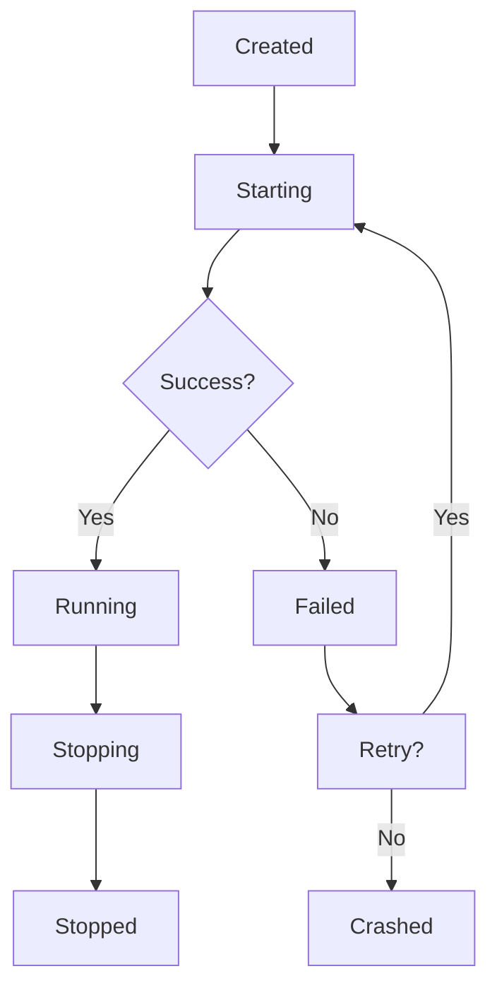

# j8s Effect Integration

This document provides comprehensive documentation for the Effect-based enhancement of the j8s service orchestration framework.

## Overview

The j8s Effect integration transforms the original service management framework into a more reliable and feature-rich system using the [Effect](https://effect.website/) library. This enhancement provides:

- **Built-in retry mechanisms** with sophisticated scheduling
- **Comprehensive error handling** with typed errors
- **Advanced observability** with tracing and metrics
- **Functional composition** enabling complex service orchestration
- **Backward compatibility** with existing j8s services

## Table of Contents

- [Getting Started](#getting-started)
- [Core Concepts](#core-concepts)
- [Service Implementation](#service-implementation)
- [Advanced Features](#advanced-features)
- [Migration Guide](#migration-guide)
- [API Reference](#api-reference)
- [Examples](#examples)
- [Best Practices](#best-practices)

## Getting Started

### Installation

The Effect integration is included with j8s. Ensure you have the required dependencies:

```bash
npm install effect @effect/platform @effect/cli @effect/experimental
```

### Basic Usage

```typescript
import { Effect, Console } from "effect";
import { 
  BaseEffectService, 
  ServiceContextLive, 
  EffectServiceManagerLive 
} from "j8s/effect";

// Create a simple Effect service
class MyService extends BaseEffectService {
  protected runService(): Effect.Effect<void, StartupError, ServiceContext> {
    return Effect.gen(this, function* () {
      yield* Console.log("Service started!");
      yield* Effect.never; // Keep running
    });
  }

  protected cleanupService(): Effect.Effect<void, ShutdownError, ServiceContext> {
    return Console.log("Service stopped!");
  }
}

// Use the service
const program = Effect.gen(function* () {
  const serviceManager = yield* EffectServiceManager;
  const service = new MyService("my-service");
  
  yield* serviceManager.addService(service);
  yield* serviceManager.startService("my-service");
});

// Run the program
Effect.runPromise(
  program.pipe(
    Effect.provide(EffectServiceManagerLive)
  )
);
```

## Core Concepts

### Service Lifecycle

Effect services follow a structured lifecycle with built-in error handling:



### Error Hierarchy

The Effect integration provides a comprehensive typed error system:

- `ServiceError` - Base service error
- `StartupError` - Service initialization failures
- `ShutdownError` - Service cleanup failures  
- `HealthCheckError` - Health monitoring failures
- `WorkerError` - Worker thread communication failures
- `ScheduleError` - Cron and scheduling failures

### Observability

Built-in observability includes:

- **Tracing**: Automatic span creation for service operations
- **Metrics**: Counters, gauges, histograms for monitoring
- **Logging**: Structured logging with correlation IDs
- **Health Checks**: Comprehensive health status reporting

## Service Implementation

### Basic Service

```typescript
import { BaseEffectService } from "j8s/effect";

class DatabaseService extends BaseEffectService {
  constructor(name: string) {
    super(name, {
      retryPolicy: {
        type: "exponential",
        maxRetries: 5,
        baseDelay: 1000
      },
      observability: {
        enableTracing: true,
        enableMetrics: true
      }
    });
  }

  protected runService(): Effect.Effect<void, StartupError, ServiceContext> {
    return Effect.gen(this, function* () {
      // Initialize database connection
      yield* this.connectToDatabase();
      
      // Keep running until stopped
      yield* Effect.never;
    });
  }

  protected cleanupService(): Effect.Effect<void, ShutdownError, ServiceContext> {
    return this.disconnectFromDatabase();
  }

  private connectToDatabase() {
    return Effect.gen(function* () {
      // Database connection logic
      yield* Effect.sleep(1000);
      yield* Console.log("Database connected");
    });
  }

  private disconnectFromDatabase() {
    return Console.log("Database disconnected");
  }
}
```

### Worker Service

```typescript
import { EffectWorkerService } from "j8s/effect";

class ComputeWorkerService extends EffectWorkerService {
  constructor(name: string) {
    super(name, {
      workerURL: new URL("./compute-worker.js", import.meta.url),
      autoTerminate: false,
      healthCheckInterval: 5000,
      maxWorkerRestarts: 3
    }, {
      retryPolicy: CommonRetryPolicies.worker,
      observability: {
        enableTracing: true,
        enableMetrics: true,
        tags: { type: "compute", priority: "high" }
      }
    });
  }
}
```

### Cron Service

```typescript
import { EffectCronService } from "j8s/effect";

class BackupService extends EffectCronService {
  constructor(name: string) {
    super(name, {
      schedule: "0 0 2 * * *", // 2 AM daily
      timezone: "UTC",
      timeout: 30 * 60 * 1000, // 30 minutes
      overlapPolicy: "skip",
      errorPolicy: "continue"
    });
  }

  protected executeTask(): Effect.Effect<void, Error, ServiceContext> {
    return Effect.gen(function* () {
      yield* Console.log("Starting backup...");
      // Backup logic here
      yield* Effect.sleep(5000);
      yield* Console.log("Backup completed!");
    });
  }
}
```

## Advanced Features

### Retry Policies

Create sophisticated retry strategies:

```typescript
import { RetryPolicyBuilder, CommonRetryPolicies } from "j8s/effect";

// Custom retry policy
const customPolicy = new RetryPolicyBuilder("exponential")
  .maxRetries(5)
  .baseDelay(1000)
  .factor(2)
  .maxDelay(30000)
  .withJitter(0.1)
  .classify((error) => {
    // Custom error classification
    if (String(error).includes("temporary")) return "retry";
    if (String(error).includes("auth")) return "abort";
    return "retry";
  })
  .build();

// Use pre-built policies
const service = new MyService("api-service", {
  retryPolicy: CommonRetryPolicies.api
});
```

### Observability Configuration

```typescript
import { makeObservabilityLayer } from "j8s/effect";

const observabilityLayer = makeObservabilityLayer({
  serviceName: "my-application",
  serviceVersion: "1.0.0",
  tracing: {
    enabled: true,
    endpoint: "http://jaeger:14268/api/traces",
    sampleRate: 1.0
  },
  metrics: {
    enabled: true,
    collectInterval: 60000
  },
  logging: {
    enabled: true,
    level: "info"
  },
  tags: {
    environment: "production",
    region: "us-west-2"
  }
});
```

### REST API

Create a full-featured REST API for service management:

```typescript
import { createEffectServiceManagerAPI } from "j8s/effect";

const program = Effect.gen(function* () {
  const serviceManager = yield* EffectServiceManager;
  const observabilityManager = yield* ObservabilityManager;
  
  const app = yield* createEffectServiceManagerAPI(
    serviceManager,
    observabilityManager,
    {
      openapi: { enabled: true },
      scalar: { enabled: true },
      streaming: { enabled: true }
    }
  );
  
  // Start server
  serve({ fetch: app.fetch, port: 3000 });
});
```

## Migration Guide

### Phase 1: Compatibility Layer

Use the hybrid manager to run both legacy and Effect services:

```typescript
import { MigrationUtilities, runWithEffectSupport } from "j8s/effect";

// Existing legacy service
class LegacyService extends BaseService {
  // ... existing implementation
}

const program = runWithEffectSupport(
  Effect.gen(function* () {
    const hybridManager = yield* MigrationUtilities.createHybridManager();
    
    // Add legacy service
    const legacyService = new LegacyService("legacy");
    hybridManager.addService(legacyService);
    
    // Add Effect service
    const effectService = new MyEffectService("effect");
    yield* hybridManager.addService(effectService);
    
    // Manage both together
    yield* hybridManager.startAllServices();
  })
);
```

### Phase 2: Service Migration

Gradually migrate services:

```typescript
// 1. Wrap legacy service for Effect compatibility
const wrappedLegacy = MigrationUtilities.wrapLegacyService(
  legacyService,
  { observability: { enableMetrics: true } }
);

// 2. Create new Effect version
class MigratedService extends BaseEffectService {
  // New implementation with Effect benefits
}

// 3. Blue-green deployment
// Run both versions, gradually shift traffic

// 4. Remove legacy version
```

### Phase 3: Full Effect Migration

Complete the migration to pure Effect services:

```typescript
const AppLayer = Layer.mergeAll(
  ServiceContextLive,
  EffectServiceManagerLive,
  observabilityLayer
);

Effect.runPromise(
  program.pipe(Effect.provide(AppLayer))
);
```

## API Reference

### Core Services

#### BaseEffectService

Abstract base class for Effect services:

```typescript
abstract class BaseEffectService implements EffectService {
  constructor(name: string, config: EffectServiceConfig)
  
  abstract runService(): Effect.Effect<void, StartupError, ServiceContext>
  abstract cleanupService(): Effect.Effect<void, ShutdownError, ServiceContext>
  
  start(): Effect.Effect<void, StartupError, ServiceContext>
  stop(): Effect.Effect<void, ShutdownError, ServiceContext>
  restart(): Effect.Effect<void, StartupError | ShutdownError, ServiceContext>
  healthCheck(): Effect.Effect<HealthCheckResult, HealthCheckError, ServiceContext>
}
```

#### EffectServiceManager

Service management operations:

```typescript
interface EffectServiceManager {
  addService(service: EffectService): Effect.Effect<void, AllServiceErrors, ServiceContext>
  removeService(name: string): Effect.Effect<void, AllServiceErrors, ServiceContext>
  startService(name: string): Effect.Effect<void, AllServiceErrors, ServiceContext>
  stopService(name: string): Effect.Effect<void, AllServiceErrors, ServiceContext>
  restartService(name: string): Effect.Effect<void, AllServiceErrors, ServiceContext>
  healthCheckService(name: string): Effect.Effect<HealthCheckResult, AllServiceErrors, ServiceContext>
  startAllServices(): Effect.Effect<void, AllServiceErrors, ServiceContext>
  stopAllServices(): Effect.Effect<void, AllServiceErrors, ServiceContext>
  healthCheckAllServices(): Effect.Effect<Record<string, HealthCheckResult>, AllServiceErrors, ServiceContext>
}
```

### Configuration Types

#### EffectServiceConfig

```typescript
interface EffectServiceConfig {
  restartPolicy?: RestartPolicy
  retryPolicy?: RetryPolicy
  cronJob?: CronJobConfig
  timeout?: number
  observability?: {
    enableTracing?: boolean
    enableMetrics?: boolean
    tags?: Record<string, string>
  }
}
```

#### RetryPolicy

```typescript
interface RetryPolicy {
  type: "linear" | "exponential" | "fibonacci" | "spaced" | "jittered"
  maxRetries?: number
  maxDuration?: number
  baseDelay?: number
  factor?: number
}
```

## Examples

Complete examples are available in the `examples/effect/` directory:

- **basic-service.ts** - Basic Effect service implementation
- **cron-service.ts** - Cron-based scheduled services  
- **api-server.ts** - Full REST API server
- **migration/legacy-to-effect.ts** - Migration strategies

## Best Practices

### 1. Error Handling

Always use typed errors and handle them appropriately:

```typescript
protected runService(): Effect.Effect<void, StartupError, ServiceContext> {
  return Effect.gen(this, function* () {
    try {
      yield* this.initialize();
    } catch (error) {
      return yield* Effect.fail(new StartupError({
        message: "Initialization failed",
        phase: "initialization",
        cause: error
      }));
    }
  });
}
```

### 2. Resource Management

Use Effect's resource management for automatic cleanup:

```typescript
private createConnection(): Effect.Effect<Connection, never, Scope.Scope> {
  return Effect.acquireRelease(
    Effect.sync(() => new Connection()),
    connection => Effect.sync(() => connection.close())
  );
}
```

### 3. Observability

Enable comprehensive observability for production services:

```typescript
const service = new MyService("production-service", {
  observability: {
    enableTracing: true,
    enableMetrics: true,
    tags: {
      environment: "production",
      version: "1.2.3",
      team: "platform"
    }
  }
});
```

### 4. Testing

Use Effect's testing utilities for comprehensive testing:

```typescript
import { TestClock, TestContext } from "effect";

const testProgram = Effect.gen(function* () {
  const service = new MyService("test-service");
  yield* service.start();
  
  // Advance test clock
  yield* TestClock.adjust(5000);
  
  const health = yield* service.healthCheck();
  expect(health.uptime).toBeGreaterThan(5000);
});

Effect.runPromise(
  testProgram.pipe(
    Effect.provide(Layer.mergeAll(TestClock.default, ServiceContextLive))
  )
);
```

### 5. Performance

- Use concurrent operations where possible with `Effect.forEach(..., { concurrency: "unbounded" })`
- Implement proper timeouts for external operations
- Monitor service metrics and adjust retry policies accordingly
- Use connection pooling for database and HTTP services

## Troubleshooting

### Common Issues

1. **Service won't start**: Check the startup error details and ensure all dependencies are available
2. **High restart count**: Review retry policies and error classification
3. **Memory leaks**: Ensure proper resource cleanup in `cleanupService()`
4. **Performance issues**: Enable metrics and monitor service health

### Debugging

Enable comprehensive logging:

```typescript
const observabilityLayer = makeObservabilityLayer({
  logging: { enabled: true, level: "debug" },
  tracing: { enabled: true, sampleRate: 1.0 }
});
```

Check service health regularly:

```typescript
const health = yield* serviceManager.healthCheckService("my-service");
console.log("Service health:", health);
```

## Contributing

When contributing to the Effect integration:

1. Follow Effect's functional programming patterns
2. Provide comprehensive type safety
3. Include thorough tests with Effect's testing utilities
4. Update documentation and examples
5. Ensure backward compatibility with migration utilities

## Resources

- [Effect Documentation](https://effect.website/)
- [j8s Original Documentation](./README.md)
- [Migration Examples](./examples/migration/)
- [API Examples](./examples/effect/)