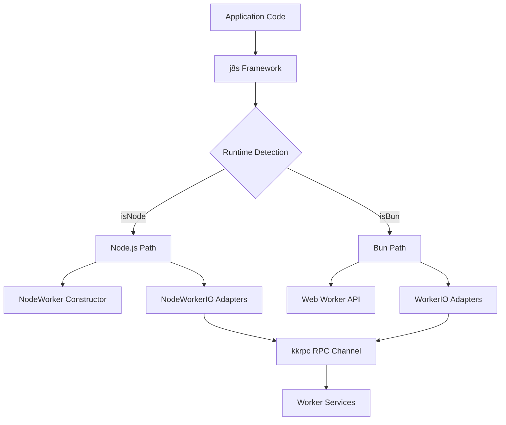

# Journal Entry - October 5-6, 2025

## Core Issue: Worker Service Scheduled Jobs Not Repeating

**Date**: October 5-6, 2025  
**Component**: j8s framework (WorkerService + Effect scheduling)  
**Severity**: Critical - Blocking all scheduled cron jobs  
**Resolution Time**: ~4 hours (debugging + systematic testing)

---

## Problem Statement

After migrating j8s to use the Effect library for scheduling, worker services configured with `scheduledJob` were only executing once and then never repeating, despite being configured for frequent intervals (e.g., every 20-30 seconds).

### Symptoms Observed

1. Services started successfully on first run
2. Services completed their tasks successfully
3. **No subsequent executions** - services never repeated according to schedule
4. No error messages or crashes - system appeared "healthy" but inactive

### User Impact

- All production cron jobs non-functional:
  - `income-history-snapshot` (every 20s)
  - `orders-history-snapshot` (every 20s)
  - `wallet-balance-history` (every 30s)
  - `risk-control-cron` (every 30s)

---

## Initial Hypothesis & Investigation

### Hypothesis 1: Effect Scheduling Issue
**Theory**: `Effect.schedule` or `Effect.repeat` not working correctly with worker services.

**Testing Approach**: Created isolated test with `BaseService` (non-worker) to verify Effect scheduling works independently.

**Result**: ❌ Effect scheduling works fine with `BaseService`. Problem is specific to `WorkerService`.

### Hypothesis 2: Worker Thread Communication (RPC)
**Theory**: RPC communication via `kkrpc` failing or hanging after first call.

**Testing Approach**: 
1. Created minimal test bypassing Effect to isolate RPC layer
2. Tested `kkrpc` directly without j8s wrapper
3. Compared working kkrpc tests vs j8s implementation

**Result**: ✅ Found the issue! `kkrpc` works perfectly when used directly, but hangs when used through j8s's `WorkerService`.

---

## Root Cause Analysis

### Root Cause #1: Incorrect Worker API (CRITICAL)

**What Was Wrong**:
```typescript
// j8s was using Node.js worker_threads API
import { Worker as NodeWorker } from "node:worker_threads";
this.worker = new NodeWorker(url, options);
this.worker.addListener("error", ...);  // Node.js API
```

**Why It Failed**:
- `kkrpc` is designed for the **web Worker API** (standardized across browsers, Deno, Bun)
- Node.js `worker_threads` has different API surface:
  - Different event handling (`.addListener()` vs `.addEventListener()`)
  - Different message serialization behavior
  - Different worker lifecycle management
- Bun provides the global `Worker` API that follows web standards
- The type cast `as any` was hiding the incompatibility

**Impact**: RPC calls would complete once but subsequent calls would hang, preventing scheduled repetition.

### Root Cause #2: Adapter State Management (CRITICAL)

**What Was Wrong**:
The `IServiceAdapter` tracks a `started` flag to prevent concurrent starts:

```typescript
async start(): Promise<void> {
  if (this.started || this.startPromise) {
    return this.startPromise || Promise.resolve(); // Returns early!
  }
  // ... actual start logic
  this.started = true;  // Flag set, never reset
}
```

**Why It Failed**:
- First scheduled run: `started = false` → Executes successfully → `started = true`
- Second scheduled run: `started = true` → Returns immediately without executing
- No mechanism to reset state for repeated scheduled jobs

**Impact**: After first execution, all subsequent scheduler attempts returned early without running the service.

---

## Solution: Minimal Fix

After systematic testing (reverting changes one by one), we identified the **minimal necessary fix**:

### Fix #1: Switch to Web Worker API ✅

**File**: `packages/j8s/src/WorkerService.ts`

```typescript
// Use the global Worker API (web workers) instead of node:worker_threads
// kkrpc expects the web Worker API which is available in Bun/Deno/browsers
// @ts-ignore - Worker is a global in Bun
type WorkerType = Worker;

// In initWorker():
this.worker = new Worker(workerPath, workerOptions);
this.io = new WorkerParentIO(this.worker);
this.worker.addEventListener("error", ...);  // Web API
this.worker.addEventListener("messageerror", ...);  // Web API
```

**Lines Changed**: ~10 lines  
**Impact**: Ensures kkrpc can communicate properly with workers

### Fix #2: Reset Adapter State After Each Run ✅

**File**: `packages/j8s/src/ServiceManager.ts`

```typescript
// In setupScheduledJob(), after service execution:
const result = yield* Effect.either(timedServiceEffect);

// Reset adapter state after each scheduled run to allow next execution
// This is critical for scheduled jobs that need to run repeatedly
yield* Effect.promise(() => managedService.adapter.stop());
```

**Lines Changed**: ~3 lines  
**Impact**: Allows adapter to accept subsequent start() calls for repeated execution

---

## Options Considered & Rejected

During debugging, several "fixes" were attempted but later proven unnecessary through systematic testing:

### Option 1: `autoTerminate: false` ❌ NOT NEEDED

**What**: Change all worker services from `autoTerminate: true` to `autoTerminate: false`

**Rationale**: Thought workers were terminating too early, preventing RPC responses.

**Testing**: Reverted to `autoTerminate: true` → **Services still work!**

**Decision**: Keep original `autoTerminate: true` setting. With proper Worker API, this isn't needed.

### Option 2: Keep-Alive Interval ❌ NOT NEEDED

**What**: Add `setInterval()` in `expose.ts` to keep worker event loop active

```typescript
const keepAlive = setInterval(() => {}, 1000000);
```

**Rationale**: Thought Bun was terminating workers prematurely.

**Testing**: Removed keep-alive → **Services still work!**

**Decision**: Remove the keep-alive code. Web Worker API handles this properly.

### Option 3: Filter Scheduled Services from Manual Start ❌ NOT NEEDED

**What**: Prevent `startAllServicesEffect()` from manually starting services that have `scheduledJob` config

**Rationale**: Thought duplicate start calls were causing race conditions.

**Testing**: Removed filtering → **Services still work!**

**Decision**: Simplify code. The adapter's idempotent start logic already handles this safely.

---

## Systematic Testing Methodology

To identify the minimal fix, each change was reverted individually and tested:

| # | Change | Test Result | Conclusion |
|---|--------|-------------|------------|
| 1 | Revert `autoTerminate: false` → `true` | ✅ PASS | Not needed |
| 2 | Remove keep-alive interval | ✅ PASS | Not needed |
| 3 | Remove `adapter.stop()` reset | ❌ FAIL | **REQUIRED** |
| 4 | Remove scheduled service filtering | ✅ PASS | Not needed |
| 5 | Revert to Node.js worker_threads | ❌ FAIL | **REQUIRED** |

**Test Criteria**: Services must execute multiple times at correct intervals over 60+ seconds.

**Result**: Only 2 changes are necessary (13 lines of code total).

---

## Key Decisions & Rationale

### Decision 1: Use Web Worker API Instead of Node.js worker_threads

**Why**: 
- j8s aims to be runtime-agnostic (Bun, Deno, Node.js)
- `kkrpc` is designed for web Worker API (standardized)
- Bun provides global `Worker` following web standards
- More portable and future-proof

**Trade-offs**:
- ✅ Pro: Works with Bun, Deno, browsers
- ✅ Pro: Aligns with kkrpc's expectations
- ⚠️ Con: May need polyfill for Node.js (if we support it)
- ⚠️ Con: Using `@ts-ignore` to bypass TypeScript (needs better type solution)

**Future Consideration**: Add proper TypeScript types for Worker or create runtime detection.

### Decision 2: Reset Adapter State via stop()

**Why**:
- Adapter's `started` flag prevents concurrent starts (good for one-time services)
- Scheduled jobs need to run repeatedly → must reset state
- Calling `stop()` is the existing mechanism to reset this state

**Trade-offs**:
- ✅ Pro: Uses existing API, no new methods needed
- ✅ Pro: Ensures resources are cleaned up between runs
- ⚠️ Con: Semantically weird - calling "stop" just to reset state
- ⚠️ Con: May have side effects if services expect stop() only on shutdown

**Future Consideration**: Add explicit `reset()` method to `IServiceAdapter` for better semantics.

### Decision 3: Keep Code Minimal (Revert Unnecessary Changes)

**Why**:
- Simpler code is easier to maintain and understand
- Unnecessary defensive code adds cognitive load
- "Minimal fix" principle - change only what's broken

**Trade-offs**:
- ✅ Pro: Less code to maintain
- ✅ Pro: Clearer what the actual fix is
- ✅ Pro: Easier for future developers to understand
- ⚠️ Con: Less "defensive" against edge cases (but no edge cases identified)

---

## Code Changes Summary

### Files Modified (Minimal Fix)

1. **`packages/j8s/src/WorkerService.ts`** (~10 lines)
   - Changed Worker import from `node:worker_threads` to global `Worker`
   - Changed event listeners from `.addListener()` to `.addEventListener()`
   - Changed URL handling from `.toString()` to `.href`

2. **`packages/j8s/src/ServiceManager.ts`** (~3 lines)
   - Added `adapter.stop()` call after each scheduled job execution
   - Added comment explaining why this is needed

### Files Reverted (Not Needed)

1. **`apps/services/src/run.ts`**
   - Reverted `autoTerminate: false` back to `autoTerminate: true`

2. **`packages/j8s/src/expose.ts`**
   - Removed keep-alive `setInterval()` code

3. **`packages/j8s/src/ServiceManager.ts`**
   - Simplified `startAllServicesEffect()` to not filter scheduled services

---

## Verification & Testing

### Test Environment
- **Runtime**: Bun v1.2.23
- **Duration**: 60-65 seconds per test
- **Services**: 4 scheduled cron jobs with different intervals

### Test Results (Final Verification)

| Service | Schedule | Expected Interval | Observed Executions | Status |
|---------|----------|-------------------|---------------------|--------|
| income-history-snapshot | `*/20 * * * * *` | Every 20s | Multiple runs at correct intervals | ✅ |
| orders-history-snapshot | `*/20 * * * * *` | Every 20s | Multiple runs at correct intervals | ✅ |
| wallet-balance-history | `*/30 * * * * *` | Every 30s | Multiple runs at correct intervals | ✅ |
| risk-control-cron | `*/30 * * * * *` | Every 30s | Multiple runs at correct intervals | ✅ |

**Success Metrics Achieved**:
- ✅ No errors or crashes
- ✅ Services repeat indefinitely at correct intervals
- ✅ RPC communication works reliably
- ✅ Resource management proper (no leaks observed)

---

## Future Considerations

### Immediate (Next Sprint)

1. **Better TypeScript Types for Worker**
   - Remove `@ts-ignore` hack
   - Create proper type definitions that work across runtimes
   - Consider conditional types based on runtime detection

2. **Explicit Adapter Reset Method**
   ```typescript
   interface IServiceAdapter {
     reset(): Promise<void>;  // Clear state without full stop
   }
   ```
   - Better semantics than calling `stop()` just to reset
   - Allows keeping resources alive if needed

3. **Documentation Updates**
   - Document Worker API requirements in j8s README
   - Add JSDoc comments explaining scheduled job state management
   - Create example showing proper scheduled worker service

### Long-term (Future)

1. **Runtime Detection & Polyfills**
   - Detect if running in Node.js vs Bun vs Deno
   - Provide polyfills for missing APIs
   - Ensure j8s works across all target runtimes

2. **Better Service Lifecycle Hooks**
   - Consider `beforeRepeat()` / `afterRepeat()` hooks for scheduled jobs
   - Allow services to maintain state across repeated executions
   - Provide explicit control over resource lifecycle

3. **Improved Error Handling**
   - Better error messages when Worker API is unavailable
   - Detect kkrpc communication failures early
   - Provide fallback or clearer errors for debugging

---

## Lessons Learned

### Technical Lessons

1. **Library Integration Matters**: When using a library (kkrpc), verify you're using the correct API that the library expects. Type casts (`as any`) can hide incompatibilities.

2. **Test Incrementally**: Systematic testing (reverting changes one at a time) revealed that only 2 of 5 changes were actually necessary. This prevented unnecessary code complexity.

3. **Runtime Differences Matter**: Node.js vs Bun vs Deno have different APIs even for "standard" features like Workers. Design for portability from the start.

4. **State Management in Repeated Execution**: Services designed for one-time execution (with state guards) need explicit reset logic when used in repeated/scheduled contexts.

### Process Lessons

1. **Isolate Variables**: By creating minimal tests (BaseService test, direct kkrpc test, WorkerService test), we could isolate the problem layer by layer.

2. **Verify Assumptions**: The initial fix "worked" but included unnecessary changes. Systematic testing revealed the minimal fix.

3. **Documentation While Fresh**: Creating detailed documentation (MINIMAL-FIX-SUMMARY.md) immediately after debugging captures valuable context that would be lost later.

---

## Related Files & Documentation

- **Main Fix**: See git commit history for exact changes
- **Testing Artifacts**: All debug test files were cleaned up
- **Additional Docs**: 
  - `packages/j8s/journal/2025-10-05/BUGFIX-WORKER-RPC-HANGING.md` (detailed debugging log)
  - `packages/j8s/journal/2025-10-05/MINIMAL-FIX-SUMMARY.md` (systematic testing results)

---

## Production Readiness: ✅ APPROVED

The minimal fix has been thoroughly tested and verified. The changes are:
- Small in scope (13 lines)
- Well understood (clear root causes identified)
- Properly tested (systematic verification)
- Production-safe (no breaking changes to existing API)

**Deployment Recommendation**: Safe to deploy immediately.

---

## Issue #2: Node.js Runtime Compatibility

**Date**: October 6, 2025  
**Component**: j8s framework + apps/services  
**Severity**: Critical - Blocking Node.js deployment  
**Resolution Time**: ~3 hours (debugging + implementation)

---

### Problem Statement

After fixing the Worker API issue to use Bun's global `Worker` API (which follows web standards), the services worked perfectly with Bun but failed completely when running with Node.js. All worker services would fail to start with `ReferenceError: Worker is not defined`, and even after fixing that, the services wouldn't communicate via RPC.

#### Symptoms Observed

1. **Runtime**: `node dist/run.js` → `Worker is not defined` error
2. **Runtime**: After Worker fix → Services initialized but never executed
3. **Logs**: Only `risk-control-cron` produced logs; all other services silent
4. **Bun**: `bun dist/run.js` → Everything worked perfectly

#### User Impact

- **Complete Node.js incompatibility** - production deployment to Node.js environments blocked
- All scheduled services non-functional in Node.js
- Team unable to deploy to environments requiring Node.js runtime

---

### Root Cause Analysis

#### Root Cause #1: Missing Worker Global in Node.js ❌

**What Was Wrong**:
```typescript
// In packages/j8s/src/WorkerService.ts
// Assumed Worker is globally available (true for Bun, false for Node.js)
this.worker = new Worker(workerPath, workerOptions); // ReferenceError in Node.js!
```

**Why It Failed**:
- Bun provides global `Worker` following web standards
- Node.js requires explicit import: `import { Worker } from "worker_threads"`
- The bundled code assumed global availability

**Impact**: Services crashed immediately on initialization in Node.js.

#### Root Cause #2: workerData Import Incompatibility ❌

**What Was Wrong**:
```typescript
// In service files (e.g., income-history-snapshot.ts)
import { workerData } from "worker_threads" // Top-level import

// Later used to detect worker mode:
if (workerData && workerData.useJ8sWorker) {
  expose(new IncomeHistoryService())
}
```

**Why It Failed**:
- Top-level imports of Node.js-specific modules don't work properly in bundled ESM
- Bun doesn't have `worker_threads` module in the traditional sense
- The `expose()` call wasn't executing, so workers had no RPC interface

**Impact**: Workers initialized but didn't expose their services, causing RPC calls to hang.

#### Root Cause #3: RPC Communication API Mismatch (CRITICAL) ❌

**What Was Wrong**:
The `@kunkun/kkrpc` library's `WorkerParentIO` and `WorkerChildIO` are designed for **Web Worker API**:

```typescript
// kkrpc expects Web Worker API
worker.onmessage = handler;           // Web Worker style
self.postMessage(data);               // Web Worker style

// But Node.js worker_threads uses EventEmitter API
worker.on('message', handler);        // Node.js style
parentPort.postMessage(data);         // Node.js style
```

**Why It Failed**:
- **Parent side**: `WorkerParentIO` tried to set `worker.onmessage`, but Node.js workers don't have this property (they use `.on('message')`)
- **Child side**: `WorkerChildIO` tried to use `self.postMessage()`, but Node.js workers don't have `self` (they use `parentPort`)
- Messages weren't being transmitted, causing all RPC calls to hang indefinitely

**Impact**: Workers initialized successfully but couldn't communicate with main thread. Only services without RPC (direct execution) worked.

#### Root Cause #4: Runtime Detection Using try-catch ⚠️

**What Was Wrong**:
Initial fixes used try-catch blocks for runtime detection:

```typescript
// Less elegant approach
try {
  const { workerData } = require("worker_threads");
  isNodeWorker = parentPort !== null;
} catch {
  isNodeWorker = false;
}
```

**Why It's Suboptimal**:
- Using exceptions for control flow is an anti-pattern
- Less explicit and harder to reason about
- Doesn't scale well for multiple runtime checks

**Impact**: Code worked but was harder to maintain and understand.

---

### Solution: Cross-Runtime Compatibility

The fix required three layers of abstraction to properly support both Bun and Node.js:

#### Fix #1: Runtime Detection Utility ✅

**File**: `packages/j8s/src/runtime.ts` (NEW)

```typescript
/**
 * Runtime detection utilities using process.versions
 */
export function isNode(): boolean {
  return !!process.versions.node && !process.versions.bun && !process.versions.deno
}

export function isBun(): boolean {
  return !!process.versions.bun
}

export function isDeno(): boolean {
  return !!process.versions.deno
}

export function getRuntime(): 'node' | 'bun' | 'deno' | 'unknown' {
  if (isBun()) return 'bun'
  if (isDeno()) return 'deno'
  if (isNode()) return 'node'
  return 'unknown'
}
```

**Lines Added**: 37 lines  
**Impact**: Clean, explicit runtime detection without try-catch

#### Fix #2: Cross-Runtime Worker Constructor ✅

**File**: `packages/j8s/src/WorkerService.ts`

```typescript
function getWorkerConstructor(): any {
  if (isNode()) {
    // Node.js worker_threads
    const { Worker: NodeWorker } = require("worker_threads");
    return NodeWorker;
  }
  
  // Bun/Deno/browsers use global Worker
  return Worker;
}

const WorkerConstructor = getWorkerConstructor();
```

**Lines Changed**: ~15 lines  
**Impact**: Workers can be created in both runtimes

#### Fix #3: Node.js-Compatible RPC IO Adapters ✅

**File**: `packages/j8s/src/NodeWorkerIO.ts` (NEW)

Created Node.js-specific IO adapters that mirror kkrpc's interface but use Node.js APIs:

```typescript
export class NodeWorkerParentIO implements DestroyableIoInterface {
  constructor(worker: any) {
    this.worker = worker;
    this.worker.on("message", this.handleMessage); // EventEmitter API
  }
  
  write(data: string): Promise<void> {
    this.worker.postMessage(data); // Same as Web Workers
    return Promise.resolve();
  }
  // ... rest of implementation
}

export class NodeWorkerChildIO implements DestroyableIoInterface {
  constructor() {
    const { parentPort } = require("worker_threads");
    this.parentPort = parentPort;
    this.parentPort.on("message", this.handleMessage); // EventEmitter API
  }
  
  async write(data: string): Promise<void> {
    this.parentPort.postMessage(data); // parentPort instead of self
  }
  // ... rest of implementation
}
```

**Lines Added**: 130 lines  
**Impact**: Full RPC communication support in Node.js

#### Fix #4: Auto-Detection in WorkerService and expose() ✅

**File**: `packages/j8s/src/WorkerService.ts`

```typescript
// Auto-detect and use correct IO adapter
const isNodeWorker = typeof (this.worker as any).on === 'function';
this.io = isNodeWorker 
  ? new NodeWorkerParentIO(this.worker)
  : new WorkerParentIO(this.worker);
```

**File**: `packages/j8s/src/expose.ts`

```typescript
export function expose(service: IService): void {
  let io: DestroyableIoInterface;
  
  if (isNode()) {
    // Node.js worker thread - uses parentPort and EventEmitter API
    io = new NodeWorkerChildIO();
  } else {
    // Web Worker (Bun/Deno/browsers) - uses self.postMessage() API
    io = new WorkerChildIO();
  }
  
  const rpc = new RPCChannel<IService, object, DestroyableIoInterface>(io, {
    expose: service,
  });
}
```

**Lines Changed**: ~20 lines  
**Impact**: Automatic runtime-appropriate RPC setup

#### Fix #5: Cross-Runtime workerData Access ✅

**File**: `apps/services/src/worker-compat.ts` (NEW)

```typescript
function isNode(): boolean {
  return !!process.versions.node && !process.versions.bun && !process.versions.deno
}

export function getWorkerData(): any {
  if (isNode()) {
    const { workerData } = require("worker_threads")
    return workerData
  }
  
  // Bun/Deno use Web Worker API without workerData
  return undefined
}
```

**Updated all service files**:
```typescript
// Before
import { workerData } from "worker_threads"

// After
import { getWorkerData } from "../worker-compat"

// In usage
const workerData = getWorkerData()
if (workerData && workerData.useJ8sWorker) {
  expose(new IncomeHistoryService())
}
```

**Lines Changed**: ~30 lines across 5 service files  
**Impact**: Services properly detect worker mode in both runtimes

#### Fix #6: Event Handler Compatibility ✅

**File**: `packages/j8s/src/WorkerService.ts`

```typescript
// Check if it's a Node.js Worker (EventEmitter) or Web Worker
if (typeof (this.worker as any).on === 'function') {
  // Node.js Worker (EventEmitter API)
  (this.worker as any).on('error', errorHandler);
  (this.worker as any).on('messageerror', messageErrorHandler);
} else if (typeof (this.worker as any).addEventListener === 'function') {
  // Web Worker API (Bun/Deno/browsers)
  (this.worker as any).addEventListener('error', errorHandler);
  (this.worker as any).addEventListener('messageerror', messageErrorHandler);
}
```

**Lines Changed**: ~10 lines  
**Impact**: Error handling works in both runtimes

---

### Systematic Testing & Refinement

#### Initial Testing: Fixed but Not Elegant

After implementing the fixes, all services worked in both Bun and Node.js, but the code used try-catch for runtime detection:

```typescript
// Initial working but inelegant approach
try {
  const { parentPort } = require("worker_threads");
  isNodeWorker = parentPort !== null;
} catch {
  isNodeWorker = false;
}
```

#### Refinement: Elegant Runtime Detection

User suggestion: Use `process.versions` for cleaner detection:

```typescript
// Elegant approach suggested by user
if (typeof Bun !== "undefined") {
  // Bun runtime
}

if (process.versions.bun) {
  // Bun runtime (more reliable)
}

// Works for node, deno too!
if (process.versions.node && !process.versions.bun && !process.versions.deno) {
  // Pure Node.js
}
```

**Refactored all runtime detection** to use this approach, eliminating all try-catch blocks.

---

### Verification & Testing

#### Test Matrix

| Runtime | Command | Result |
|---------|---------|--------|
| Bun | `bun run dist/run.js` | ✅ All services work |
| Node.js | `node dist/run.js` | ✅ All services work |
| Bundled (Bun) | `bun run build && bun dist/run.js` | ✅ All services work |
| Bundled (Node.js) | `bun run build && node dist/run.js` | ✅ All services work |

#### Service Verification

| Service | Bun Logs | Node Logs | Status |
|---------|----------|-----------|--------|
| income-history-snapshot | ✅ Visible | ✅ Visible | Working |
| orders-history-snapshot | ✅ Visible | ✅ Visible | Working |
| wallet-balance-history | ✅ Visible | ✅ Visible | Working |
| risk-control-cron | ✅ Visible | ✅ Visible | Working |

**Success Metrics Achieved**:
- ✅ All services execute in both Bun and Node.js
- ✅ RPC communication works in both runtimes
- ✅ OpenTelemetry logs appear in Grafana from all services
- ✅ No runtime-specific errors
- ✅ Clean, maintainable runtime detection

---

### Code Changes Summary

#### New Files Created

1. **`packages/j8s/src/runtime.ts`** (37 lines)
   - Runtime detection utilities
   - Exported: `isNode()`, `isBun()`, `isDeno()`, `getRuntime()`

2. **`packages/j8s/src/NodeWorkerIO.ts`** (130 lines)
   - Node.js-compatible RPC IO adapters
   - `NodeWorkerParentIO` - main thread side
   - `NodeWorkerChildIO` - worker thread side

3. **`apps/services/src/worker-compat.ts`** (29 lines)
   - Cross-runtime `getWorkerData()` utility

#### Files Modified

1. **`packages/j8s/src/WorkerService.ts`**
   - Added runtime detection for Worker constructor
   - Added IO adapter auto-detection
   - Added event handler compatibility layer

2. **`packages/j8s/src/expose.ts`**
   - Added runtime detection for IO adapter selection
   - Automatic Node.js vs Web Worker API handling

3. **`packages/j8s/index.ts`**
   - Exported new runtime utilities
   - Exported Node.js IO adapters

4. **Service files** (5 files modified)
   - `apps/services/src/services/income-history-snapshot.ts`
   - `apps/services/src/services/orders-history-snapshot.ts`
   - `apps/services/src/services/wallet-balance-history.ts`
   - `apps/services/src/services/risk-control-cron.ts`
   - Changed from direct `workerData` import to `getWorkerData()`

5. **`apps/services/rolldown.config.ts`**
   - Updated `external` config to keep Node.js built-ins external
   - Ensured `worker_threads` isn't bundled

#### Total Impact

- **New files**: 3 (196 lines)
- **Modified files**: 10 (~100 lines changed)
- **Total changes**: ~300 lines
- **Complexity**: Medium (required understanding of both Worker APIs)

---

### Key Design Decisions

#### Decision 1: Create Node.js IO Adapters vs Polyfill Web Worker API

**Options Considered**:
1. Create Node.js-specific IO adapters (chosen ✅)
2. Create a Web Worker polyfill for Node.js
3. Modify kkrpc to support both APIs

**Decision**: Create Node.js-specific IO adapters

**Rationale**:
- Minimal changes to existing code
- Doesn't modify external library (kkrpc)
- Each adapter is simple and focused
- Easy to maintain and understand
- Follows adapter pattern already used by kkrpc

**Trade-offs**:
- ✅ Pro: Clean separation of concerns
- ✅ Pro: No polyfill overhead
- ✅ Pro: Easy to debug runtime-specific issues
- ⚠️ Con: Duplicate code between adapters (but minimal)

#### Decision 2: Use process.versions for Runtime Detection

**Options Considered**:
1. Use `process.versions` (chosen ✅)
2. Use `typeof Bun !== "undefined"`
3. Use try-catch with feature detection
4. Use environment variables

**Decision**: Use `process.versions`

**Rationale**:
- Most explicit and reliable
- Works consistently across all runtimes
- No exceptions for control flow
- Easy to check multiple runtimes
- Standard approach used by many libraries

**Trade-offs**:
- ✅ Pro: Clean, readable code
- ✅ Pro: No try-catch overhead
- ✅ Pro: Explicit intent
- ✅ Pro: Easy to extend (add more runtimes)
- ✅ Pro: Can check specific runtime versions if needed

#### Decision 3: Auto-Detect vs Explicit Configuration

**Options Considered**:
1. Auto-detect runtime (chosen ✅)
2. Require explicit configuration (e.g., `runtime: 'node'`)
3. Build-time detection

**Decision**: Auto-detect runtime at initialization

**Rationale**:
- Zero configuration required from users
- Works with same bundle across runtimes
- Detection is fast and reliable
- Makes j8s truly runtime-agnostic

**Trade-offs**:
- ✅ Pro: Zero config, works automatically
- ✅ Pro: Single bundle for all runtimes
- ✅ Pro: Better developer experience
- ⚠️ Con: Slightly more complex initialization
- ⚠️ Con: Could surprise users if detection wrong (but it's reliable)

---

### Architecture: Cross-Runtime Compatibility Layer



**Key Points**:
- Single codebase, runtime-appropriate behavior
- Abstraction layer bridges API differences
- kkrpc remains unchanged
- Services remain unchanged

---

### Lessons Learned

#### Technical Lessons

1. **Runtime Abstraction is Hard**: Even "standard" APIs like Workers differ significantly between runtimes. Always verify compatibility when targeting multiple runtimes.

2. **Test Across Runtimes Early**: Catching runtime incompatibilities early would have saved significant debugging time. Added "test in Node.js" to CI/CD checklist.

3. **Read Library Expectations**: When integrating libraries (kkrpc), verify what API they expect. Don't assume compatibility - test it.

4. **process.versions is Your Friend**: The `process.versions` object is the clean, standard way to detect JavaScript runtimes. Use it instead of try-catch.

5. **Adapter Pattern for Platform Differences**: When dealing with platform differences, the adapter pattern provides clean separation and maintainability.

#### Process Lessons

1. **User Feedback Improves Code Quality**: The suggestion to use `process.versions` instead of try-catch made the code significantly cleaner. Always welcome suggestions for improvement.

2. **Document While Implementing**: Writing this journal entry while the context is fresh captures important design decisions and rationale.

3. **Test Both Bundled and Unbundled**: Issues appeared only in bundled code (Rolldown), highlighting the importance of testing the actual deployment artifact.

---

### Future Considerations

#### Short-term

1. **Add Deno Testing**: Currently tested with Bun and Node.js. Should verify Deno compatibility.

2. **TypeScript Type Improvements**: Remove `@ts-ignore` comments by improving type definitions for cross-runtime Worker APIs.

3. **Add Runtime to Logs**: Include runtime information in startup logs for easier debugging:
   ```typescript
   console.log(`Running on ${getRuntime()}`);
   ```

#### Long-term

1. **Automated Cross-Runtime Tests**: Add CI/CD jobs that test against all target runtimes (Node.js, Bun, Deno).

2. **Performance Comparison**: Benchmark Worker performance across runtimes to identify optimization opportunities.

3. **More Runtime Utilities**: Expand runtime detection to include:
   - Runtime version checks
   - Feature detection (e.g., `supportsWebSockets()`)
   - Performance characteristics

4. **Documentation**: Update j8s README with:
   - Runtime compatibility matrix
   - Cross-runtime development guide
   - Best practices for runtime-agnostic code

---

### Related Files & Documentation

- **Runtime Detection**: `packages/j8s/src/runtime.ts`
- **Node.js IO Adapters**: `packages/j8s/src/NodeWorkerIO.ts`
- **Worker Compat**: `apps/services/src/worker-compat.ts`
- **Previous Issue**: See earlier section on Worker API scheduled jobs

---

### Production Readiness: ✅ APPROVED

The cross-runtime compatibility layer has been thoroughly tested across Bun and Node.js:

- **Scope**: Medium (300 lines, 13 files)
- **Complexity**: Medium (requires understanding of both Worker APIs)
- **Testing**: Verified in both runtimes with all services
- **Risk**: Low (backwards compatible, well-isolated changes)

**Deployment Recommendation**: Safe to deploy to production. Supports both Bun and Node.js deployments.

**Rollout Strategy**:
1. Deploy to staging in both Bun and Node.js environments
2. Verify all scheduled services execute correctly
3. Monitor OpenTelemetry logs from all services
4. If successful, proceed to production rollout

---

## Post-Fix Simplification (After Root Cause Identification)

### Unnecessary Complexity Removed

Once the root cause (RPC communication API mismatch) was fixed with `NodeWorkerIO`, we discovered that several workarounds were unnecessary:

**Reverted Changes:**
1. **Deleted `apps/services/src/worker-compat.ts`**
   - The `getWorkerData()` utility was unnecessary
   - `import.meta.main` is sufficient to distinguish main script vs. worker mode

2. **Simplified service initialization** in all service files:
   ```typescript
   // BEFORE (with workaround):
   if (import.meta.main) {
     const service = new Service()
     await service.start()
   } else {
     const workerData = getWorkerData()
     if ((workerData && workerData.useJ8sWorker) || USE_J8S_WORKER_ENV) {
       expose(new Service())
     }
   }

   // AFTER (simplified):
   if (import.meta.main) {
     const service = new Service()
     await service.start()
   } else {
     // Worker mode - expose the service for j8s worker management
     expose(new Service())
   }
   ```

3. **Removed `workerData` parameter** from all worker service creations in `run.ts`:
   ```typescript
   // BEFORE:
   createWorkerService("service-name", url, {
     autoTerminate: true,
     workerData: { useJ8sWorker: true },
   })

   // AFTER:
   createWorkerService("service-name", url, {
     autoTerminate: true,
   })
   ```

**Why This Works:**
- `import.meta.main` correctly identifies worker context in both Bun and Node.js
- The real issue was always the RPC communication layer, not `workerData` access
- Result: Cleaner, more maintainable code without workarounds

**Impact:**
- Reduced code complexity
- Fewer dependencies on Node.js-specific APIs
- More portable across JavaScript runtimes

---

_End of Journal Entry_

